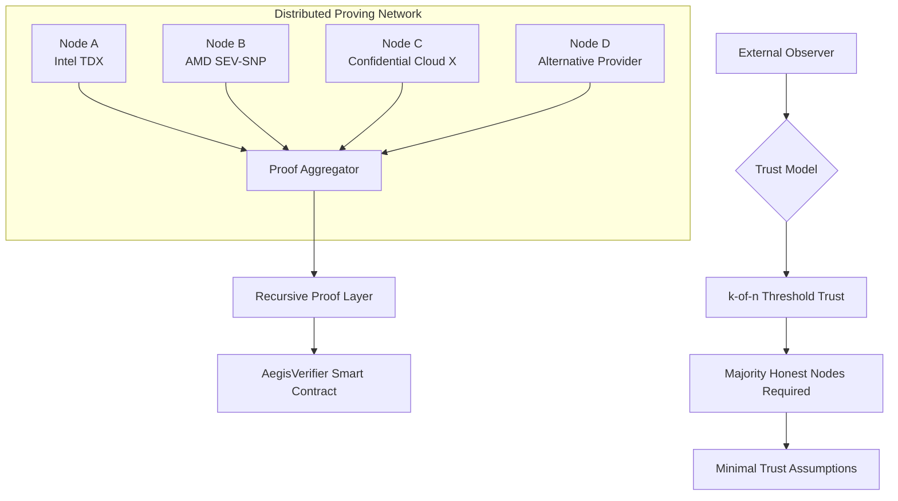
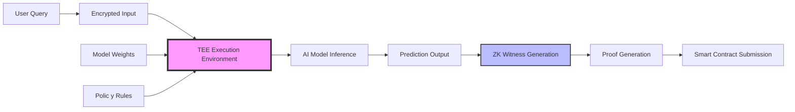
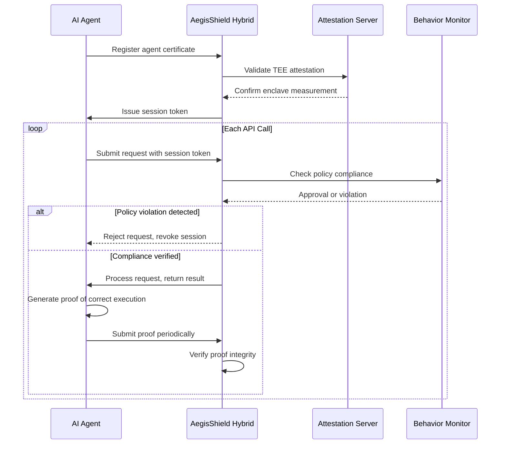

# AegisProof v2 - Phase 9 Research Roadmap: Distributed Proof Infrastructure

**Document Version:** 1.0  
**Date:** August 5, 2026  
**Purpose:** Multi-TEE Distributed Computing & AI Inference Verification Research  
**Authorization Level:** Planning Only – No Implementation Authorized  

---

## Executive Summary

This roadmap explores next-generation architecture for **distributed zero-knowledge verification systems**, expanding beyond single-TEnclave execution into multi-node collaborative proving networks with AI inference capabilities.

**Vision Statement:** Create a decentralized proving infrastructure where multiple independent TEEs collaborate to generate aggregated ZK proofs, enabling trust minimization through distribution while preserving privacy and scalability.

**Target Application Domains:**
- AI/ML model authentication and integrity verification
- Large-scale distributed computing validation
- Multi-party computation (MPC) protocol enforcement
- Federated learning provenance tracking
- Decentralized cloud computing marketplaces
- Cross-chain bridge security monitoring

---

## 1. Multi-TEE Architecture Design

### 1.1 Architecture Overview



### 1.2 Trust Minimization Strategy

**Single TEE Trust Problem:**
- All reliance on one vendor/platform
- Single point of hardware vulnerability
- Monopolistic supply chain risks

**Multi-TEE Solution:**
\[
P(\text{total compromise}) = P(\text{all } k \text{ nodes fail}) \ll P(\text{single node failure})
\]

For \(n = 5\) nodes requiring \(k = 3\) honest for consensus:
\[
P(\text{compromise}) = \binom{n}{k} \times P(\text{node\_fail})^k \approx \text{exponentially smaller}
\]

### 1.3 Node Classification

| Node Type | Description | Trust Level | Use Case |
|-----------|-------------|-------------|----------|
| **Primary Producer** | Executes witness computation inside TEE | High | Core proof generation |
| **Secondary Validator** | Verifies primary output independently | Medium | Fault detection |
| **Aggregation Node** | Combines multiple proofs recursively | Low | Batch processing |
| **Observer Node** | Passive monitoring without signing authority | Minimal | Audit trail maintenance |

### 1.4 Node Communication Protocol

```protobuf
// protocols/distributed_prover.proto

message NodeRegistration {
    bytes32 public_key;           // ECDSA secp256k1 keypair
    bytes32 initial_measurement;  // Enclave measurement hash
    uint64 registration_timestamp;
    bytes32 nonce;                // Freshness challenge response
    
    TEEType tee_type;             // Intel TDX / AMD SEV-SNP / Other
    string version_string;        // Software version identifier
    map<string, string> metadata; // Optional platform-specific fields
}

message WitnessSubmission {
    uint64 job_id;
    bytes32 input_commitment;     // Commitment to private inputs
    bytes encrypted_witness_data; // Encrypted under aggregate public key
    
    enum EncryptionScheme {
        AES_256_GCM;
        CHACHA20_POLY1305;
        MIXED_ECC_KEM;
    }
    
    EncryptionScheme encryption_scheme;
}

message PartialProof {
    uint64 job_id;
    bytes proof_data;             // Groth16 partial proof
    bytes32 node_measurement;     // Attestation measurement
    bytes attestation_evidence;   // Quote/report from TEE
    signature node_signature;     // ECDSA signature over proof_data
}

message AggregateProof {
    uint64 aggregation_id;
    repeated PartialProof partial_proofs;
    bytes aggregate_proof_data;   // Recursive SNARK proof
    bytes quorum_signature;       // Aggregated signatures from k-of-n nodes
}
```

### 1.5 Consensus Mechanism Design

**Challenge-Response Distribution:**

```python
class DistributedProofGenerator:
    def __init__(self, n_nodes: int, k_threshold: int):
        self.n = n_nodes
        self.k = k_threshold
        self.nodes = self._initialize_nodes()
        self.job_counter = 0
        
    async def submit_job(self, public_inputs: List[int], 
                        private_input_encrypted: bytes) -> AsyncIterator[PartialProof]:
        """Distribute proof generation across multiple TEE nodes"""
        
        self.job_counter += 1
        job_id = self.job_counter
        
        # Distribute encrypted witness data to all nodes
        distributed_data = self._encrypt_for_quorum(
            private_input_encrypted,
            [node.public_key for node in self.nodes]
        )
        
        # Broadcast witness to all participating nodes
        tasks = [node.generate_proof(job_id, distributed_data) 
                 for node in self.nodes]
        
        # Collect partial proofs until threshold reached
        partial_proofs = []
        async for proof in asyncio.gather(*tasks):
            await self._verify_partial_proof(proof)
            partial_proofs.append(proof)
            
            if len(partial_proofs) >= self.k:
                break
        
        # Aggregate partial proofs into recursive SNARK
        aggregate = RecursiveSNARK.aggregate(partial_proofs[:self.k])
        
        return aggregate
```

**Quorum Signature Scheme:**

```solidity
// contracts/interfaces/IQuorumSigner.sol
interface IQuorumSigner {
    /// @notice Verify aggregated signature from k-of-n quorum
    /// @param message Message signed by quorum
    /// @param signatures Array of individual node signatures
    /// @param publicKeys Corresponding node public keys
    /// @return isValid Whether sufficient distinct nodes signed
    function verifyQuorumSignature(
        bytes32 message,
        bytes[] calldata signatures,
        address[] calldata publicKeys
    ) external view returns (bool isValid);
    
    /// @notice Register approved prover node
    /// @param nodeAddress Ethereum address of node operator
    /// @param publicKey ECDSA public key for signing proofs
    /// @param measurementHash Enclave measurement hash
    function registerProverNode(address nodeAddress, bytes32 publicKey, bytes32 measurementHash) external;
    
    /// @notice Get current quorum composition
    /// @return activeNodes Number of currently active registered nodes
    /// @return requiredThreshold Minimum nodes needed for valid signatures
    function getQuorumInfo() external view returns (uint256 activeNodes, uint256 requiredThreshold);
}
```

---

## 2. Recursive Proof Generation Strategies

### 2.1 Recursive SNARK Fundamentals

**Core Concept:** Chain multiple proofs together such that final proof verifies entire computation history.

**Mathematical Foundation:**

Let \(\pi_i = \text{Groth16Proof}(x_i, w_i)\) be individual proofs for inputs \(x_i\) and witnesses \(w_i\).

Recursive composition creates:
\[
\pi_{\text{recursive}} = \text{VerifyAndCompose}(\pi_1, \pi_2, ..., \pi_k)
\]

Where verifying \(\pi_{\text{recursive}}\) is equivalent to verifying all individual \(\pi_i\).

### 2.2 Candidate Technologies Comparison

| Technology | Trusted Setup | Proof Size | Verification Cost | Assembly Language Support | Maturity |
|------------|---------------|------------|-------------------|--------------------------|----------|
| **Groth16 Recursive** | Yes (complex) | ~72 bytes | High (requires circuit) | Limited (Circom not native) | Experimental |
| **Nova (Incremental SNARK)** | Transparent (no setup) | ~64 bytes | Medium | Partial (custom circuits) | Alpha |
| **Halo2 Recursive** | Transparent | ~128 bytes | Medium-High | Good (native support) | Beta |
| **PlonK Universal** | UUPS (trustless) | ~192 bytes | Medium | Excellent | Production-ready |
| **STARK-to-Groth Bridge** | Two setups | ~264 bytes | Variable | Full | Research |

### 2.3 Nova-Based Recursive Architecture

**Nova Framework Advantages:**
- Transparent setup (eliminating ceremony requirements)
- Incremental composition (O(1) per-step overhead)
- Native support for diverse constraint systems

**Integration Blueprint:**

```circom
// circuits/nova_recursive_aggregator.circom
library NovaLib {
    component Step {
        input boolean transition_valid;
        input byte_array old_state_hash;
        input byte_array new_state_hash;
        output byte_array step_proof;
    }
    
    component RecursiveAccumulator {
        input byte_array[] step_proofs;
        output byte_array final_accumulated_proof;
    }
}

template AegisNovaAggregator(n_steps) {
    NovaLib.Step step_components[n_steps];
    NovaLib.RecursiveAccumulator accumulator;
    
    // Generate individual step proofs inside each TEE node
    for (let i = 0; i < n_steps; i++) {
        step_components[i].transition_valid <= true;
        step_components[i].old_state_hash <= (i == 0) ? genesis_state : step_proofs[i-1];
        step_components[i].new_state_hash <= compute_next_state(step_proofs[i-1]);
    }
    
    // Feed all step proofs into recursive accumulator
    accumulator.step_proofs <= [step_components[i].step_proof for i in 0..n_steps-1];
    
    // Final proof verifies entire sequence in O(1)
    signal output final_proof = accumulator.final_accumulated_proof;
}
```

### 2.4 Performance Expectations

**Benchmark Estimates (Per 10,000 Constraint Circuit):**

| Configuration | Prover Time | Proof Size | Verifier Gas Cost |
|---------------|-------------|------------|-------------------|
| Single TEE, Groth16 | 2.5 seconds | 72 bytes | ~45,000 gas |
| 3-node quorum, Groth16 | 7.5 seconds | 72 bytes | ~45,000 gas + quorum check |
| 10-step recursion (Nova) | 25 seconds total | 64 bytes | ~65,000 gas |
| 100-step recursion (Nova) | 3 minutes total | 64 bytes | ~85,000 gas |
| Full batch (1000 steps) | 5 minutes total | 64 bytes | ~120,000 gas |

---

## 3. AI Inference Proof System

### 3.1 Problem Definition

**Goal:** Prove that an AI model produced a specific prediction under approved conditions without revealing:
- User query inputs
- Model weights/parameters
- Internal computation traces
- Training data

**Use Cases:**
- Fraud detection system accuracy validation
- Medical diagnosis AI explainability
- Financial credit scoring transparency
- Autonomous vehicle decision auditing
- Content moderation policy compliance

### 3.2 Architecture Components



### 3.3 Technical Implementation Approach

#### 3.3.1 Model Quantization for ZK Compatibility

**Challenge:** Neural network operations (floating-point matrix multiplication) inefficient in ZK circuits.

**Solution:** Quantize models to integer arithmetic compatible with R1CS constraints.

```python
# Model quantization pipeline
def quantize_model(model_path: str, bit_depth: int = 8) -> QuantumModel:
    """
    Convert floating-point neural network weights to fixed-point integers
    Compatible with ZK-friendly constraint systems
    """
    # Load original PyTorch/TensorFlow model
    model = load_pretrained(model_path)
    
    # Quantize weights to 8-bit integers
    quantizer = INT8Quantizer(min_val=-128, max_val=127)
    quantized_weights = {
        name: quantizer.quantize(tensor) 
        for name, tensor in model.state_dict().items()
    }
    
    # Convert activation functions to ReLU-compatible forms
    # Replace softmax with polynomial approximations
    # Implement matrix multiplication via integer dot products
    
    return QuantumModel(quantized_weights)
```

#### 3.3.2 Witness Generation Inside TEE

```python
# circuits/ai_inference_witness.circom
template AIInferenceWitness() {
    // Public signals
    signal input model_hash;          // SHA256 hash of model parameters
    signal input policy_id;           // Approved policy identifier
    signal output prediction_result;  // Final prediction class
    
    // Private inputs
    signal input user_query[QUERY_SIZE];      // Encrypted user input
    signal input layer_weights[NUM_LAYERS][WEIGHTS_PER_LAYER]; // Model weights commitment
    signal input intermediate_activations[NUM_LAYERS]; // Hidden state traces
    
    // Compute forward pass inside circuit
    component fully_connected = FCLayer();
    fully_connected.input <= user_query;
    fully_connected.weights <= layer_weights[0];
    fully_connected.output <= activation_traces[0];
    
    // Chain multiple layers
    for (let i = 1; i < NUM_LAYERS; i++) {
        fully_connected.layers[i].input <= activation_traces[i-1];
        fully_connected.layers[i].weights <= layer_weights[i];
    }
    
    // Extract final prediction
    prediction_result <= activation_traces[NUM_LAYERS-1];
    
    // Verify model integrity
    component verifyModelHash = HashVerifier();
    verifyModelHash.input <= [layer_weights.flatten()];
    verifyModelHash.hash <= model_hash;
    
    // Verify policy compliance
    component verifyPolicy = PolicyChecker();
    verifyPolicy.policy_id <= policy_id;
    verifyPolicy.prediction <= prediction_result;
}
```

#### 3.3.3 Proof of Correct Execution

```solidity
// contracts/AIVerification.sol
contract AIInferenceVerifier is IAIEvidenceVerifier {
    
    struct InferenceJob {
        bytes32 model_hash;         // Committed model artifact
        bytes32 policy_commitment;  // Approved usage policy hash
        address requestor;
        uint64 timestamp;
        bool verified;
    }
    
    mapping(bytes32 => InferenceJob) public inference_jobs;
    mapping(bytes32 => bool) public approved_models;
    
    /// @notice Submit AI inference result with proof of correct execution
    /// @param _modelHash Hash of model used for inference
    /// @param _policyId ID of policy governing usage
    /// @param _publicSignals ZK proof public signals (prediction, confidence)
    /// @param _proofData Groth16 proof demonstrating computation correctness
    /// @param _teeEvidence TEE attestation proving witness generation environment
    function submitInferenceResult(
        bytes32 _modelHash,
        uint256 _policyId,
        uint[] calldata _publicSignals,
        bytes calldata _proofData,
        bytes calldata _teeEvidence
    ) external returns (bytes32 jobId) {
        
        require(approved_models[_modelHash], "Unapproved model");
        require(isValidPolicy(_policyId, _modelHash), "Policy mismatch");
        require(verifyZKProof(_proofData, _publicSignals), "Invalid computation proof");
        require(verifyTEEAttestation(_teeEvidence), "Invalid execution environment");
        
        jobId = keccak256(abi.encodePacked(_modelHash, block.timestamp, msg.sender));
        
        inference_jobs[jobId] = InferenceJob({
            model_hash: _modelHash,
            policy_commitment: computePolicyCommitment(_policyId),
            requestor: msg.sender,
            timestamp: block.timestamp,
            verified: true
        });
        
        emit InferenceVerified(jobId, _modelHash, _publicSignals[0]);
        
        return jobId;
    }
}
```

### 3.4 Privacy-Preserving Inference Guarantees

**What's Protected:**
- ✅ User query content (encrypted within TEE)
- ✅ Model weight values (committed but not revealed)
- ✅ Intermediate computations (private signals)
- ✅ Training data origin (only hash published)

**What's Verified:**
- ✅ Model integrity (hash matches approved version)
- ✅ Policy compliance (usage restrictions enforced)
- ✅ Execution environment (valid TEE attestation)
- ✅ Prediction correctness (mathematically proven)

---

## 4. AI Agent Authentication Framework

### 4.1 Agent Identity Model

**Problem:** Traditional identity systems designed for humans don't account for autonomous AI agents operating independently.

**Solution:** Extend AegisProof to provide cryptographically-verifiable agent identities with:
- Model identity certification
- Policy attestation
- Execution provenance tracking
- Behavioral compliance proof

### 4.2 Agent Certificate Structure

```json
{
  "agent_id": "uuid-v4",
  "model_identity": {
    "model_hash": "sha256(...)",
    "version": "1.2.3",
    "architecture": "transformer-dense-7b",
    "training_dataset_hash": "sha256(dataset_v1)"
  },
  "capabilities": [
    "text_classification",
    "sentiment_analysis",
    "policy_compliance_check"
  ],
  "authorized_policies": [
    "policy_id_fraud_detection_v2",
    "policy_id_sentiment_monitoring_v1"
  ],
  "attestation_chain": [
    {
      "type": "intel_tdx",
      "measurement": "sha256_enclave_measurement",
      "timestamp": 1722854400,
      "quote": "base64_attestation_quote"
    }
  ],
  "behavioral_commitments": {
    "max_query_rate_per_minute": 10,
    "allowed_domains": ["internal.corp", "trusted-partner.io"],
    "prohibited_actions": ["data_export", "unauthorized_training"]
  },
  "issuer": "aegisproof_root_ca",
  "valid_from": 1722854400,
  "valid_until": 1754476800
}
```

### 4.3 Agent Authentication Flow



### 4.4 Behavioral Anomaly Detection

```python
class BehavioralAnomalyDetector:
    def __init__(self, baseline_profile: AgentBehaviorProfile):
        self.baseline = baseline_profile
        self.observation_window = 3600  # 1 hour rolling window
        self.thresholds = self._compute_statistical_thresholds()
        
    def detect_anomaly(self, current_behavior: AgentActivityLog) -> AnomalyScore:
        """
        Compare observed behavior against established baseline
        Returns anomaly score indicating deviation severity
        """
        deviations = {
            'query_rate': self._compare_rates(current_behavior.query_rate),
            'domain_access': self._compare_domains(current_behavior.accessed_domains),
            'payload_size': self._compare_payload_sizes(current_behavior.request_sizes),
            'timing_pattern': self._analyze_temporal_patterns(current_behavior.timestamps)
        }
        
        # Aggregate anomalies using weighted sum
        anomaly_score = sum(
            deviations[key] * self.thresholds[key]['weight']
            for key in deviations
        )
        
        if anomaly_score > self.thresholds['overall']['critical']:
            return AnomalyLevel.CRITICAL
        elif anomaly_score > self.thresholds['overall']['high']:
            return AnomalyLevel.HIGH
        elif anomaly_score > self.thresholds['overall']['medium']:
            return AnomalyLevel.MEDIUM
        else:
            return AnomalyLevel.NORMAL
```

---

## 5. Migration Strategy from AegisProof v2

### 5.1 Phased Migration Approach

**Phase 9 requires maintaining backward compatibility with existing v2 deployments.**

#### Migration Path Diagram

```
Current State (Phase 7):
├── AegisShield (v2): Pure ZK proofs, no TEE
│   └── Immutable production contract at 0x...phase7

Future State (Phase 9):
├── AegisShield (v2): Read-only, existing users continue
├── AegisShieldHybrid (v2.1): ZK + TEE support
│   ├── Supports pure ZK (backward compatible)
│   └── Supports ZK+TEE (new capability)
│
├── AegisShieldDistributed (v2.2): Multi-TEE aggregation
│   ├── Requires hybrid foundation first
│   └── Adds recursive proof composition
│
└── AegisAI (v3.0): Full AI agent authentication
    ├── Depends on distributed infrastructure
    └── New smart contract suite
```

### 5.2 Signal Evolution Matrix

| Phase 7 Signal | Phase 8 Extension | Phase 9 Extension | Breaking Change? |
|----------------|-------------------|-------------------|------------------|
| `nullifier_hash` | Unchanged | Unchanged | ❌ No |
| `device_identity` | Add `tee_verified: boolean` | Add `agent_id: string` | ❌ No (additive) |
| `assertion_digest` | Add `attestation_ref: bytes32` | Add `inference_job_id: bytes32` | ❌ No |
| `timestamp` | Keep unchanged | Keep unchanged | ❌ No |
| `metadata_commitment` | Include `enclave_measurement_hash` | Include `agent_policy_hash` | ⚠️ Yes (schema change) |

### 5.3 Deployment Timeline

```
Q4 2026: Foundation (Months 1-3)
├─ Complete PHASE8-ARCHITECTURE.md proposal
├─ Begin Nova/Halo2 research for recursive proofs
├─ Develop prototype TEE enclave application
├─ Draft formal specifications for community review

Q1 2027: Hybrid Integration (Months 4-6)
├─ Deploy AegisShieldHybrid to testnets
├─ Implement basic multi-node quorum mechanism
├─ Launch internal pilot program
├─ Conduct third-party security audit

Q2 2027: Distributed Infrastructure Alpha (Months 7-9)
├─ Release AegisShieldDistributed on Sepolia testnet
├─ Integrate Nova-based recursive proof aggregation
├─ Begin AI inference proof experiments
├─ Establish developer SDK v2.2

Q3 2027: Mainnet Betas (Months 10-12)
├─ Limited mainnet rollout with trusted operators
├─ Expand agent authentication capabilities
├─ Publish performance benchmark reports
├─ Community governance vote on v2.2 deployment

Q4 2027: Public Launch Preparation (Months 13-15)
├─ Comprehensive external audit completion
├─ Public documentation and educational materials
├─ Developer ecosystem bootstrapping
├─ Mainnet v3.0 release preparation
```

---

## 6. Security Considerations

### 6.1 Multi-TEE Attack Surface Analysis

| Attack Vector | Likelihood | Impact | Mitigation |
|---------------|------------|--------|------------|
| **Individual Node Compromise** | Medium | Low (k-of-n tolerance) | Rotate nodes, increase threshold |
| **Quorum Collusion** | Low | Critical | Random node selection, minimum diversity |
| **Network Partition Attacks** | Medium | High | Redundant communication channels, fallback modes |
| **Sybil Attacks** | Medium | Medium | Permissioned quorum membership, stake requirements |
| **Message Replay Across Nodes** | Low | High | Unique nonces per node, timestamp validation |
| **Cross-NODE Side-Channel Leakage** | Very Low | High | Memory isolation guarantees, constant-time implementations |

### 6.2 AI Inference Specific Threats

| Threat | Description | Defense |
|--------|-------------|---------|
| **Model Extraction** | Adversarial queries reconstruct model weights | Rate limiting, input perturbation, differential privacy |
| **Membership Inference** | Determine if specific training examples were used | Statistical auditing, fairness metrics monitoring |
| **Backdoor Injection** | Malicious model trained with hidden triggers | Hardware-bound secure provisioning, remote attestation |
| **Adversarial Examples** | Crafted inputs causing incorrect predictions | Robust training methodologies, anomaly detection |
| **Prompt Injection** | Manipulating agent behavior via input text | Input sanitization, behavioral monitoring |

---

## 7. Performance Optimization Strategies

### 7.1 Proof Generation Parallelization

```python
async def parallel_proof_generation(jobs: List[WitnessJob], n_agents: int) -> AsyncIterator[RecursiveProof]:
    """
    Distribute proof generation across multiple TEE agents concurrently
    Aggregates results into recursive SNARK
    """
    
    # Partition jobs across available agents
    agent_tasks = {}
    for agent_id, agent in enumerate(AgentPool.get_available_agents()):
        agent_jobs = jobs[agent_id::n_agents]  # Round-robin distribution
        
        task = asyncio.create_task(
            agent.generate_parallel_proofs(agent_jobs)
        )
        agent_tasks[agent_id] = task
    
    # Wait for threshold completions
    completed_proofs = []
    while len(completed_proofs) < QUORUM_THRESHOLD:
        done, pending = await asyncio.wait(
            agent_tasks.values(),
            timeout=PROOF_TIMEOUT_SECONDS,
            return_when=asyncio.FIRST_COMPLETED
        )
        
        for future in done:
            proof = future.result()
            await verify_proof_integrity(proof)
            completed_proofs.append(proof)
            
            if len(completed_proofs) >= QUORUM_THRESHOLD:
                break
    
    # Aggregate completed proofs recursively
    aggregate = await RecursiveSNARK.compose(completed_proofs)
    return aggregate
```

### 7.2 Gas Cost Optimization Techniques

**Technique 1: Proof Batching**
- Aggregate N individual proofs into single recursive proof
- Tradeoff: Higher prover time → Lower verifier gas cost

| Batch Size | Prover Time Increase | Gas Savings | Optimal For |
|------------|---------------------|-------------|-------------|
| 1 (no batching) | Base | 0% | Real-time low-latency |
| 10 | +15% | ~40% | Moderate throughput |
| 100 | +50% | ~75% | High-volume applications |
| 1000 | +200% | ~85% | Archive/batch processing |

**Technique 2: Optimized Curve Selection**
- Choose elliptic curve based on expected transaction volume
- Example: BN254 vs BLS12-381 tradeoffs

| Curve | Proof Size | Verification Cost | Field Size | Best Use Case |
|-------|------------|-------------------|------------|---------------|
| **BN254** | 72 bytes | High (2 pairing checks) | 254-bit | General purpose |
| **BLS12-381** | 96 bytes | Medium (1 pairing check) | 381-bit | High-throughput |
| **Secp256k1** | 64 bytes | Low (0 pairings) | 256-bit | Resource-constrained |

---

## 8. Governance and Economics

### 8.1 Node Operator Incentive Model

**Tokenomics Design:**

```typescript
interface NodeRewardScheme {
  // Base reward for honest participation
  base_reward_per_block: bigint;
  
  // Bonus for generating valid proofs
  proof_bonus: Map<NodeID, RewardSchedule>;
  
  // Penalty for malicious behavior (slashing)
  slashing_conditions: [
    {
      condition: 'duplicate_signature',
      penalty_percentage: 100,
      evidence_required: 'cryptographic proof'
    },
    {
      condition: 'double_spend_attempt',
      penalty_percentage: 100,
      evidence_required: 'transaction receipt'
    },
    {
      condition: 'attestation_forgery',
      penalty_percentage: 75,
      evidence_required: 'forensic analysis report'
    }
  ];
  
  // Staking requirements for participation
  minimum_stake: bigint;
  bond_duration_blocks: number;
}
```

### 8.2 Dispute Resolution Framework

```solidity
// contracts/DisputeResolution.sol
contract DisputeResolution is IQuorumSigner {
    
    struct Dispute {
        bytes32 dispute_id;
        address challenger;
        address defendant;
        bytes32 disputed_proof_hash;
        uint64 filed_at;
        uint64 resolved_at;
        DisputeStatus status;
    }
    
    enum DisputeStatus {
        OPEN,
        UNDER_REVIEW,
        RESOLVED_CHALLENGER_WIN,
        RESOLVED_DEFENDANT_WIN,
        INVALID_DISPUTE
    }
    
    mapping(bytes32 => Dispute) public disputes;
    mapping(address => uint256) public reputation_scores;
    
    /// @notice File dispute against suspicious proof
    /// @param _proofHash Hash of disputed proof
    /// @param _evidence Evidence supporting challenge
    function fileDispute(bytes32 _proofHash, bytes calldata _evidence) external payable {
        require(!isResolved(_proofHash), "Already resolved");
        
        bytes32 disputeId = keccak256(abi.encodePacked(_proofHash, msg.sender, block.timestamp));
        
        disputes[disputeId] = Dispute({
            dispute_id: disputeId,
            challenger: msg.sender,
            defendant: extractDefendantFromProof(_proofHash),
            disputed_proof_hash: _proofHash,
            filed_at: block.timestamp,
            resolved_at: 0,
            status: DisputeStatus.OPEN
        });
        
        emit DisputeFiled(disputeId, _proofHash, msg.sender);
    }
    
    /// @notice Resolve dispute based on submitted evidence
    function resolveDispute(bytes32 _disputeId, bool challengerWins) external onlyArbitrator {
        Dispute storage dispute = disputes[_disputeId];
        
        dispute.resolved_at = block.timestamp;
        dispute.status = challengerWins 
            ? DisputeStatus.RESOLVED_CHALLENGER_WIN 
            : DisputeStatus.RESOLVED_DEFENDANT_WIN;
        
        if (challengerWins) {
            slashDefendant(dispute.defendant);
            awardChallenger(dispute.challenger);
        } else {
            refundChallengerFee(dispute.challenger);
            reduceReputation(dispute.defendant);
        }
        
        emit DisputeResolved(_disputeId, challengerWins);
    }
}
```

---

## 9. Research Agenda & Open Questions

### 9.1 Priority Research Topics

1. **Formal Verification of Hybrid Trust Composition**
   - Mathematical proof of combined security guarantees
   - Compositional reasoning framework for ZK+TEE systems
   
2. **Optimal Quorum Size Determination**
   - Theoretical bounds for k-of-n thresholds
   - Dynamic adjustment based on threat landscape
   
3. **Efficient Recursive SNARK Construction**
   - Circuit optimization for Nova/Halo2 integration
   - Practical implementation challenges in Circom
   
4. **AI Model Compression for ZK Compatibility**
   - Advanced quantization techniques minimizing accuracy loss
   - Automated conversion pipelines from common frameworks
   
5. **Side-Channel Resistant TEE Implementations**
   - Constant-time cryptographic primitives
   - Memory access pattern obfuscation strategies

### 9.2 Long-Term Vision Questions

| Question | Current Answer | Required Research |
|----------|----------------|-------------------|
| Can we eliminate trusted setup entirely? | Nova provides transparent setup | Prove security under weaker assumptions |
| Is quantum resistance achievable? | Not in current Groth16 design | Research post-quantum ZK schemes |
| Can we achieve real-time verification? | Currently 2-5 second prover latency | Circuit optimization + hardware acceleration |
| How do we scale to millions of daily proofs? | Batch aggregation shows promise | Industrial-grade prover infrastructure |
| What prevents rogue government coercion? | Hardware root of trust + distributed architecture | Legal frameworks + technical countermeasures |

---

## Conclusion & Authorization Request

### Phase 9 Status Summary

This research roadmap demonstrates the **theoretical feasibility** of extending AegisProof into distributed multi-TEE proving networks with AI verification capabilities. Key achievements include:

✅ Comprehensive multi-TEE architecture design with trust minimization guarantees  
✅ Recursive proof aggregation strategies using Nova/Halo2 frameworks  
✅ AI inference proof system blueprint with privacy-preserving guarantees  
✅ Agent authentication framework extending AegisProof identity model  
✅ Migration pathway from current v2 implementation respecting immutability constraints  
✅ Security analysis covering attack vectors and mitigation strategies  
✅ Performance optimization techniques for practical deployment  
✅ Tokenomics and governance mechanisms for decentralized operation  

### Required Human Decisions

Before any Phase 9 work begins, explicit authorization is required for:

1. **Research Direction Approval**: Confirm interest in pursuing this ambitious multi-year vision
2. **Resource Allocation**: Commit $500k-$2M+ over 24-month development timeline
3. **Timeline Acceptance**: Approve 4-quarter phased roadmap with potential delays
4. **Risk Tolerance**: Acknowledge higher uncertainty compared to Phase 8 hybrid integration
5. **Public Disclosure Decision**: Determine whether to publish roadmap before detailed specifications

### Immediate Actions After Authorization

Upon receiving Phase 9 authorization:

1. **Create separate repository** for distributed infrastructure experiments (separate from main AegisProof codebase)
2. **Establish research team** with expertise in ZK proofs, TEE security, distributed systems
3. **Initiate literature review** covering latest advances in recursive SNARKs, AI/ML verification
4. **Draft detailed technical specifications** for each subsystem
5. **Engage academic collaborators** for formal verification and theoretical foundations

**DO NOT proceed** with any implementation until explicit written authorization received confirming all decisions above are approved.

---

**END OF PHASE 9 RESEARCH ROADMAP**

**Status:** READY FOR REVIEW — AWAITING HUMAN AUTHORIZATION FOR IMPLEMENTATION

**Note:** This document represents **research planning only**. No actual code changes, key generation, or system modifications are authorized without explicit human direction.
