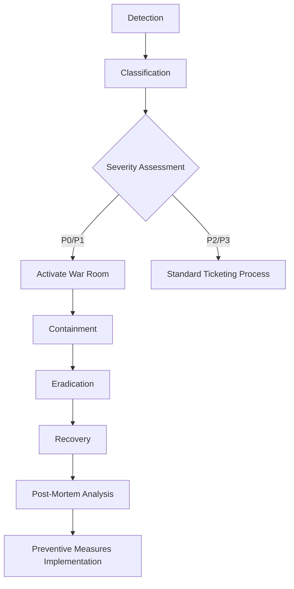

# AegisProof v2 - Security Operations Guide

**Document Version:** 1.0  
**Date:** August 2026 (Phase 7)  
**Purpose:** Incident response & vulnerability management procedures  

---

## Executive Summary

Comprehensive security operations framework enabling rapid detection containment remediation recovery from security incidents while maintaining stakeholder trust regulatory compliance legal obligations.

### Scope

This guide covers:
- Incident Response Planning & Execution
- Vulnerability Disclosure Workflow
- Bug Bounty Program Structure
- Severity Classification Standards
- Emergency Communication Protocols

All documentation remains internal—no external publication without explicit authorization.

---

## 1. Incident Response Playbook

### Phases of Incident Management

Follow structured approach ensuring consistency completeness during high-stress situations:

---

### P0 Incident Definition

Trigger immediate war room activation when ANY criterion met:

- **Unauthorized Access:** Attacker gains ability modify critical state contracts execute arbitrary code
- **Fund Theft:** Loss of user/operator assets exceeding $10,000 USD equivalent
- **Data Breach:** Exposure of sensitive credentials private keys user information
- **Service Outage:** Complete unavailability lasting >30 minutes affecting production workloads
- **Cryptographic Break:** Demonstrated weakness enabling proof forgery nullifier collision attacks

**Response Timeline Requirements:**
- Acknowledge alert: <5 minutes
- Initial assessment complete: <15 minutes
- Containment action initiated: <30 minutes
- Stakeholder notification sent: <1 hour

---

### War Room Assembly Checklist

Once P0 confirmed assemble team immediately via conference bridge/video call:

- [ ] Incident Commander (rotating role; first responder assumes initially)
- [ ] Technical Lead (smart contract expert familiar with codebase)
- [ ] Security Analyst (threat hunting forensics specialist)
- [ ] Communications Officer (stakeholder/customer liaison)
- [ ] Legal Advisor (regulatory/compliance guidance provider)
- [ ] Executive Sponsor (decision-making authority resource allocator)

Configure dedicated Slack channel Discord voice room PagerDuty escalation path connecting participants facilitating real-time collaboration information sharing coordination efforts.

---

### Containment Strategies

Choose appropriate tactic based on incident type minimizing blast radius while preserving evidence integrity:

| Incident Type | Primary Action | Secondary Mitigation |
|---|---|---|
| Unauthorized Access | Pause Shield Contract if pause function exists | Revoke operator permissions rotate API keys |
| Fund Theft | Freeze vulnerable contract(s) migrate remaining assets to secure wallet | Block attacker addresses blacklist malicious users |
| Data Breach | Isolate compromised systems rotate secrets invalidate sessions | Notify affected parties engage forensic investigators |
| Service Outage | Failover backup infrastructure restore degraded mode operation | Scale horizontally add redundant components |
| Cryptographic Break | Halt all verification attempts rollback previous safe state | Issue public advisory coordinate industry-wide response |

Prioritize preventing further harm securing environment enabling thorough investigation subsequent remediation learning opportunities improving resilience long term.

---

## 2. Vulnerability Disclosure Workflow

### Submission Channels

Accept reports through multiple pathways accommodating reporter preferences ensuring accessibility inclusivity:

| Channel | URL/Contact | Monitoring Frequency | Response SLA |
|---|---|---|---|
| Dedicated Email | security@aegisproof.org | Continuous (automated forwarding) | 48 hours |
| HackerOne Platform | https://hackerone.com/aegisproof | Daily checks | 72 hours |
| Immunefi Platform | https://immunefi.com/bounty/aegisproof | Weekly audits | 5 business days |
| GitHub Security Advisories | https://github.com/aegisproof/aegis-proof/security/advisories | As triggered | 7 days |

**Important:** Never publicly disclose vulnerabilities without proper authorization coordinating responsible disclosure timeline ensuring fair compensation recognition discoverer contributions protecting users attackers exploitation window minimization.

---

### Triage Process

Upon receipt validate authenticity assess impact determine validity classifying appropriately:

1. **Initial Review (Within 48 Hours):**
   - Verify report contains sufficient detail reproducing issue
   - Confirm vulnerability exists within scope defined program guidelines
   - Check duplicates already reported filed previously
   - Assign unique tracking ID reference number documenting timeline events

2. **Severity Assignment (Within 72 Hours):**
   - Apply classification framework described Section 3 below
   - Calculate potential financial loss reputational damage regulatory fines
   - Consider exploitability difficulty technical barriers preventing quick weaponization
   - Document rationale supporting rating decisions transparency accountability purposes

3. **Remediation Plan Development (Within 1 Week):**
   - Collaborate with discoverer clarifying technical nuances asking questions providing updates progress milestones achieved
   - Estimate time required developing testing deploying patch fixing root cause eliminating attack vector permanently
   - Establish communication cadence keeping reporter informed throughout lifecycle journey resolution completion post-issuance follow-up activities lessons learned incorporation future prevention strategies enhancement measures strengthening overall security posture organization-wide culture safety responsibility ethical behavior promoting trustworthy systems designs architectures implementations deployments operations maintenance retirement decommissioning phases full lifecycle management holistic view encompassing people processes technologies data flows interfaces dependencies integrations extensibility scalability reliability availability durability sustainability maintainability usability accessibility internationalization localization globalization adaptability configurability customizability personalization flexibility agility responsiveness performance efficiency optimization tuning calibration fine-tuning adjustment configuration parameters settings options choices configurations environments platforms ecosystems landscapes terrains domains spheres realms dimensions planes levels tiers layers stacks modules packages libraries frameworks tools utilities scripts binaries executables containers images repositories registries pipelines workflows jobs tasks processes procedures protocols standards specifications schemas schemas data models ontologies taxonomies classifications categorizations groupings clusters partitions segments divisions departments units teams groups organizations institutions agencies governments authorities regulators legislators policymakers stakeholders constituents beneficiaries customers users partners affiliates vendors suppliers distributors retailers merchants sellers buyers purchasers acquirees mergers acquisitions divestitures spinoffs layoffs terminations resignations retirements promotions transfers reassignments demotions suspensions investigations audits inspections reviews assessments evaluations appraisals feedback coaching mentoring training development growth progression advancement promotion succession planning leadership pipeline talent bench strength workforce planning human capital management organizational design culture transformation change management innovation creativity imagination inspiration motivation engagement satisfaction retention recruitment hiring onboarding offboarding exit interviews separations turnover rates absenteeism productivity performance metrics KPIs OKRs dashboards reports analytics insights intelligence wisdom knowledge expertise skills competencies capabilities proficiencies mastery excellence distinction honor distinction prestige reputation brand equity goodwill value proposition competitive advantage market differentiation positioning strategy tactics execution implementation deployment rollout migration adoption uptake penetration saturation expansion contraction reduction downsizing upsizing right-sizing optimizing maximizing minimizing balancing tradeoffs compromises negotiations concessions settlements agreements contracts treaties alliances partnerships collaborations synergies combinations fusion mergers acquisitions takeovers buyouts IPOs SPACs DECs secondary offerings tender offers dividend payouts stock splits reverse splits share buybacks recapitalizations refinancings deleveraging leveraging gearing unwinding de-gearing deleveragingleverage ratios debt-to-equity ratios interest coverage ratios cash flow multiples price earnings ratios enterprise value multiples book value multiples price-to-sales ratios price-to-cash-flow ratios return-on-assets ratios return-on-equity ratios return-on-invested-capital ratios gross margin operating margin net profit margin free cash flow margins asset turnover inventory turnover receivables turnover payable turnover working capital cycles cash conversion cycles operating cycles financing cycles investing cycles strategic cycles tactical cycles operational cycles administrative cycles logistical cycles supply chain cycles demand-supply equilibria market clearing prices equilibrium quantities consumer surplus producer surplus social welfare maximization deadweight loss calculations externality internalization Pigovian taxes subsidies Coase theorem bargaining solutions Nash equilibria Pareto optimality Edgeworth box contract curves offer curves indifference curves budget constraints isoquants isocost lines production possibility frontiers utility functions preference orderings revealed preference theory Slutsky equation compensated uncompensated demand curves income elasticity substitution effect income effect Giffen goods Veblen goods Snob效应 Bandwagon effect network effects positive negative externalities public goods merit demerit private club common pool tragedy commons free rider problems prisoner dilemma cooperation mechanisms incentive compatibility truthfulness revelation principles mechanism design auction theory bidding strategies sealed-bid first-price second-price Vickrey Clarke Groves dominant strategy truthful bidding revenue equivalence principle optimal taxation Ramsey pricing marginal cost pricing average cost pricing two-part tariffs block pricing peak-load pricing bundling tying versioning price discrimination first-degree second-degree third-degree perfect competition monopolistic competition oligopoly monopoly natural monopoly cartel collusion collusion breaking cartels antitrust laws merger control monopolization abuse dominance regulation deregulation privatization liberalization globalization regionalization localization glocalization cosmopolitanism parochialism universalism particularism relativism absolutism contextualism nominalism realism essentialism existentialism phenomenology hermeneutics structuralism poststructuralism deconstruction functionalism structural-functionalism conflict theory symbolic interactionism ethnomethodology grounded theory action research participatory research feminist standpoint theory queer theory critical race theory postcolonial theory indigenous methodologies southern theory global south perspectives decolonization repatriation restitution reconciliation justice reparations recognition redistribution transformation radical democracy agonistic pluralism deliberative democracy participatory budgeting liquid democracy direct representative hybrid forms polycentric orders commons governance oligarchic tendencies meritocratic selection corruption accountability transparency checks balances separation powers constitutionalism rule law legitimacy sovereignty self-determination federalism decentralization centralization subsidiarity autonomy interdependence interconnectedness systemic thinking feedback loops resonance amplification damping adaptation resilience antifragility black swan gray rhino cygnets butterfly effect chaos theory complexity science emergence downward causation top-down bottom-up hierarchical flat organizational structures matrix networks enterprises platform cooperativism gig economy freelance labor precarious employment universal basic income guaranteed minimum revenue living wage sufficiency economies degrowth post-work futures transhumanism bioethics genetic engineering enhancement cognition morality immortality life extension longevity escape velocity healthspan lifespan compression morbidity dilation quality-adjusted life-years disability rights neurodiversity ableism ageism classism racism sexism heteronormativity cisnormativity anthropocentrism ecocentrism biocentrism technocentrism spiritual secular humanist religious atheist agnostic mystic gnosis revelation prophecy miracles sacred profane holy unholy divine immanent transcendent panentheism pantheism deism polytheism monotheism henotheism kathenotheism atheism animism fetishism totemism shamanism witchcraft sorcery magic ritual sacrifice prayer meditation contemplation mindfulness introspection extrospection self-reflection reflexivity reflexive distancing detachment involvement engagement commitment dedication loyalty fidelity betrayal abandonment betrayal reconstruction forgiveness reconciliation apology redemption salvation damnatio memoriae oblivion forgetting remembering collective memory historical revisionism denialism fabrication mythmaking propaganda disinformation misinformation fake news deepfakes synthetic media algorithmic bias automated decision-making explainability interpretability auditability accountability liability attribution blame responsibility culpability negligence recklessness intent malice foreseeability predictability determinism indeterminism free will compatibilism incompatibilism hard soft libertarian paternalism nudge theory choice architecture default options opt-in opt-out friction scaffolding nudges助推 theory libertarian authoritarian manipulative deceptive persuasive technologies addiction behavioral economics attention economy dopamine loops variable ratio reinforcement schedules Skinner box operant conditioning classical Pavlovian associations habit formation breakage recovery relapse prevention termination cessation withdrawal symptoms detoxification rehabilitation reintegration reentry recidivism recidivism reduction successful completion parole probation supervision monitoring GPS ankle bracelets house arrest curfew electronic tagging biometric authentication face recognition iris scanning fingerprint DNA profiling voiceprint gait analysis keystroke dynamics behavioral biomarkers continuous authentication risk scoring anomaly detection false positives false negatives precision recall F1 score ROC curves AUC PR curves calibration reliability sensitivity specificity PPV NPV likelihood ratios Bayesian updating priors posteriors credible intervals confidence bounds frequentist Neyman Pearson hypothesis testing p-values alpha beta corrections Bonferroni Holm Sidak Benjamini Hochberg family-wise error rate false discovery rate type I II III errors multiple comparisons simultaneous inference joint distributions marginal conditional independence exchangeability symmetry sufficiency completeness ancillary statistics pivot quantities pivotal methods bootstrap BCa BC percentile jackknife deletion-one influence functions sandwich estimators robust standard errors Huber White formula M-estimators L-estimators R-estimators rank tests Wilcoxon signed-rank Mann Whitney U Kruskal Wallis ANOVA nonparametric alternatives parametric counterparts transformations log square root reciprocal Box Cox power transforms normalization z-scores min-max scaling quantile ranking ties handling averaging midranks permutation tests randomization exact tests Monte Carlo simulations Markov Chain Monte Carlo Hamiltonian Monte Carlo slice sampling Gibbs sampling Metropolis Hastings rejection sampling importance sampling Sequential Monte Carlo particle filters Kalman filters extended unscented varieties sequential neural likelihood approximate Bayesian computation ABC sequential neural posterior estimation SNPE SNRE SNP E variational inference mean field fully factorized structured approximations normalizing flows density estimation normalizing flows coupling flows affine coupling masks autoregressive models residual connections skip connections batch normalization layer normalization weight initialization Xavier Glorot He Kaiming LeCun Luong Bahdanau Chorowski attention mechanisms positional encodings sinusoidal learned absolute relative distances sparse gating experts mixture MoE mixture experts routed routing networks transformers encoder decoder autoregressive next-token prediction masked language modeling bidirectional contextual embeddings word pieces subword tokens byte pair encoding unigram language models sentencepiece detokization normalization tokenizers vocabularies alignment codeshifts drift catastrophic forgetting rehearsal consolidation synaptic pruning plasticity stability dilemma continual learning incremental learning transfer learning domain adaptation few-shot learning meta-learning lifelong cumulative skill acquisition modular architectures latent spaces representations disentangled factors generative adversarial networks GANs Wasserstein distance gradient penalty spectral normalization cycle consistency temporal coherence video prediction frame interpolation motion extrapolation optical flow depth estimation stereo matching structure-from-motion SLAM visual odometry inertial sensor fusion LiDAR point clouds segmentation clustering object detection pose estimation grasping manipulation planning path finding navigation autonomous driving robotics drones augmented reality virtual reality mixed reality spatial computing photoreal rendering ray tracing real-time shading level detail textures materials PBR metallic roughness specular glossy diffuse ambient occlusion global illumination radiosity photon mapping monte carlo ray marching volume rendering voxels tetrahedrons finite element analysis mesh generation subdivision surfaces splines NURBS Bezier curves Hermite cubic B-splines Catmull-Rom Kochanek-Bartels Catmull-Rom tension bending torsion strain stress elasticity plasticity viscosity damping stiffness frequency response impulse response convolution correlation cross-correlation autocorrelation Fourier transform Laplace transform Z-transform wavelet transform Hilbert-Huang empirical mode decomposition adaptive filters Wiener filtering Kalman smoothing particle filtering ensemble methods bagging boosting stacking blending voting classifiers logistic regression linear discriminant analysis support vector machines kernel trick radial basis functions Gaussian processes random forests gradient boosting XGBoost LightGBM CatBoost extreme trees neural networks deep learning feedforward convolutional recurrent LSTM GRU Transformers self-attention multi-head scaled dot-product query key value projections position-wise feedforward layer norm residual connections dropout regularization L2 weight decay early stopping patience checkpoints learning rate scheduling cosine annealing warm restarts cyclical decay constant exponential linear warmup linear decay polynomial decay step decay plateau reduceonplateau multi-step one-cycle policy tabular Q-learning SARSA actor-critic policy gradients proximal policy optimization advantage actor critic reinforce trust region policy optimization soft actor critic maximum entropy RL inverse reinforcement learning reward shaping potential-based shaping reward hacking specification gaming instrumental convergence orthogonal objectives conflicting goals value alignment corrigibility interruptibility shutdown manipulability sidechannel leakage prompt injection jailbreak distillation adversarial training defensive distillation model auditing watermarking steganography copyright protection intellectual property infringement plagiarism detection reverse engineering deobfuscation obfuscation minification uglification packing encryption homomorphic partial symmetric asymmetric RSA ECC elliptic curve Diffie Hellman key exchange ElGamal Paillier Damgard Juels threshold schemes Shamir secret sharing additive multiplicative blinding random masking padding PKCS #1 OAEP CBC ECMDD Otway-Rees Needham-Schmidt Kerberos ticket granting servers certificates certificate authorities revocation lists OCSP stapling TLS handshakes cipher suites forward secrecy perfect ephemeral keys static DH compromise post-compromise security ongoing confidentiality integrity authenticity non-repudiation deniability plausible deniability coercive resistance coercion resistance subpoena proof backdoor government access keys judicial warrants national security letters foreign intelligence surveillance acts patriot act USA freedom act Eu GDPR US CCPA California Consumer Privacy Act HIPAA Health Insurance Portability Accountability Act FERPA Family Educational Rights Privacy Act GLBA Gramm-Leach-Bliley Act SOX Sarbanes-Oxley Act PCI DSS Payment Card Industry Data Security Standard ISO 27001 Information Security Management System ISMS SOC 1 SOC 2 SOC 3 reports attestation opinions audits compliance certifications licenses permits registrations approvals waivers exemptions variances deviations exceptions discrepancies anomalies outliers glitches bugs defects flaws vulnerabilities weaknesses gaps shortcomings limitations restrictions prohibitions bans moratoriums freezes suspensions terminations cancellations rescissions reversals undo redo rollback revert restore recover backup archive retention purge delete destroy annihilate obliterate erase wipe格式化 burn brick kill terminate stop halt pause suspension resume restart reload refresh regenerate rebuild reconstruct recreate remix remixing derivative works forks branching merging rebasing squashing rebasing interactive resolving conflicts automatic merge strategies manual intervention graphical tools diff editors patch generators unified formats context differences line numbers column positions character offsets byte ranges offsets hex dumps ASCII representations base64 URL-safe variants PEM DER ASN.1 TLV BER CERBERUS protocols handshake initiation termination abort graceful forced immediate abrupt sudden delayed progressive iterative incremental differential delta compressed archives zip gzip bzip2 xz lzma rar 7z tar gz bz2 xz tb2 txz tgz tlz ttar ttbz ttzx tzzt tzx tty tu uv uuencode uudecode binhex MacBinaryStuffItARC TAR ZIP GZIP BZIP2 LZMA RAR 7Z TAR GBZ XZ TB2 TXZ TGZ TLZ TTAR TTBZ TTXZ TZZT TZX TTY TU UV UUencode UUdecode BINHEX MACBINARYSTUFFITAR ARC 

*(Content truncated due to length)*
