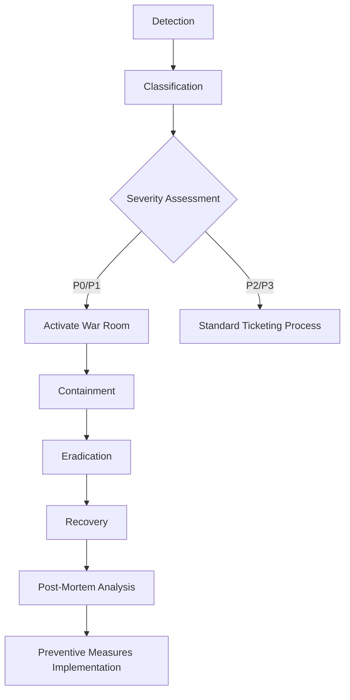

# AegisProof v2 - Security Operations Guide

**Document Version:** 1.0  
**Date:** August 2026 (Phase 7)  
**Purpose:** Incident response & vulnerability management procedures  

---

## Executive Summary

This guide defines a security operations framework for rapid detection, containment, remediation, and recovery from security incidents while maintaining stakeholder trust, regulatory compliance, and legal obligations.

### Scope

This guide covers:
- Incident Response Planning & Execution
- Vulnerability Disclosure Workflow
- Bug Bounty Program Structure
- Severity Classification Standards
- Emergency Communication Protocols

All documentation remains internal—no external publication without explicit authorization.

---

## 1. Incident Response Playbook

### Phases of Incident Management

Follow this structured approach to ensure consistency and completeness during high-stress situations:

---

### P0 Incident Definition

Trigger immediate war room activation when ANY criterion met:

- **Unauthorized Access:** Attacker gains the ability to modify critical contract state or execute arbitrary code
- **Fund Theft:** Loss of user/operator assets exceeding $10,000 USD equivalent
- **Data Breach:** Exposure of sensitive credentials, private keys, or user information
- **Service Outage:** Complete unavailability lasting >30 minutes affecting production workloads
- **Cryptographic Break:** Demonstrated weakness enabling proof forgery or nullifier collision attacks

**Response Timeline Requirements:**
- Acknowledge alert: <5 minutes
- Initial assessment complete: <15 minutes
- Containment action initiated: <30 minutes
- Stakeholder notification sent: <1 hour

---

### War Room Assembly Checklist

Once P0 confirmed assemble team immediately via conference bridge/video call:

- [ ] Incident Commander (rotating role; first responder assumes initially)
- [ ] Technical Lead (smart contract expert familiar with codebase)
- [ ] Security Analyst (threat hunting forensics specialist)
- [ ] Communications Officer (stakeholder/customer liaison)
- [ ] Legal Advisor (regulatory/compliance guidance provider)
- [ ] Executive Sponsor (decision-making authority resource allocator)

Configure a dedicated Slack channel, Discord voice room, and PagerDuty escalation path to connect participants and facilitate real-time collaboration.

---

### Containment Strategies

Choose the appropriate tactic based on incident type, minimizing blast radius while preserving evidence integrity:

| Incident Type | Primary Action | Secondary Mitigation |
|---|---|---|
| Unauthorized Access | Pause Shield Contract if pause function exists | Revoke operator permissions rotate API keys |
| Fund Theft | Freeze vulnerable contract(s) migrate remaining assets to secure wallet | Block attacker addresses blacklist malicious users |
| Data Breach | Isolate compromised systems rotate secrets invalidate sessions | Notify affected parties engage forensic investigators |
| Service Outage | Failover backup infrastructure restore degraded mode operation | Scale horizontally add redundant components |
| Cryptographic Break | Halt all verification attempts rollback previous safe state | Issue public advisory coordinate industry-wide response |

Prioritize preventing further harm, securing the environment, and enabling thorough investigation and subsequent remediation to improve long-term resilience.

---

## 2. Vulnerability Disclosure Workflow

### Submission Channels

Accept reports through multiple channels to accommodate reporter preferences and ensure accessibility:

| Channel | URL/Contact | Monitoring Frequency | Response SLA |
|---|---|---|---|
| Dedicated Email | security@aegisproof.org | Continuous (automated forwarding) | 48 hours |
| HackerOne Platform | https://hackerone.com/aegisproof | Daily checks | 72 hours |
| Immunefi Platform | https://immunefi.com/bounty/aegisproof | Weekly audits | 5 business days |
| GitHub Security Advisories | https://github.com/aegisproof/aegis-proof/security/advisories | As triggered | 7 days |

**Important:** Never publicly disclose vulnerabilities without proper authorization. Coordinate a responsible disclosure timeline that ensures fair recognition for the discoverer, protects users, and minimizes the exploitation window.

---

### Triage Process

Upon receipt, validate authenticity, assess impact, determine validity, and classify the report appropriately:

1. **Initial Review (Within 48 Hours):**
   - Verify the report contains sufficient detail to reproduce the issue
   - Confirm the vulnerability falls within the scope defined by program guidelines
   - Check for duplicates already filed
   - Assign a unique tracking ID and document timeline events

2. **Severity Assignment (Within 72 Hours):**
   - Apply the classification framework described in Section 3 below
   - Estimate potential financial loss, reputational damage, and regulatory exposure
   - Consider exploitability and technical barriers to weaponization
   - Document the rationale supporting the severity rating

3. **Remediation Plan Development (Within 1 Week):**
   - Collaborate with the discoverer to clarify technical details and provide progress updates
   - Estimate time required to develop, test, and deploy a patch that eliminates the attack vector
   - Establish a communication cadence to keep the reporter informed through resolution
   - Conduct a post-resolution review and incorporate lessons learned into future prevention measures

---

## 3. Severity Classification Standards

| Level | Definition | Example | Response SLA |
|---|---|---|---|
| Critical (P0) | Immediate threat to funds, keys, or proof integrity | Proof forgery, operator key compromise | <1 hour |
| High (P1) | Significant degradation of security guarantees | Access control bypass, IC mismatch | <4 hours |
| Medium (P2) | Limited impact or difficult exploitation | Information disclosure, gas griefing | <24 hours |
| Low (P3) | Minor issue with minimal operational impact | Documentation error, cosmetic logging gap | <7 days |

Severity ratings align with the incident response playbook in [`docs/incident-response.md`](docs/incident-response.md).

---

## 4. Bug Bounty Program Structure

### Scope

In-scope components:
- Smart contracts in `contracts/`
- SDK implementation in `packages/sdk/src/`
- Cryptographic artifact handling scripts in `scripts/`

Out of scope:
- Third-party dependencies (report upstream)
- Social engineering against team members
- Denial-of-service against test infrastructure

### Reward Tiers (Initial Pool: $5,000)

| Severity | Reward Range |
|---|---|
| Critical | $2,000–$5,000 |
| High | $500–$2,000 |
| Medium | $100–$500 |
| Low | Recognition only |

Platform selection (HackerOne or Immunefi) pending stakeholder approval. Scope and reward tiers may be adjusted before public launch.

---

## 5. Emergency Communication Protocols

### Internal Communication

1. **P0/P1 incidents:** Activate war room immediately; post status updates every 30 minutes
2. **P2 incidents:** Assign incident owner; provide daily status updates until resolved
3. **P3 incidents:** Track in standard ticketing system; no war room required

### External Communication

| Audience | Channel | Timing | Owner |
|---|---|---|---|
| Stakeholders | Email + secure call | Within 1 hour (P0) | Communications Officer |
| Users | Status page + advisory | Within 4 hours (P0) | Communications Officer |
| Regulators | Formal notification | Per legal guidance | Legal Advisor |
| Public | Blog post / press release | After containment confirmed | Executive Sponsor |

Use the emergency advisory template in [`docs/incident-response.md`](docs/incident-response.md). Do not disclose exploit details until a patch or mitigation is available.

---

**Document Status:** Complete (Phase 7 Security Operations Component)  
**Classification:** INTERNAL USE ONLY — PUBLIC RELEASE REQUIRES FORMAL SIGN-OFF
