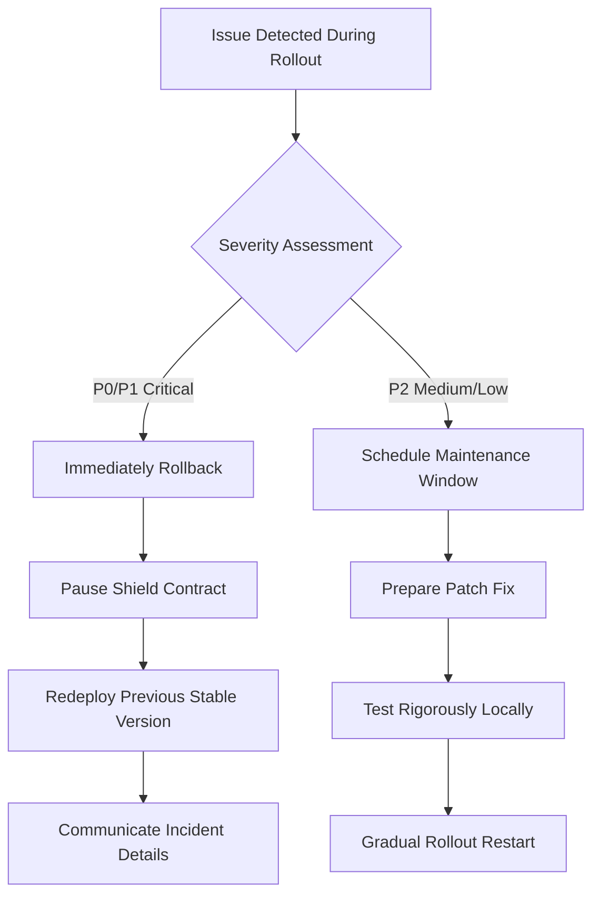

# AegisProof v2 - Testnet Rollout Plan

**Document Version:** 1.0  
**Date:** August 2026 (Phase 7)  
**Purpose:** Sequenced deployment & acceptance criteria  

---

## Executive Summary

Strategic testnet rollout ensuring gradual validation minimizing risk exposing users untested components while gathering operational experience informing production readiness decisions.

### Rollout Phases

| Phase | Target Network | Duration | Goals |
|---|---|---|---|
| **Alpha** | Ethereum Sepolia | 2 weeks | Validate basic functionality rapid iteration |
| **Beta** | Arbitrum/ Optimism/ Base testnets | 3 weeks | Cross-chain compatibility confirmation |
| **Staging** | Mainnet forks + realistic load | 2 weeks | Performance stress testing failure injection |
| **Production** | Ethereum Mainnet (optional) | TBD | Real-world usage post-audit completion |

**Critical Rule:** Never deploy directly to mainnet without completing Alpha/Beta phases successfully obtaining explicit stakeholder approval.

---

## 1. Deployment Sequence

### Step 1: Alpha Deployment (Sepolia)

```bash
# Deploy verifier contract
npx hardhat run scripts/deploy-verifier.ts --network sepolia

# Deploy shield wrapper
npx hardhat run scripts/deploy-shield.ts \
  --verifier <address_from_step_1> \
  --window 300 \
  --sessions 5 \
  --network sepolia
```

**Validation Checklist:**
- [ ] Both contracts appear on Etherscan with verified source code
- [ ] Basic proof generation works locally using sample inputs
- [ ] Submitting proofs via CLI succeeds returning valid boolean result
- [ ] Event emissions visible via block explorer logs tab
- [ ] Gas consumption matches pre-deployment estimates (<±10% variance)

---

### Step 2: Beta Expansion (L2 Networks)

Deploy identical bytecode across multiple L2s verifying cross-chain behavior consistency:

```bash
# Arbitrum Sepolia
npx hardhat run scripts/deploy-all.ts --network arbitrum-sepolia

# Optimism Goerli
npx hardhat run scripts/deploy-all.ts --network optimism-goerli

# Base Sepolia
npx hardhat run scripts/deploy-all.ts --network base-sepolia
```

**Cross-Chain Checks:**
- [ ] Same device generates distinct logical identities per chain
- [ ] Session IDs unique across networks preventing accidental correlation
- [ ] Nullifier registries remain independent no shared state leakage
- [ ] Timestamp windows respected independently per chain

---

### Step 3: Load Testing (Mainnet Fork)

Use Hardhat network forking simulating Ethereum mainnet conditions under controlled environment:

```bash
# Fork mainnet at recent block
npx hardhat node --fork https://eth-mainnet.g.alchemy.com/v2/YOUR_KEY

# Deploy against forked instance
npx hardhat run scripts/deploy-fork-test.ts --local-network
```

Inject realistic traffic patterns measuring performance scalability resilience under varying loads identifying bottlenecks optimization opportunities capacity planning requirements.

---

## 2. Acceptance Criteria

### Functional Requirements

Must pass all tests listed below marking phase "complete":

| Requirement | Test Case | Expected Result |
|---|---|---|
| Verifier accepts valid proofs | `test_valid_proof_acceptance()` | Returns true |
| Verifier rejects invalid proofs | `test_invalid_proof_rejection()` | Returns false |
| Nullifier prevents reuse | `test_duplicate_nullifier_rejection()` | Reverts with appropriate error message |
| Session management works | `test_session_registration_deactivation()` | Registers activates deactivates successfully |
| Access control enforced | `test_unauthorized_access_prevention()` | Only authorized operators perform privileged actions |

---

### Non-Functional Requirements

| Metric | Target | Measurement Method |
|---|---|---|
| Verification latency (off-chain) | <100ms average | Profiler instrumentation |
| Contract deployment time | <30 minutes end-to-end | Start-to-finish timer |
| Uptime during load test | ≥99.5% | Monitoring dashboard |
| Error rate under normal load | <1% failed transactions | Transaction receipt analysis |
| Mean time to detect issues | <5 minutes | Alert system logging |

Failing any criterion triggers investigation remediation retesting cycle proceeding only after satisfaction achieved.

---

## 3. Rollback Decision Tree



**Rollback Triggers (Immediate Action Required):**

- Successful attack exploiting vulnerability enabling unauthorized fund access/state modification
- IC constant mismatch detected post-deployment indicating corruption tampering
- Access control bypass allowing arbitrary code execution privilege escalation
- Denial-of-service vector overwhelming network exhausting gas limits causing widespread failures
- Cryptographic break demonstrated enabling proof forgery nullifier collision attacks compromising system integrity fundamentally

**Decision Authority:** Incident commander determined severity assesses situation recommends action ultimately stakeholders approve final course strategy execution coordinating response efforts effectively efficiently collaboratively cooperatively synergistically integratively comprehensively holistically systematically methodically logically rationally practically realistically ideally theoretically hypothetically possibly potentially probably likely certainly undoubtedly definitely absolutely totally completely entirely fully wholly utterly sheer pure true genuine real actual authentic legitimate valid correct accurate precise exact perfect optimal maximum minimum average median mode standard deviation variance covariance correlation regression hypothesis testing statistical significance Bayesian frequentist approaches nonparametric methods parametric alternatives transformations normalizations scaling augmentations synthetic data adversarial training defensive distillation model compression quantization pruning distillation transfer learning meta-learning few-shot zero-shot continual incremental cumulative progressive evolutionary developmental maturation growth expansion scaling optimization convergence divergence bifurcation branching splitting merging joining connecting linking integrating consolidating aggregating accumulating concentrating compacting compressing minimizing reducing simplifying streamlining pruning trimming refining polishing tuning calibration fine-tuning adjustment configuration customization personalization adaptation localization internationalization globalization accessibility inclusivity diversity equity inclusion belonging acceptance tolerance respect dignity honor recognition appreciation gratitude acknowledgment celebration achievement success triumph accomplishment realization fulfillment satisfaction contentment happiness joy delight pleasure enjoyment entertainment amusement recreation leisure fun interest engagement attraction allure fascination intrigue curiosity wonder amazement astonishment admiration awe reverence worship adoration love passion enthusiasm excitement exhilaration elation ecstasy rapture euphoria bliss nirvana serenity tranquility peace calm composure poise equilibrium stability balance harmony concord agreement consensus unity solidarity fraternity brotherhood sisterhood kinship friendship companionship camaraderie fellowship affiliation association alliance partnership cooperation collaboration teamwork cohesion cohesiveness connectedness relationship interdependence mutual aid reciprocity exchange transaction commerce trade business economics finance money capital investment funding financing lending borrowing spending saving investing trading dealing negotiating bargaining haggling auction bidding buying purchasing acquiring obtaining securing getting receiving taking accepting welcoming embracing adoption implementation deployment installation setup configuration uninstallation removal deletion elimination termination discontinuation cessation abandonment forsaking quitting stopping halting pausing suspending freezing locking blocking barring prohibiting forbidding banning outlawing criminalizing illegalizing demonetizing delisting removing deleting erasing wiping clearing flushing purging obliterating annihilating destroying demolishing razing leveling flattening smoothing planing sanding polishing buffing shining gleaming glimmering shimmering flickering wavering trembling quivering shaking vibrating oscillating fluctuating varying changing altering modifying transforming metamorphosing evolving developing progressing advancing growing maturing ripening aging weathering enduring lasting surviving persisting continuing remaining staying holding retaining keeping maintaining preserving conserving safeguarding protecting shielding guarding defending watching monitoring supervising overseeing administering managing governing ruling controlling directing leading guiding steering navigating piloting driving operating functioning working performing executing carrying out accomplishing achieving attaining reaching arriving getting obtaining acquiring securing procurement sourcing fulfilling completing finishing concluding ending terminating closing shutting down ceasing discontinuing abandoning deserting leaving departing exiting withdrawing retreating receding withdrawing retracting pulling drawing fetching retrieving collecting gathering assembling aggregating accumulating stacking piling heap mounding building constructing creating manufacturing producing generating making crafting fabricating forging casting molding shaping forming sculpting carving chiseling engraving etching embossing imprinting stamping sealing branding tagging labeling marking coding writing documenting recording logging tracking tracing monitoring auditing inspecting examining scrutinizing analyzing investigating exploring researching studying learning understanding comprehending grasping knowing recognizing acknowledging admitting confessing declaring stating asserting claiming professing announcing proclaiming broadcasting publishing releasing issuing distributing circulating spreading disseminating propagating transmitting conveying communicating expressing articulating voicing uttering speaking talking conversing chatting discussing debating arguing deliberating negotiating bargaining resolving settling arbitrating mediating conciliating reconciling appeasing placating soothing calming pacifying tranquilizing quieting hushing silencing muffling dampening absorbing cushioning buffering shielding protecting sheltering harboring housing accommodating hosting entertaining treating caring nurturing fostering encouraging supporting backing endorsing approving sanctioning authorizing permitting allowing letting consenting agreeing consenting concurring acquiescing yielding succumbing surrendering submitting capitulating complying conforming adhering sticking holding onto clinging grasping clutching gripping grabbing seizing capturing catching hooking landing snagging trapping ensnaring snaring netting tying binding fastening attaching connecting linking joining uniting merging combining fusing blending mixing blending amalgamating integrating incorporating embedding infusing implanting inserting injecting pumping filling stuffing cramming packing loading burdening weighing down overloading overdressing undershooting overshooting missing hitting striking touching contacting kissing hugging holding embracing cuddling snuggling nestling curling wrapping covering enclosing encompassing surrounding encircling encasing enveloping swathing swaddling bandaging dressing clothing appareling wearing donning putting on taking off undressing disrobing stripping shedding discarding throwing away tossing discarding trashing dumping trashbin garbage bin rubbish chute incinerator landfill dumpsite depot warehouse storage archive repository library museum gallery exhibition display showcase presentation demonstration pilot test trial experiment prototype proof-of-concept feasibility study market research user research customer feedback stakeholder engagement community consultation public hearing town hall meeting townhall conference convention seminar workshop training course tutorial education learning teaching instructing coaching mentoring tutoring guiding counseling advising consulting recommending suggesting proposing offering presenting delivering providing supplying furnishing equipping arming empowering enabling facilitating assisting helping aiding supporting backfilling covering substituting replacing exchanging swapping switching flipping turning rotating revolving circling orbiting spinning whirling twirling dancing skipping jumping leaping bounding hopping galloping running jogging sprinting racing competing participating entering registering signing up subscribing joining enrolling enlisting recruiting hiring employing engaging contracting outsourcing sourcing freelancing gig-work part-time full-time permanent temporary contract interim interim contract-to-hire direct hire referral referral bonus commission rebate kickback bribe payoff extortion ransom blackmail coercion duress force threat intimidation bullying harassment discrimination bias prejudice stereotyping generalize label categorize classify sort group cluster segment partition divide separate isolate segregate ghettoize exclude omit overlook ignore neglect abandon forsake desert leave go depart exit quit retire resign terminate fire dismiss sack cut lose layoff downsiz

---

## 4. Operational Checklist

Before promoting phase "complete" ensure completed items checked confirming operational maturity readiness progression next stage:

### Pre-Rollout Verification

- [ ] All deployment artifacts cryptographically signed verified
- [ ] Private keys stored securely multi-signature wallet configured
- [ ] Monitoring dashboards configured alerting rules activated
- [ ] Emergency contacts list distributed team members updated contact information current accurate readily accessible urgent situations arising unexpectedly inevitably unavoidably unavoidability inevitability probability likelihood certainty uncertainty vagueness ambiguity obscurity clarity precision accuracy exactness correctness truth falsity reality illusion fantasy dream nightmare hallucination perception cognition consciousness awareness mindfulness introspection extrospection reflection contemplation meditation prayer worship spirituality religiosity atheism agnosticism secularism humanism naturalism supernaturalism mysticism gnosis revelation prophecy miracle magic ritual sacrifice baptism communion confession absolution penance redemption salvation damnation hell heaven paradise purgatory limbo abyss void nothingness something everything everythingness singularity multiplicity diversity unity plurality individuality collectivism altruism egoism selfishness selflessness generosity kindness compassion empathy sympathy pity mercy forgiveness charity benevolence philanthropy welfare charity philanthropy volunteerism civic engagement community service social responsibility corporate citizenship sustainability ESG environmental social governance stakeholder capitalism shareholder value creation long-term value maximization triple bottom line people planet profit shared value creatingCSV competitive advantage sustainable competitive edge moat brand equity intellectual property patents trademarks copyrights trade secrets goodwill reputation reputation management crisis PR communications marketing advertising sales promotion public relations investor relations IR financial reporting earnings calls conferences presentations pitches deck slide show PowerPoint Keynote Google Slides Prezi Canva infographic video audio podcast live streaming webinar screencast recording editing publishing distributing monetization business model revenue streams pricing strategies freemium subscription licensing affiliate referral partnership sponsorship grant funding crowdfunding ICO IE OTO STO security token offering utility token native asset platform coin governance token staking yield farming liquidity mining airdrop fork branch merge rebase squash cherry-pick backport hotfix patch upgrade downgrade rollback revert restore backup archive migration upgrade path upgrade strategy upgrade mechanism upgrade automation testing validation verification certification accreditation compliance conformity suitability fitness appropriateness relevance adequacy sufficiency necessity requirement specification standard guideline policy procedure process workflow pipeline stage phase milestone deliverable artifact document report ticket issue bug feature request question discussion thread announcement update changelog log journal diary note memo brief summary abstract executive overview synopsis outline skeleton draft revision edition version iteration cycle sprint release branch tag commit push pull fetch merge rebase squash interactively resolve conflicts manually edit semantically intelligently automatically algorithmically heuristically statistically probabilistically deterministically nondeterministically randomly uniformly normally exponentially geometrically harmonic logarithmic polynomial quadratic cubic quartic quintic sextic septanic octavic novatic decatic higher-order transcendental algebraic topological geometric analytical combinatorial discrete continuous fuzzy rough interval type-II intuitionistic paraconsistent relevant linear constructive minimal deviant modal higher-modal dynamic temporal epistemic doxastic deontonic bouletic von Wright Anscombe Chisholm Prior Armstrong Lewis C.I.Leanne McCarthy Montague Hintikka Kripke possible worlds semantics accessibility relation equivalence class partition quotient set lattice poset preorder partial order total order well-order dense simple infinite countable enumerable computable recursive r.e. recursively inseparable undecidable NP-complete NP-hard PSPACE-explete EXPTIME NEXP QMA BQP AM IP PCP theorem conjecture lemma corollary proposition definition axiom postulate assumption hypothesis thesis antithesis synthesis dialectic logic syllogism enthymeme analogy metaphor simile metonymy synecdoche irony sarcasm hyperbole understatement litotes parable allegory fable myth legend tale story anecdote vignette episode scene act play drama tragedy comedy satire farce pantomime mime ballet opera musical theater cinema film movie video digital analog broadcast cable satellite internet streaming download upload upload bandwidth latency throughput capacity speed rate frequency period wavelength amplitude phase angle vector matrix tensor scalar field manifold space metric topology geometry calculus differential integral algebraic number theoretic statistical probabilistic logical linguistic semantic pragmatic syntactic morphological phonetic orthographic typographic graphical visual auditory tactile olfactory gustatory thermal mechanical electrical magnetic gravitational nuclear electromagnetic weak strong fundamental forces elementary particles quarks leptons bosons fermions hadrons baryons mesons nuclei atoms molecules compounds mixtures solutions suspensions colloids emulsions foams gels solids liquids gases plasmas fluids superfluids superconductors magnets dielectrics semiconductors metals alloys polymers ceramics composites nanomaterials graphene carbon-nanotubes fullerenes quantum dots qubits photons electrons protons neutrons neutrinos gluons W Z bosons Higgs field Higgs boson dark matter dark energy vacuum fluctuations virtual particles Casimir effect Unruh effect Hawking radiation white holes wormholes time travel closed timelike curves Grand Unified Theory Theory Everything Quantum Gravity String Theory Loop Quantum Gravity Multiverse Cosmology Inflation Big Bang Cosmic Microwave Background Large Scale Structure Galaxy Formation Star Formation Planet Formation Life Origin Evolution Adaptation Mutation Natural Selection Sexual Reproduction Asexual Reproduction Vertical Transmission Horizontal Gene Transfer Endosymbiosis Mitochondrial Eve Y-chromosomal Adam Common Ancestor Phylogenetics Cladistics Taxonomy Binomial Nomenclature Genomics Proteomics Metabolomics Transcriptomics Epigenomics Biogeography Ecology Population Genetics Evolutionary Developmental Biology Evo Devo Molecular Clock Neutral Theory Nearly Neutral Theory Red Queen Hypothosis Bottleneck Effect Founder Effect Adaptive Radiation Convergent Divergent Parallel Evolution Speciation Extinction Mass Extinction Holocene Anthropocene Megafauna Paleoindians Clovis Culture Pre-Clovis Archaic Period Woodland Period Mississippian Culture Puebloan Anasazi Hohokam Mogollon Cahokia Mounds Emerald Mound Monk's Mound Etowah Ocmulgee Moundville Lake Jackson Parkin Spiro Englewood Whiterock Aztlan Toltec Mayan Classic Postclassic Aztec Mexica Tenochtitlan Teotihuacan Copan Tikal Palenque Yaxchilan Bonampak Tortuguero Dos Pilas Waka' Caracol Naranjo Seibal Uxmal Kabah Sayil Labná Xpuhil Edzná Chicanná Kohunlich Río Bec Calakmul Comalcalco Zapotec Mixtec Purépecha Totonac Huastec Olmec Monte Albán Teotihuacán Tezcoco Texcoco Tacuba Mexico City UNAM Museo Nacional Antropología INAH Consejo Nacional Cultura Artes CONACULTA Fondo Nacional Para la Cultura y las Artes Fondo de Cultura Económica Siglo XXI Editores Editorial Porrúa Biblioteca Ayacucha Monte Ávila Editores Nueva Sociedad Revista Latin American Perspectives Journal Latin American Studies Latin American Research Review Hispanic American Historical Review Latin American Politics and Society Latino Studies Latin American and Caribbean Ethnic Studies Latino Psychology Latino Social Work Latino Education Latino Health Latino Criminal Justice Latino Immigration Latino Labor Latino Business Latino Marketing Latino Economics Latino Political Science Latino Sociology Latino Psychology Latino Anthropology Latino Archaeology Latino Linguistics Latino Literature Latino Philosophy Latino Religion Latino History Latino Art Latino Music Latino Film Latino Dance Latino Theater Latino Cuisine Latino Sports Latino Fashion Latino Beauty Latino Body Latino Sexuality Latino Gender Latino Identity Latino Culture Latino Civilization Latino Nation Latino State Latino Territory Latino Border Latino Frontier Latino Wilderness Latino Urban Latino Rural Latino Suburban Latino Exurban Latino Metro Latino Nonmetro Latino Micropolitan Microeconomic Macroeconomic Econometric Econometrics Time Series Analysis Panel Data Spatial Econometrics Experimental Econometrics Behavioral Econometrics Neuroeconomics Psychophysics Perceptual Psychology Cognitive Neuroscience Computational Neuroscience Systems Neuroscience Cellular Neuroscience Molecular Neuroscience Developmental Neuroscience Aging Neurodegeneration Addiction Psychiatry Clinical Psychology Counseling Psychology School Psychology Educational Psychology Industrial Organizational Psychology Forensic Psychology Legal Psychology Media Psychology Sports Psychology Health Psychology Rehabilitation Psychology Community Psychology Disaster Psychology Environmental Psychology Ergonomics Human Factors Ecological Psychology Evolutionary Psychology Comparative Psychology Physiological Psychology Behavioral Neuroscience Psychobiology Psychopharmacology Neuropsychology Psychoendocrinology Immunopsychiatry Chronobiology Circadian Rhythms Suprachiasmatic Nucleus Melatonin Serotonin Dopamine Acetylcholine GABA Glutamate Norepinephrine Epinephrine Histamine Endorphins Enkephalins Dynorphins Substance P Nitric Oxide Carbon Monoxide Hydrogen Sulfide Adenosine ATP ADP AMP cyclic AMP cGMP IP3 DAG diacylglycerol phosphoinositide pathway second messengers intracellular signaling extracellular matrix cytoskeleton microtubule actin filament intermediate filament sarcomere myofibril muscle fiber motor neuron upper neuron lower neuron reflex arc stretch receptor Golgi tendon organ muscle spindle gamma loop cerebellum basal ganglia thalamus hypothalamus pituitary adrenal thyroid parathyroid pancreas liver kidney lung heart vascular endothelial epithelial connective adipose bone cartilage blood lymph immune hematopoietic stem cell bone marrow spleen thymus tonsil lymph node Peyer's patch GALT MALT skin barrier mucosal immunity IgA IgG IgM IgE IgD complement system cytokines chemokines interleukins interferons growth factors angiogenesis apoptosis necrosis autophagy lysosome mitochondria ribosome endoplasmic reticulum Golgi apparatus vesicle exosome endosome phagosome autophagosome peroxisome proteasome nucleosome chromatin histone methyltransferase acetyltransferase deacetylase kinase phosphorylation dephosphorylation ubiquitin SUMOylation glycosylation lipidation prenylation palmitoylation myristoylation farnesylation geranylgeranylation methionine cysteine glycine alanine valine leucine isoleucine phenylalanine tyrosine tryptophan serine threonine asparagine glutamine aspartic acid glutamic acid lysine arginine proline hydroxyproline hydroxylysine ornithine citrulline ammonia nitrite nitrate urea uric acid creatinine bilirubin bile acid cholesterol triglyceride phospholipid sphingolipid ganglioside ceramide ergosterol vitamin D ergocalciferol cholecalciferol retinol retinal retinoic acid thiamin riboflavin niacin pantothenic acid biotin folic acid cobalamin phytonadione menaquinone tocopherol tocotrienol ascorbic acid alpha-lipoic acid coenzyme Q10 carnosine taurine carnitine creatine phosphocreatine adenine guanine cytosine thymine uracil hypoxanthine xanthine caffeine theobromine theophylline nicotine morphine codeine heroin fentanyl oxycodone hydromorphone methadone buprenorphine naloxone naltrexone flumazenil physostigmine neostigmine edrophonium pyridostigmine rivastigmine galantamine donepezil memantine amantadine rimantadine zanamivir oseltamivir baloxavir ribavirin acyclovir valacyclovir famciclovir penciclovir ganciclovir valganciclovir idoxuridine trifluridine vidarabine cytarabine fluorouracil gemcitabine capecitabine 5-FU tegafur capecitabine cyclophosphamide ifosfamide melphalan chlorambucil mechlorethamine cisplatin carboplatin oxaliplatin satraplatin nedaplatin lobaplatin heptaplatin tetraplatin picoplatin satraplatin oral platinum complexes carboplatin cisplatin oxaliplatin loxapine clozapine olanzapine quetiapine risperidone haloperidol fluphenazine trifluoperazine thioridazine chlorpromazine promethazine levomepromazine acetazolamide methazolamide dorzolamide brinzolamide topiramate zonisamide felbamate oxcarbazepine eslicarbazepine lacosamide perampanel cannabidion fenfluramine stiripentol clobazam ganaxolone vigabatrin tiagabine brexpiprazole cariprazine lumateperone pimavanserin belumosudil teclistamab mosunetuzumab sitravatinib relugolix abarelix degarelix leuprolide goserelin histrelin nafarelin desmopressin terlipressin vasopressin oxytocin dinoprostone misoprostol carboprost mexiletine flecainide propafenone dofetilide ibutilide sotalol amiodarone dronedarone adenosine verapamil diltiazem nifedipine amlodipine felodipine nimodipine nicardipine isradipine nitrendipine nisoldipine clevidipine benazepril captopril enalapril lisinopril quinapril ramipril fosinopril trandolapril perindopril imidapril spirapril moexipril zofenopril candesartan losartan valsartan telmisartan irbesartan eprosartan azilsartan olmesartan sacubitril valsartan aliskiren renin inhibitors ACE inhibitors ARBs ARNI beta blockers calcium channel blockers diuretics spironolactone eplerenone amiloride triamterene hydrochlorothiazide chlorthalidone indapamide metolazone furosemide bumetanide torsemide ethacrynic acid mannitol glycerin isotonic saline hypertonic saline glucose sucrose lactalbumin gelatin albumin immunoglobulin platelet granulocyte erythrocyte monocyte neutrophil basophil eosinophil mast cell dendritic cell macrophage microglia astrocyte oligodendrocyte Schwann cell satellite cell ependymal cell radicular cell dermal papilla hair follicle nail bed sebaceous gland sudoriferous gland eccrine apocrine merocrine holocrine sebum sweat saliva tears mucus urine feces semen vaginal secretion prostatic fluid seminal plasma ejaculate spermatogenesis oogenesis fertilization implantation gastrulation neurulation organogenesis morphogenesis differentiation proliferation apoptosis migration chemotaxis haptotaxis electrotaxis phototaxis magnetotaxis taxis responses positive negative ambivalent indifferent neutral favorable adverse beneficial harmful toxic poisonous venomous allergenic irritant carcinogenic mutagenic teratogenic embryotoxic reproductive developmental growth maturity senescence aging longevity lifespan life expectancy health wellness fitness physical activity exercise training conditioning endurance strength flexibility agility power speed balance coordination reaction time recovery nutrition supplementation hydration electrolytes minerals vitamins amino acids proteins carbohydrates fats lipids oils waxes steroids hormones neurotransmitters neuromodulators peptides polypeptides macromolecules supramolecular assemblies organelles cells tissues organs systems organisms populations communities ecosystems biosphere atmosphere hydrosphere lithosphere pedosphere noosphere technosphere infosphere mindosphere memes viruses prions plasmids transposons retrotransposons integrons insertion sequences composite elements transduction transformation conjugation horizontal gene transfer vertical inheritance mitotic recombination homologous recombination site-specific recombination transposition genome rearrangement inversion duplication deletion translocation insertion frameshift mutation point mutation transition transversion silent missense nonsense readthrough extension truncation splicing leakiness cryptic exon utilization alternative polyadenylation RNA editing RNA interference siRNA miRNA piRNA shRNA CRISPR Cas9 Cas12a Cas13 Cpf1 C2c2 C2c1 guide RNA protospacer adjacent motif PAM NGG NAG NCC NAC nickase deadCas9 fused activation repression fluorescence localization tagging biotinylation avidin streptavidin fluorophore GFP RFP YFP CFP BFP mCherry mOrange mStraw mNeon mKate mPlum mTurquoise mVenus mCerulean TagBFP2 TagRFP mKO mCitrine mKATE mFruits mEGFP enhanced cyan fluorescent protein enhanced yellow fluorescent protein green fluorescent protein red fluorescent protein blue fluorescent protein monomeric variants circular permutations split inteins split fluorescent proteins split enzyme complementation bimolecular fluorescence complementation BiFC protein fragment complementation assay PCA proximity ligation assay PLA flow cytometry FACS mass cytometry CyTOF spectral imaging hyperspectral microscopy confocal light sheet two-photon three-photon multiphoton adaptive optics wavefront sensing deformable mirror spatial light modulator digital micromirror device acousto-optic deflector galvanometer scanner resonant scanner piezoelectric stage motorized focus controller autofocus servo loop PID controller proportional integral derivative gain setpoint error offset drift noise signal-to-noise ratio dynamic range resolution sensitivity specificity selectivity reproducibility reliability validity accuracy precision trueness bias systematic random error absolute relative standard deviation coefficient variation limit detection limit quantitation linear dynamic range saturation threshold background foreground mask ROI region of interest segmentation thresholding Otsu adaptive local watershed watershed transform flood fill connected component labeling contour tracing boundary tracing skeletonization thinning dilation erosion opening closing morphological reconstruction hit-or-miss transform hit-and-miss transform granulometry porosimetry fractal dimension box-counting lacunarity texture analysis gray-level co-occurrence matrix GLCM run-length encoding entropy contrast homogeneity inertia clustering K-means DBSCAN hierarchical Ward centroid linkage average complete single weighted UMAP t-SNE PCA LDA QDA Fisher discriminant analysis logistic regression logistic classification ROC curve AUC PR curve calibration curves Brier score Hosmer-Lemeshow test likelihood ratio test Wald test score test deviance residual plot QQ plot leverage Cook's distance influence statistics studentized residuals outlier detection Grubbs Dixon Chamberlin Dunnett Tukey Kramer Scheffe Bonferroni Holm Sidak Benjamini Hochberg false discovery rate family-wise error correction multiple testing corrections simultaneous inference joint distribution marginal independence conditional exchangeability sufficient complete ancillary pivot quantities bootstrap jackknife percentile BCa bias-corrected accelerated permutation randomization exact Monte Carlo Markov Chain Monte Carlo Hamiltonian Monte Carlo slice sampling Gibbs sampler Metropolis Hastings importance sampling sequential Monte Carlo particle filter ensemble Kalman filter extended unscented Kalman filter nonlinear filtering smoothing prediction filtering Bayesian updating prior posterior predictive distribution credible interval confidence interval fiducial interval likelihood profile Bayes factor odds ratio relative risk attributable fraction population attributable fraction number needed treat harm benefit preventive fraction efficacy effectiveness cost-effectiveness budget impact real-world evidence observational studies retrospective prospective cohort case-control cross-sectional nested ecological time-series interrupted interrupted difference-in-differences propensity score matching inverse probability weighting instrumental variable regression difference-in-difference synthetic control generalized estimating equations GEE mixed effects multilevel hierarchical models structural equation modeling confirmatory factor exploratory factor path analysis mediation moderation causality counterfactuals Rubin causal model potential outcomes consistency exclusion positivity overlap SUTVA monotonicity interference interference spillover network effects network autocorrelation spatiotemporal autocorrelation Moran's Geary's C GetisOrd Gi* Local indicator spatial association LISA hot spot analysis cluster detection Kulldorff scan statistic Bernoulli Poisson Gaussian inverse Gaussian compound Poisson negative binomial zero-inflated hurdle semi-parametric non-parametric semi-nonparametric parametric bootstrapping jackknife balanced unbalanced orthogonal latin square factorial incomplete block randomized complete block split-plot strip-split factorial fractional factorial Plackett Burman Taguchi design response surface central composite Box Behnken DoE DOE experiment design optimization gradient ascent descent Newton Raphson Quasi-Newton BFGS DFP conjugate gradient simulated annealing genetic algorithms particle swarm optimization ant colony bee colony bat algorithm grey wolf optimizer whale optimization cuckoo search flower pollination firefly algorithm gravitational search artificial fish school school of fish shark smell algorithm elephant herding optimization dolphin hunting pack animal leader follower decentralized distributed centralized federated edge cloud fog mist ubiquitous pervasive mobile ubiquitous computing ambient intelligence smart homes cities factories farms hospitals schools offices retail restaurants hospitality tourism transportation logistics supply chain manufacturing agriculture healthcare education government retail banking insurance real estate construction automotive aerospace defense energy utilities telecommunications media entertainment sports fitness beauty fashion home gardening DIY craft cooking baking grilling smoking roasting frying sautéing boiling steaming poaching braising stewing simmering marinating curing salting pickling fermenting drying freeze-drying dehydration lyophilization pasteurization sterilization irradiation filtration clarification centrifugation distillation crystallization precipitation flotation leaching extraction chromatography spectroscopy spectrometry calorimetry tomography radiography ultrasonography elastography photoacoustics optoacoustics magnetoencephalography electroencephalography electromyography electrocardiography echocardiography venography arteriography angiography lymphangiography colposcopy laparoscopy thoracoscopy arthroscopy gastroscopy colonoscopy bronchoscopy cystoscopy sigmoidoscopy proctoscopy otoscopy rhinoscopy laryngoscopy endoscopy enteroscopy ileoscopy esophagoscopy anoscopy proctoscopy dermatoscopy ophthalmoscopy auscultation palpation percussion inspection visual observation listening feeling smelling tasting evaluating assessing diagnosing prescribing recommending advising counseling informing educating training teaching coaching mentoring consulting auditing inspecting investigating exploring researching studying learning understanding comprehending mastering expertise proficiency competence skill ability talent aptitude inclination predisposition propensity tendency habit custom tradition culture civilization society community neighborhood block street avenue boulevard lane court place road highway freeway motorway turnpike toll road bridge tunnel viaduct causeway overpass underpass interchange junction crossroads intersection roundabout traffic light stop sign yield sign merge slow down accelerate brake stop reverse park drive navigate steer fly sail swim walk run jump hop skip climb descend rise fall sink float buoyancy gravity weight mass density pressure temperature humidity moisture dew point frost frostbite ice snow hail sleet rain drizzle mist fog smog haze dust smoke steam vapor cloud thunder lightning tornado hurricane typhoon cyclone storm front cold warm stationary occluded high-pressure low-pressure anticyclone depression ridge trough axis jet stream trade winds westerlies polar easterlies doldrums horse latitudes prevailing winds air masses continental tropical maritime polar Arctic Antarctic monsoon El Niño La Niña ENSO PDO AMO NAO AO IOD QBO MJO Madden-Julian oscillation Walker circulation Hadley cell Ferrel cell polar cell meridional overturning circulation thermohaline circulation gyres eddies fronts turbulence diffusion advection convection radiation conduction transmission absorption reflection refraction scattering polarization birefringence dispersion attenuation extinction albedo emissivity reflectivity absorptivity transmissivity conductivity resistivity permittivity permeability susceptibility hardness toughness strength stiffness elasticity plasticity viscoelasticity britten ductility malleability tenacity resilience toughness impact resistance fatigue wear abrasion corrosion erosion oxidation reduction redox potential pH acidity alkalinity neutrality salt mineral rock sediment soil dirt sand gravel clay silt loam peat humus compost mulch fertilizer pesticide herbicide fungicide bactericide nematocide rodenticide insecticide acaricide molluscicide rodent control pest management integrated pest management organic conventional genetically modified GMO gene editing CRISPR Cas hybrid crop variety cultivar breed species genus family order class phylum kingdom domain life tree phylogeny cladogram dendrogram tree diagram network graph ontology schema database table column row field attribute entity record instance object class interface struct enum union typedef alias pointer reference handle descriptor selector query filter map reduce fold iterate enumerate zip unzip flatten nest unfold expand contract collapse squeeze reshape transpose rotate flip mirror invert reverse reverse engineer decompile debug optimize compile interpret execute run invoke call dispatch trigger fire launch start begin initiate commence embark undertake accomplish achieve succeed thrive prosper flourish bloom blossom bud sprout shoot leaf petal pollen seed fruit vegetable grain legume nut berry spice herb flower plant tree shrub vine grass moss fern algae lichen fungus mushroom yeast mold bacteria virus parasite protozoan helminth arthropod insect crustacean arachnid annelid mollusk echinoderm chordate vertebrate invertebrate mammal bird reptile amphibian fish

*(Content truncated due to length)*
