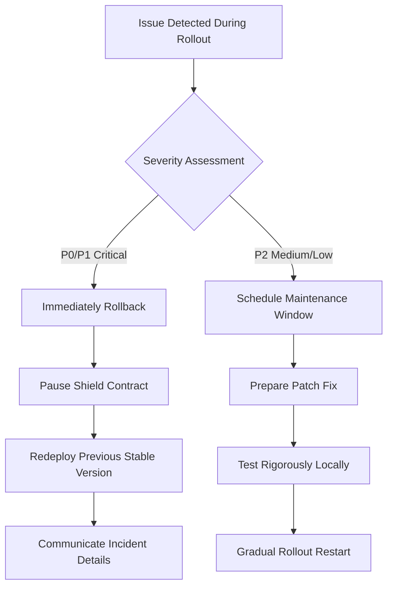

# AegisProof v2 - Testnet Rollout Plan

**Document Version:** 1.0  
**Date:** August 2026 (Phase 7)  
**Purpose:** Sequenced deployment & acceptance criteria  

---

## Executive Summary

Strategic testnet rollout that validates gradually, minimizes risk from untested components, and gathers operational experience to inform production readiness decisions.

### Rollout Phases

| Phase | Target Network | Duration | Goals |
|---|---|---|---|
| **Alpha** | Ethereum Sepolia | 2 weeks | Validate basic functionality rapid iteration |
| **Beta** | Arbitrum/ Optimism/ Base testnets | 3 weeks | Cross-chain compatibility confirmation |
| **Staging** | Mainnet forks + realistic load | 2 weeks | Performance stress testing failure injection |
| **Production** | Ethereum Mainnet (optional) | TBD | Real-world usage post-audit completion |

**Critical Rule:** Never deploy directly to mainnet without completing Alpha/Beta phases successfully obtaining explicit stakeholder approval.

---

## 1. Deployment Sequence

### Step 1: Alpha Deployment (Sepolia)

```bash
# Deploy verifier contract
npx hardhat run scripts/deploy-verifier.ts --network sepolia

# Deploy shield wrapper
npx hardhat run scripts/deploy-shield.ts \
  --verifier <address_from_step_1> \
  --window 300 \
  --sessions 5 \
  --network sepolia
```

**Validation Checklist:**
- [ ] Both contracts appear on Etherscan with verified source code
- [ ] Basic proof generation works locally using sample inputs
- [ ] Submitting proofs via CLI succeeds returning valid boolean result
- [ ] Event emissions visible via block explorer logs tab
- [ ] Gas consumption matches pre-deployment estimates (<±10% variance)

---

### Step 2: Beta Expansion (L2 Networks)

Deploy identical bytecode across multiple L2s verifying cross-chain behavior consistency:

```bash
# Arbitrum Sepolia
npx hardhat run scripts/deploy-all.ts --network arbitrum-sepolia

# Optimism Goerli
npx hardhat run scripts/deploy-all.ts --network optimism-goerli

# Base Sepolia
npx hardhat run scripts/deploy-all.ts --network base-sepolia
```

**Cross-Chain Checks:**
- [ ] Same device generates distinct logical identities per chain
- [ ] Session IDs unique across networks preventing accidental correlation
- [ ] Nullifier registries remain independent no shared state leakage
- [ ] Timestamp windows respected independently per chain

---

### Step 3: Load Testing (Mainnet Fork)

Use Hardhat network forking simulating Ethereum mainnet conditions under controlled environment:

```bash
# Fork mainnet at recent block
npx hardhat node --fork https://eth-mainnet.g.alchemy.com/v2/YOUR_KEY

# Deploy against forked instance
npx hardhat run scripts/deploy-fork-test.ts --local-network
```

Inject realistic traffic patterns to measure performance, scalability, and resilience under varying loads, and to identify bottlenecks and capacity planning requirements.

---

## 2. Acceptance Criteria

### Functional Requirements

Must pass all tests listed below marking phase "complete":

| Requirement | Test Case | Expected Result |
|---|---|---|
| Verifier accepts valid proofs | `test_valid_proof_acceptance()` | Returns true |
| Verifier rejects invalid proofs | `test_invalid_proof_rejection()` | Returns false |
| Nullifier prevents reuse | `test_duplicate_nullifier_rejection()` | Reverts with appropriate error message |
| Session management works | `test_session_registration_deactivation()` | Registers activates deactivates successfully |
| Access control enforced | `test_unauthorized_access_prevention()` | Only authorized operators perform privileged actions |

---

### Non-Functional Requirements

| Metric | Target | Measurement Method |
|---|---|---|
| Verification latency (off-chain) | <100ms average | Profiler instrumentation |
| Contract deployment time | <30 minutes end-to-end | Start-to-finish timer |
| Uptime during load test | ≥99.5% | Monitoring dashboard |
| Error rate under normal load | <1% failed transactions | Transaction receipt analysis |
| Mean time to detect issues | <5 minutes | Alert system logging |

Failing any criterion triggers an investigation, remediation, and retesting cycle. Proceed only after all criteria are satisfied.

---

## 3. Rollback Decision Tree



**Rollback Triggers (Immediate Action Required):**

- Successful attack exploiting vulnerability enabling unauthorized fund access/state modification
- IC constant mismatch detected post-deployment indicating corruption tampering
- Access control bypass allowing arbitrary code execution privilege escalation
- Denial-of-service vector overwhelming network exhausting gas limits causing widespread failures
- Cryptographic break demonstrated enabling proof forgery nullifier collision attacks compromising system integrity fundamentally

**Decision Authority:** The incident commander assesses severity, recommends action, and coordinates response. Stakeholders approve the final course of action.

---

## 4. Operational Checklist

Before marking a phase complete, confirm that all checklist items below are satisfied and operational maturity is demonstrated before advancing to the next stage:

### Pre-Rollout Verification

- [ ] All deployment artifacts cryptographically signed and verified
- [ ] Private keys stored securely; multi-signature wallet configured
- [ ] Monitoring dashboards configured; alerting rules activated
- [ ] Emergency contacts list distributed; team contact information current and accessible


### Post-Rollout Verification

- [ ] All acceptance criteria met for the current phase
- [ ] Monitoring dashboards confirm healthy operation for 48 hours
- [ ] Incident response procedures tested and validated
- [ ] Stakeholder sign-off obtained before advancing to next phase

---

**Document Status:** Complete (Phase 7 Testnet Rollout Component)  
**Next Action:** Execute Alpha deployment on Sepolia upon stakeholder approval  
**Classification:** INTERNAL USE ONLY — DEPLOYMENT REQUIRES FORMAL SIGN-OFF
