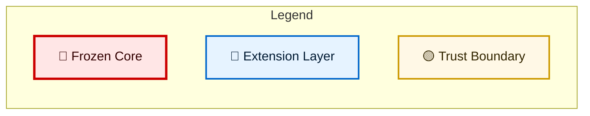
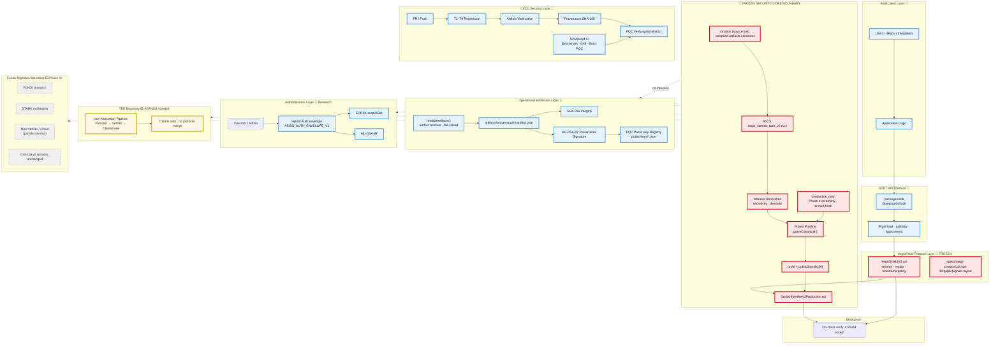
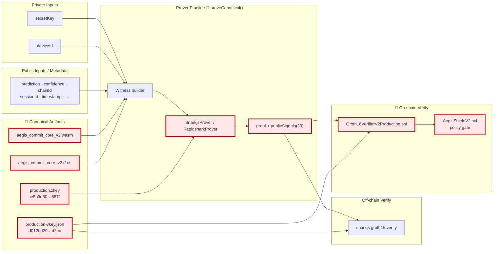
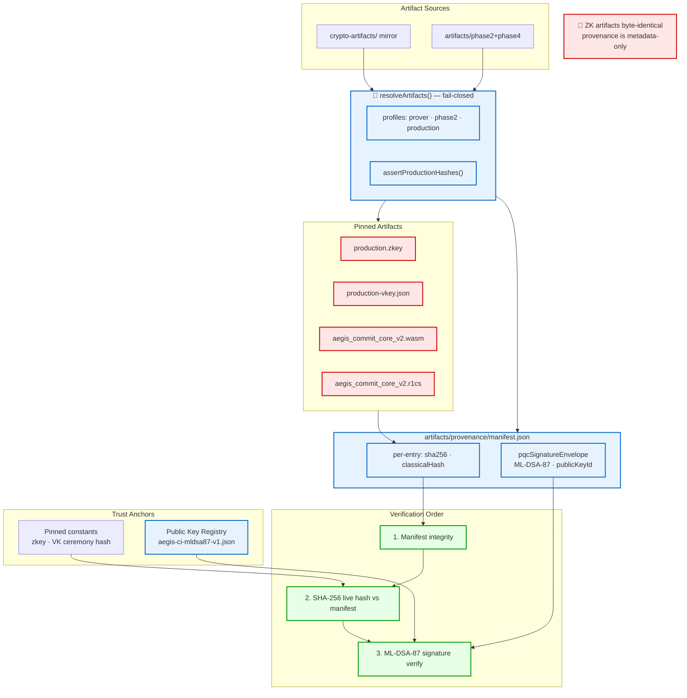
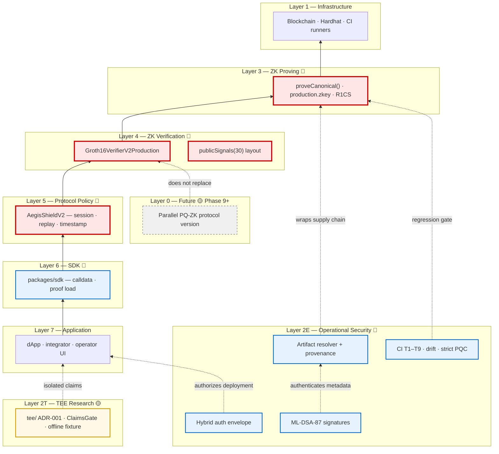
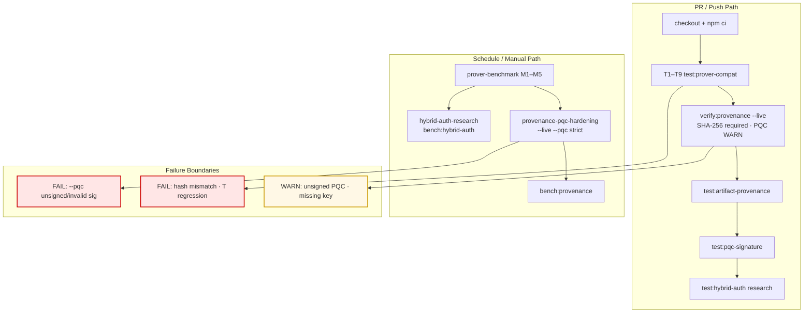
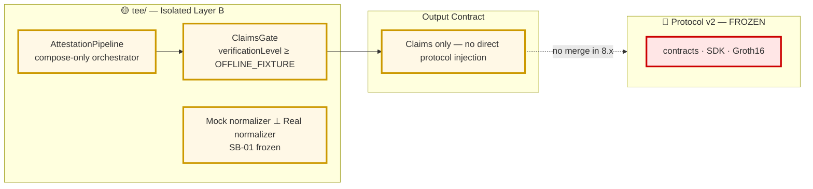
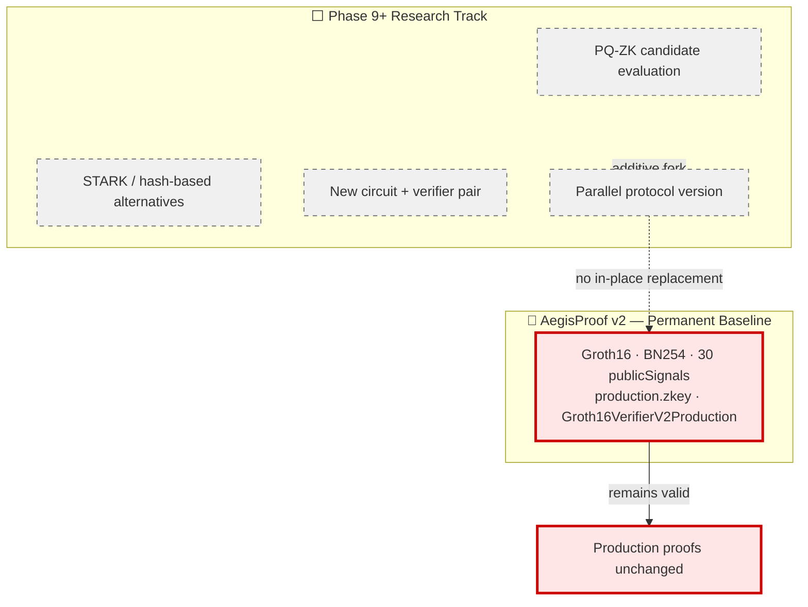

# AegisProof v2 — Full Architecture Diagram

**Version:** v2 (current final state as of Phase 8.13)  
**Audience:** Engineers, security auditors, architecture reviewers  
**Format:** Mermaid (SVG-exportable)  
**Scope:** ZK core, operational extensions, PQC layers, CI security, TEE boundary, future migration  

---

## Legend

| Symbol | Meaning |
|--------|---------|
| 🔴 **Frozen Boundary** | Immutable without Architecture Review — circuits, zkey, VK, verifier, protocol, SDK, `proveCanonical()` |
| 🔵 **Extension Layer** | Additive, rollback-safe — resolver, provenance, PQC, hybrid auth, CI tooling |
| 🟡 **Trust Boundary** | Explicit security isolation line |
| ➡️ **Data Flow** | Artifact / proof / signal movement |
| 🔒 **Trust Flow** | Verification / authorization / attestation |



---

## 1. AegisProof v2 — Full System Architecture



### Frozen vs Mutable Summary

| 🔴 Frozen (Architecture Review required) | 🔵 Mutable / Extension |
|----------------------------------------|------------------------|
| `circuits/` compiled artifacts | Prover backend (snarkjs / rapidsnark) |
| R1CS | `resolveArtifacts()` profiles |
| Trusted setup / `production.zkey` | Provenance manifest |
| Verification key (ceremony hash pinned) | ML-DSA-87 provenance layer |
| `publicSignals` layout (30) | Hybrid auth envelope (research) |
| `Groth16VerifierV2Production.sol` | CI tooling & benchmarks |
| `protocol/contracts/` | Public key registry (public keys only) |
| `packages/sdk/` API semantics | TEE research adapter |
| `proveCanonical()` return semantics | — |
| `tee/` ADR-001 boundary | — |

---

## 2. ZK Proof Flow Diagram

End-to-end Groth16 proof generation and verification — **entire path inside 🔴 Frozen Core**.



**Invariant checks (T1–T9):** proof verifies off-chain · on-chain · publicSignals 30/30 · zkey/VK hashes pinned · tampered proof/commitment rejected.

---

## 3. Artifact Trust Chain Diagram

Supply-chain integrity: classical hash binding + PQC authenticity — **does not alter ZK artifacts**.



---

## 4. PQC Integration Boundary Diagram

Shows **where PQC applies** vs **where Groth16 remains classical** — critical for audit.

```mermaid
flowchart TB
  subgraph ATTACK["Attacker Model"]
    A1["Supply-chain tampering"]
    A2["Manifest spoofing"]
    A3["Unauthorized deployment"]
    A4["Quantum break (BN254/Groth16)"]
  end

  subgraph DEFENSE["Defense Layers 🔵 Additive Only"]
    D1["SHA-256 integrity<br/>artifact-provenance.mjs"]
    D2["ML-DSA-87 provenance<br/>pqc-signature.mjs"]
    D3["Hybrid Auth Envelope<br/>ECDSA + ML-DSA-87"]
    D4["CI strict mode --pqc"]
  end

  subgraph FROZEN["🔴 FROZEN — NO PQC REPLACEMENT"]
    GROTH16["Groth16 proof system"]
    BN254["BN254 curve"]
    VERIFIER["Groth16VerifierV2Production"]
    PROVE["proveCanonical()"]
  end

  subgraph BOUNDARY["🟡 Trust Boundary"]
    LINE["PQC never enters proof/verify path"]
  end

  A1 --> D1
  A2 --> D2
  A3 --> D3
  A4 -.->|"monitor Phase 9+"| FUTURE2["Future PQ-ZK research"]

  D1 --> D2
  D2 --> D4
  D3 -.->|"future deploy gate"| DEPLOY["scripts/deploy.ts"]

  D1 -.-> LINE
  D2 -.-> LINE
  D3 -.-> LINE
  LINE -.-> GROTH16
  GROTH16 --> BN254 --> VERIFIER
  PROVE --> GROTH16

  classDef frozen fill:#ffe6e6,stroke:#cc0000,stroke-width:3px
  classDef extension fill:#e6f3ff,stroke:#0066cc,stroke-width:2px
  classDef attack fill:#fff0f0,stroke:#990000,stroke-width:1px
  classDef boundary fill:#fff8e6,stroke:#cc9900,stroke-width:4px

  class GROTH16,BN254,VERIFIER,PROVE frozen
  class D1,D2,D3,D4,DEPLOY extension
  class A1,A2,A3,A4 attack
  class LINE,BOUNDARY boundary
```



### Domain Separation (signing contexts)

| Layer | Domain String | Module |
|-------|---------------|--------|
| Artifact provenance | `AEGIS_ARTIFACT_PROVENANCE_V1` | `pqc-signature.mjs` |
| Deployment auth payload | `AEGIS_DEPLOYMENT_AUTH_V1` | `hybrid-auth-envelope.mjs` |
| Auth envelope wrapper | `AEGIS_AUTH_ENVELOPE_V1` | `hybrid-auth-envelope.mjs` |

---

## 5. Security Layer Stack Diagram

Defense-in-depth from user to chain — **audit view in ~5 minutes**.



---

## 6. CI/CD Security Flow



---

## 7. TEE Boundary (ADR-001)



---

## 8. Future Migration Boundary (Phase 9+)



---

## Quick Audit Checklist (5-Minute Review)

1. **Is Groth16 touched by PQC?** No — separate domains, separate modules, dashed boundary in §4.
2. **What fails closed?** Artifact resolver, SHA-256 mismatch, `--pqc` strict mode, T1–T9 regression.
3. **What is WARN-only?** Unsigned PQC on PR path; hybrid auth research mode.
4. **What is frozen?** Red-boxed nodes in §1 table — any change requires Architecture Review.
5. **TEE vs Protocol?** ADR-001 isolation — claims only, no contract merge.
6. **Future PQ?** Parallel version only — v2 Groth16 baseline preserved.
7. **GitHub vs Vault?** GitHub = code + public metadata; secrets in external storage — see [GitHub Security Boundary](./github-security-boundary.md).

---

## Trust Model Layers (Task 8 — GitHub Governance)

| Layer | Components | GitHub role |
|-------|------------|-------------|
| **Frozen Core** | circuits, R1CS, zkey hash, VK hash, Groth16Verifier, publicSignals(30), proveCanonical() | Hash pins only — binaries target external storage |
| **Operational Layer** | scripts, CI, benchmarks | Full repository management |
| **Trust Extension** | provenance, ML-DSA signatures, public key registry | Public keys + manifest; private keys in vault |
| **Secret Layer** | private keys, HSM, deployment credentials | **Never commit** — enforced by `check:sensitive-files` |

## SVG Export

Render any diagram to SVG via Mermaid CLI:

```bash
npx @mermaid-js/mermaid-cli -i docs/architecture/aegisproof-v2-full-architecture.md -o docs/architecture/diagrams/
```

Or paste individual fenced `mermaid` blocks into [Mermaid Live Editor](https://mermaid.live) for export.

---

## References

- [Architecture Overview](./overview.md)
- [GitHub Repository Boundary](./github-repository-boundary.md) — inventory A/B/C/D classification
- [GitHub Security Boundary](./github-security-boundary.md) — trust model, key lifecycle, CI gate
- [ADR-001 Architecture Hardening Freeze](./adr/001-architecture-hardening-freeze.md)
- [Prover Regression Contract](../perf/prover-regression-contract.md)
- [Phase 8.13 PQC CI Policy](../research/phase8.13-pqc-ci-policy.md)
- [Phase 8.13 Hybrid Auth Envelope](../research/phase8.13-hybrid-auth-envelope.md)
