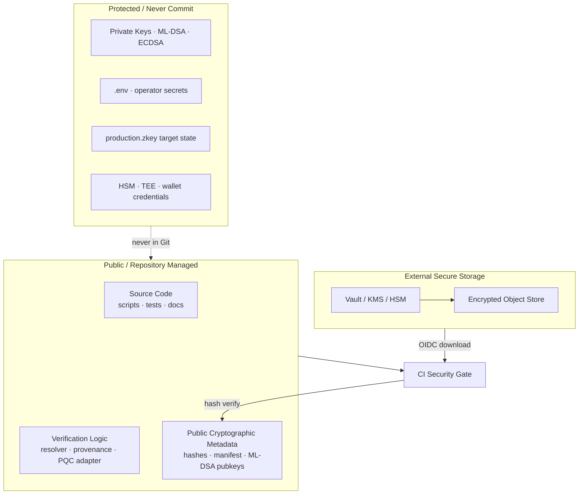
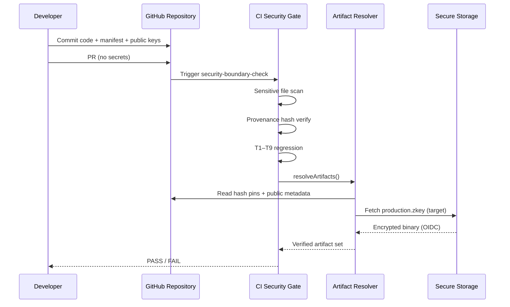
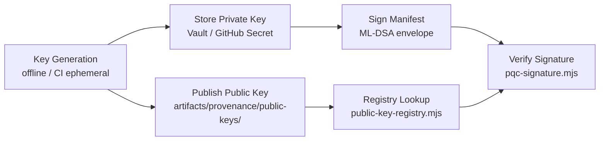

# GitHub Security Boundary — AegisProof v2

**Version:** 1.0  
**Date:** 2026-08-07  
**Status:** Repository governance (ZK core frozen)

---

## 1. Repository Trust Model

AegisProof v2 separates **trust layers** so GitHub remains auditable without holding production secrets.



### Trust Extension (Phase 8.13+)

| Layer | Trust anchor | GitHub role |
|-------|-------------|-------------|
| **Frozen Core** | circuits, R1CS, zkey hash, VK hash, Groth16Verifier, publicSignals(30) | Immutable pins in manifest |
| **Operational** | scripts, CI, benchmarks | Active development |
| **Provenance** | ML-DSA-87 signatures, public key registry | Public keys only |
| **Secret** | private keys, HSM, deployment credentials | **Never committed** |

---

## 2. GitHub Managed Assets

### Source & Verification

- `scripts/` — prover, provenance, PQC, auth tooling
- `tests/` — T1–T9, artifact provenance, PQC, hybrid auth
- `.github/workflows/` — reproducibility + security gates
- `packages/sdk/` — frozen public API (ADR boundary)

### Documentation

- `docs/architecture/` — system & repository boundaries
- `docs/research/` — PQC, hybrid auth research
- `docs/perf/` — benchmark methodology

### Public Cryptographic Metadata

| Asset | Location | Content |
|-------|----------|---------|
| Artifact manifest | `artifacts/provenance/manifest.json` | SHA-256 pins, schema v1 |
| Public key registry | `artifacts/provenance/public-keys/` | ML-DSA-87 CI key |
| Ceremony evidence | `artifacts/phase4/ceremony/`, `hashes/`, `transcripts/` | Non-secret audit trail |
| Hash constants | `scripts/lib/resolve-artifacts.mjs` | Frozen integrity anchors |

---

## 3. External Secret Assets

These **must not** appear in git history (enforced by `check:sensitive-files` + `.gitignore`):

| Category | Examples | Storage |
|----------|----------|---------|
| Proving keys | `production.zkey` | Secure object store (migration from `crypto-artifacts/`) |
| Private keys | `*.key`, `*.pem`, `artifacts/provenance/keys/` | Vault / HSM |
| Environment | `.env`, `.env.*` | CI secrets / deployment vault |
| Ceremony toxic waste | contribution randomness | Air-gapped archive |
| Operator auth | wallet mnemonics, keystore | HSM / MPC |
| TEE runtime | attestation signing keys | TEE-bound storage |

**Migration debt:** Legacy tracked paths are allowlisted in `scripts/sensitive-files-allowlist.json` with WARN until migrated.

---

## 4. Artifact Lifecycle



### Lifecycle stages

1. **Build** — circuits compiled; hashes recorded in manifest
2. **Ceremony** — production setup; toxic waste off-repo
3. **Pin** — SHA-256 committed to `manifest.json`
4. **Sign** — ML-DSA provenance envelope (optional strict tier)
5. **Verify** — CI `verify:provenance --live` on every PR
6. **Deploy** — resolver fetches from secure storage; hash check before use

---

## 5. Provenance Verification Flow

```
manifest.json
    │
    ├─► hash pins (wasm, r1cs, zkey, vkey)
    │
    ├─► optional PQC envelope
    │       ├─ domain: AEGIS_ARTIFACT_PROVENANCE_V1
    │       ├─ algorithm: ML-DSA-87
    │       └─ public key: artifacts/provenance/public-keys/
    │
    └─► verify-provenance-manifest.mjs --live
            ├─ hash match (required on PR)
            └─ PQC verify (WARN on PR, strict on schedule)
```

**CI tiers:**

| Event | Hash verify | PQC verify |
|-------|-------------|------------|
| Pull Request | **Required** | WARN if unsigned |
| Schedule / manual | **Required** | **Strict** (`--pqc`) |

---

## 6. Key Lifecycle



| Key type | Public (GitHub) | Private (External) |
|----------|-----------------|-------------------|
| ML-DSA-87 CI | `aegis-ci-mldsa87-v1.json` | `AEGIS_PQC_PRIVATE_KEY_HEX` secret |
| ECDSA deploy | fingerprint in research docs | HSM / operator vault |
| Groth16 proving | hash pin only | `production.zkey` in secure storage |

**Rotation:** New public key committed → old key deprecated in registry → private key rotated in vault → manifest re-signed.

---

## End-to-End Deployment Flow

```
Developer
    ↓  (PR: code + docs + manifest updates only)
GitHub Repository
    ↓  (security-boundary-check)
CI Verification
    ├─ check:sensitive-files
    ├─ verify:provenance --live
    └─ test:prover-compat (T1–T9)
    ↓
Artifact Resolver
    ├─ hash verify against manifest
    └─ load zkey from crypto-artifacts/ (current) → Secure Storage (target)
    ↓
Secure Storage
    ↓  (OIDC / short-lived credentials)
Production Deployment
```

---

## Enforcement Commands

```bash
npm run check:sensitive-files              # PR gate — fail on new secrets
npm run check:security-boundary            # sensitive + provenance
npm run verify:provenance -- --live        # hash required
npm run test:prover-compat                 # T1–T9 frozen boundary
```

---

## Frozen Boundary Confirmation

These **must not change** as part of repository governance work:

| Item | Status |
|------|--------|
| Groth16 core (circuits, R1CS) | 🔴 Frozen |
| production.zkey hash pin | 🔴 Frozen |
| VK hash pin | 🔴 Frozen |
| publicSignals (30) | 🔴 Frozen |
| proveCanonical() | 🔴 Frozen |
| Groth16VerifierV2Production.sol | 🔴 Frozen |

---

## Related Documents

- [GitHub Repository Boundary](./github-repository-boundary.md) — inventory classification A/B/C/D
- [AegisProof v2 Full Architecture](./aegisproof-v2-full-architecture.md)
- [Artifact Retention Policy](../artifact-retention.md)
