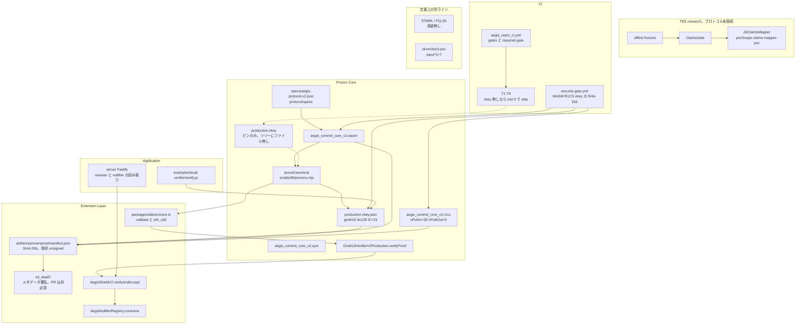

# AegisProof v2 Repository Architecture

調査日: 2026-10-05。対象は作業ツリー `cee47fb`（`master` から分岐した時点のスナップショット）。この文書は、その時点でリポジトリ内に存在したソース・設定・テスト・CI・生成物を読んだ結果である。README の記述は、対応する実装を確認できた場合にだけ採用している。

この文書は Frozen Core の変更提案ではない。既存成果物がどこにあり、何によって照合されているかを記録する。

## 1. Executive Summary

AegisProof v2 は、非公開入力 `secretKey` と `deviceId` を知っていることを、Poseidon で計算した `commitment` と `nullifier` に結び付けて示す Groth16 プロトコルである。公開出力は 30 個の field element で、オフチェーン検証は `snarkjs.groth16.verify`、オンチェーン検証は `Groth16VerifierV2Production.verifyProof(uint[2], uint[2][2], uint[2], uint[30])` である。

正本として確認できる v2 回路は、ソースではなくコンパイル済み成果物である。

| 成果物 | 場所 | この作業ツリーで確認した SHA-256 |
|---|---|---|
| WASM | `crypto-artifacts/phase2/phase2/r1cs/aegis_commit_core_v2_js/aegis_commit_core_v2.wasm` | `a0d3c53f3cdce624d5140874f0884b6b8075e701539978bdd55a826e41db60bd` |
| R1CS | `crypto-artifacts/phase2/phase2/r1cs/aegis_commit_core_v2.r1cs` | `3d47226b06d707b1765d7bf35acd01966b9800b0f6fb77cfe084a775f0fa5599` |
| シンボル | `crypto-artifacts/phase2/phase2/r1cs/aegis_commit_core_v2.sym` | `3aea81b1778b99c4191491234a717ab3f226805c0662151b9b785e290b69e390` |
| 検証鍵 | `crypto-artifacts/phase4/production-vkey.json` | `d012bd29ff6e4c44b4c656c7af6b289c5c8286a1554ce7b2b8fd1a7d3c67d2ec` |
| 証明鍵 | `artifacts/phase4/final/production.zkey`（gitignore。この作業ツリーにはファイルが無い） | ピン値 `ce5a3d308868f2fe7a6a8e3b68d717c3217f84b0ddfbb3dc155338b9be4d6571`（`scripts/lib/resolve-artifacts.mjs` の `PRODUCTION_ZKEY_HASH` と `artifacts/phase4/ceremony/ceremony-metadata.json`） |

R1CS ヘッダの実測値は `nPubOut=0`、`nPubIn=30`、`nPrvIn=2`、`nConstraints=6590`、`nWires=6618` である。検証鍵は `protocol=groth16`、`curve=bn128`、`nPublic=30`、`IC.length=31` である。`bn128` は snarkjs の曲線名であり、R1CS の素体と Solidity の事前コンパイル呼び出し先（アドレス 6、7、8）は、Ethereum の alt_bn128 / BN254 と同じ素体定数を使っている。

`protocol/circuits/aegis_commit_core.circom` は v2 の 30 信号回路ではない。コメントと `main {public [...]}` は公開入力 24 と公開出力 5、合計 29 である。対応する `circuits/aegis_commit_core.r1cs` のヘッダも `nPubOut=5`、`nPubIn=24`、`nPublic=29` である。v2 Circom ソース `aegis_commit_core_v2.circom` はリポジトリに無い。`docs/v2-circom-reconstruction-task.md` は、そのソースが Phase 2 以前に失われ、再構成は「定義のみで実装は認可されていない」と書いている。

外側の層は、SHA-256 マニフェスト、任意の ML-DSA-87 メタデータ署名、CI の回帰、SDK の calldata 変換、アプリケーション向けの読み取り API である。`tee/` の `ClaimsGate` はオフライン fixture 上の研究実装であり、`protocol/` や回路への import は確認できない。STARK と PQ-ZK は文書上の別ラインであり、証明経路の実装は確認できない。

このチェックアウトだけでは `production.zkey` が無いため、`tests/prover-compatibility.test.ts` は `artifactsReady()` が偽のとき exit 0 で T1–T9 をスキップする。PR 必須ジョブ `prover-compatibility` も、リポジトリ変数 `AEGIS_PRODUCTION_ZKEY_AVAILABLE == 'true'` のときだけ走る。

## 2. Repository Structure

追跡ファイルは 553 件（`git ls-files`）。`node_modules/` は gitignore されている。主要ディレクトリの役割は次のとおり。

| パス | 確認できた役割 |
|---|---|
| `protocol/contracts/` | Solidity。本番検証器、Shield、nullifier registry、29 信号の旧検証器 |
| `protocol/circuits/aegis_commit_core.circom` | 29 公開信号の Circom。v2 R1CS とは配線が一致しない |
| `protocol/specs` | JSON ファイル。ゲートと `scripts/phase2_verify.mjs` が読む SSoT |
| `specs/aegis-protocol.v2.json` | コード生成が読む SSoT。信号配列は `protocol/specs` と一致し、`crossContract` の文章だけ異なる |
| `crypto-artifacts/` | 追跡されている v2 WASM、R1CS、開発用 zkey / ptau、本番 vkey |
| `artifacts/phase4/` | セレモニー記録、ハッシュ、ベースライン証明 JSON。`production.zkey` は除外 |
| `artifacts/provenance/` | SHA-256 マニフェストと ML-DSA-87 公開鍵 |
| `packages/sdk/` | 信号検証、calldata 変換、viem による `eth_call` |
| `scripts/` | 証明、プロベナンス、ゲート、デプロイ補助 |
| `tests/` と `verification/tests/` | T1–T9、プロベナンス、ペネトレーション、Hardhat 統合 |
| `tee/` | TDX / SEV-SNP の研究アダプタと ClaimsGate |
| `formal/` | Lean 4。信号数 30 などのモデル。暗号実装そのものではない |
| `zkvm/risc0-poc/` | `input^2 + 7` の RISC Zero 実験。Groth16 経路とは未接続 |
| `server/` | Fastify。セッションと nullifier の読み取り |
| `examples/` | 多くは README。実行コードは `examples/local-verifier/verify.js` とブラウザのプレースホルダ HTML |
| `.github/workflows/` | 再現性 CI、セキュリティゲート、リリース、mainnet 事前確認 |
| `docs/` | ADR、研究計画、運用文書。実装の有無はソース側で再確認が必要 |
| `deployments/` | gitignore。この作業ツリーにはファイルが無い |

ルートの `hardhat.config.ts` は Hardhat 設定オブジェクトを `export` していない。読み込み時に `main()` を呼び、コントラクトをデプロイして `.env` と JSON を書くスクリプトである。証明テスト用の設定は `scripts/hardhat-prover.config.ts`（Solidity `0.8.28`、ソースは `scripts/prover-contracts`）である。`aegis_repro_ci.yml` の FAST ジョブは `npx hardhat compile` を `--config` なしで呼ぶ。このコマンドが成功するかは、本調査では実行していない。

## 3. Architecture Overview

システムは四層に分かれる。接続がコード上に無いものは、図でも接続していない。

### Frozen Core

Groth16 証明の意味を固定する層。入力は witness 用 JSON（公開 30 + 非公開 2）。出力は Groth16 proof と長さ 30 の `publicSignals`。実装の実体は `crypto-artifacts/` の WASM / R1CS / SYM、`crypto-artifacts/phase4/production-vkey.json`、`protocol/contracts/Groth16VerifierV2Production.sol`、`specs/aegis-protocol.v2.json` と `protocol/specs`、生成物 `generated/AegisSignals.ts` と `protocol/contracts/generated/AegisSignals.sol` である。証明関数は `scripts/lib/provers.mjs` の `proveCanonical()`。

セキュリティ上の意味は、検証者が信頼するのは「ピンされた R1CS と検証鍵に対する Groth16 の健全性」と「セレモニーで作られた証明鍵がその R1CS に対応していること」である。証明鍵ファイル自体はこの公開ツリーに無い。

### Extension Layer

証明の中身は変えず、成果物のハッシュ、任意の署名、回帰、SDK、コントラクトポリシーを足す層。入力はファイルバイト列、マニフェスト、proof JSON。出力は SHA-256、ML-DSA-87 署名封筒、calldata、`verifyAndAccept` の成否である。場所は `scripts/lib/artifact-provenance.mjs`、`scripts/lib/pqc-signature.mjs`、`packages/sdk/src/core.ts`、`protocol/contracts/AegisShieldV2.sol`、`.github/workflows/`。

ML-DSA-87 が署名するのはプロベナンスのエントリであり、Groth16 proof ではない。`pqc-signature.mjs` の先頭コメントも「ZK 検証経路には触らない」と書いている。

### TEE Isolation Boundary

`tee/integration/claims-gate.ts` の `ClaimsGate`。入力は正規化済み attestation と `TeeVerificationResult`。出力は `TeeClaims`（`teeProviderId`、`measurementHash`、`bindingNonce`、`pocScope: 'claims-mapper-poc'`）。`ZkClaimsMapper` のコメントは「`protocol/`、回路、信号スキーマには接続しない」と明記している。リポジトリ検索でも `protocol/` から `ClaimsGate` への import は無い。

### Future Migration Path

`FUTURE_RESEARCH_ROADMAP.md` と `docs/research/phase9-roadmap.md` に STARK、PLONK、Halo2、PQ-ZK が計画として書かれている。証明を置き換えるコードは確認できない。`zkvm/risc0-poc/` は別の小さな実験であり、30 信号の Groth16 を包んでいない。

### 技術スタックと実行環境

| 項目 | 確認した値 |
|---|---|
| 言語 | JavaScript / TypeScript（`"type": "module"`）、Solidity、Circom 2.1.6（存在するソースのみ）、Lean 4、Rust（RISC Zero PoC） |
| ZK | `snarkjs` `^0.7.6`。任意で rapidsnark（バイナリが無いと T2/T4 はスキップ） |
| 曲線名 | 成果物 JSON は `bn128`。素体は BN254 スカラー体 `21888242871839275222246405745257275088548364400416034343698204186575808495617`（SDK の `BN254_SCALAR_FIELD` と検証器の `r` が一致） |
| ハッシュ | 回路内は Poseidon（circomlib）。成果物照合は Node `crypto` の SHA-256 |
| PQC | `@noble/post-quantum` の `ml_dsa87`。開発依存 |
| チェーン | viem、Hardhat toolbox。CI の Node は 22 |
| サーバ | Fastify 5。`127.0.0.1:3000` |

### データフロー（実装されている範囲）

1. 呼び出し側が 32 キーの JSON を用意する（`crypto-artifacts/phase2/phase2/tests/input_v2.json` がテストベクタ）。
2. `proveCanonical()` が WASM witness calculator で witness を作り、zkey で Groth16 proof を出す。
3. `publicSignals.length === 30` でなければ例外。`verify: true` なら vkey で snarkjs 検証する。
4. SDK が信号個数・BN254 範囲・G2 座標順を検査し、`verifyProof` の ABI 引数を作る。
5. `AegisShieldV2.verifyAndAccept` が検証器を呼び、chainId、protocol version、時刻窓、ゼロ検査、セッション、purpose、nullifier 消費を追加する。

TEE の claims はこの列に入らない。

### 信頼境界（要約）

開発者マシンと Git はソースとピンされた公開成果物を運ぶ。`production.zkey` と署名秘密鍵はリポジトリの外に置く設計である（`.gitignore` と `scripts/lib/sensitive-files-policy.mjs`）。検証者は vkey と proof と publicSignals を検証できる。証明の健全性は、その vkey が意図した R1CS のセレモニーから来たことに依存する。その対応をこのツリーだけで再計算することは、zkey が無いためできない。

## 4. Frozen Core

### 4.1 何が凍結対象として宣言されているか

`docs/adr/0001-frozen-core.md` は、凍結を「ディレクトリを編集しない」ではなく「証明の意味、30 信号の並び、検証器の振る舞い、TEE をプロトコルへ融合しないこと」を Architecture Review なしに変えない、と定義している。宣言上の対象は、R1CS、`production.zkey` ハッシュ、検証鍵ハッシュ、`Groth16VerifierV2Production.sol`、`protocol/contracts/` の意味、SDK の `proveCanonical()` 戻り値、`publicSignals` 30、ADR-001 の TEE 隔離である。

CI が差分を拒否するパスは、この宣言より狭い。`.github/workflows/security-gate.yml` の `frozen-core` ジョブが列挙するのは次の 3 ファイルだけである。

- `crypto-artifacts/phase2/phase2/r1cs/aegis_commit_core_v2_js/aegis_commit_core_v2.wasm`
- `crypto-artifacts/phase2/phase2/r1cs/aegis_commit_core_v2.r1cs`
- `crypto-artifacts/phase4/production-vkey.json`

同じジョブが、これら 3 ファイルの SHA-256 をハードコード値と照合する。本調査で再計算したダイジェストは、その期待値と一致した。`production.zkey`、`.sym`、SSoT、Solidity、Circom はこのジョブの差分拒否リストに入っていない。

### 4.2 Groth16 と曲線

証明方式は成果物とコントラクトの両方で Groth16 である。

- `crypto-artifacts/phase4/production-vkey.json`: `"protocol": "groth16"`, `"curve": "bn128"`, `"nPublic": 30`
- `Groth16VerifierV2Production.sol`: snarkjs 生成。`verifyProof` が `staticcall` で事前コンパイル 7（加算）、6（スカラー倍）、8（ペアリング）を呼ぶ
- スカラー体 `r` とベース体 `q` は、Ethereum の alt_bn128（BN254）定数と同じ値である

リポジトリは曲線を `bn128` と表記する。BN254 という文字列を回路成果物の曲線フィールドには使っていない。SDK だけが定数名 `BN254_SCALAR_FIELD` を使っている。

### 4.3 WASM、R1CS、zkey

`scripts/lib/resolve-artifacts.mjs` の `resolveArtifacts()` が唯一の解決入口である。候補は `artifacts/phase2/...` を先に見、無ければ `crypto-artifacts/...` に落ちる。この作業ツリーでは WASM、R1CS、SYM、witness calculator、入力 JSON、開発用 zkey、本番 vkey は `crypto-artifacts/` 側に存在する。`artifacts/phase4/final/production.zkey` と `crypto-artifacts/phase4/production.zkey` はどちらも存在しない。

本番証明鍵を外に置く経路は環境変数 `AEGIS_PRODUCTION_ZKEY_PATH`（絶対パス必須）である。開発プロファイル `profile: "phase2"` は `aegis_v2_0000.zkey` を使う。この開発 zkey は Git に追跡され、`scripts/sensitive-files-allowlist.json` で移行債務として許可されている。

セレモニー記録 `artifacts/phase4/ceremony/ceremony-metadata.json` は次を述べている。

- `nPublic: 30`、`nConstraints: 6590`、`potPower: 14`
- 最終 zkey SHA-256 は上記ピンと一致
- `contributorPolicy`: 独立した人間の貢献者ではなく、スロットごとに `crypto.randomBytes` を使い、貢献後にエントロピーを捨てるオーケストレーションである
- beacon は Bitcoin genesis block hash、`iterationsExp: 10`
- `snarkjsVersion: "0.7.6"`

このメタデータは、セレモニーが「複数の独立した人間」であったとは書いていない。

### 4.4 証明と検証の流れ

`proveCanonical(input, opts)`（`scripts/lib/provers.mjs`）:

1. `assertCoreArtifacts` で wasm、witness calculator、zkey、vkey、input の存在を要求する。
2. witness calculator で `.wtns` を書く。
3. `SnarkjsProver` または、バイナリがあるときの `RapidsnarkProver` で証明する。rapidsnark が無く `allowFallback` が真なら snarkjs に落ち、警告を出す。
4. `publicSignals.length` が 30 でなければ例外。
5. `opts.verify !== false` なら vkey で `snarkjs.groth16.verify` し、偽なら例外。

オンチェーン側の T3 は、Hardhat 上に `scripts/prover-contracts/Groth16VerifierV2Production.sol` をデプロイして `verifyProof` を呼ぶ。このファイルは `protocol/contracts/Groth16VerifierV2Production.sol` とバイト一致である（どちらも 19069 バイト）。

### 4.5 publicSignals は 30 個か

v2 の正本については、次がすべて 30 で一致した。

| 根拠 | 値 |
|---|---|
| `specs/aegis-protocol.v2.json` の `publicSignals` 配列 | 30 |
| `protocol/specs` の同配列 | 30（文章 2 箇所以外は一致） |
| `circuitMechanism.publicInputs` | 30。`outputs: 0`。`privateInputs: 2` |
| R1CS ヘッダ | `nPubIn=30`、`nPubOut=0`、`nPrvIn=2` |
| `.sym` のワイヤ 1..30 | SSoT と同じ名前。31=`secretKey`、32=`deviceId` |
| 本番 vkey | `nPublic=30`、`IC.length=31` |
| Solidity | `uint[30] calldata _pubSignals`。IC 定数は 31 個 |
| `artifacts/phase4/reports/production_proof_baseline.json` | `publicSignals` の長さ 30 |
| `packages/sdk/src/generated/AegisSignals.ts` | `N_PUBLIC_SIGNALS = 30` |
| `proveCanonical` | `EXPECTED_PUBLIC_SIGNALS = 30` |

29 は別世代である。`build/vkey.json` は `nPublic: 29`。`Groth16Verifier.sol`、`Groth16Verifier24.sol`、`Groth16Verifier29.sol`、`AegisShield.sol` は `uint[29]`。`AegisVerifier.sol` は `uint[28]`。`DEPLOYMENT_INFO.md` は localhost の歴史的記録として 29 信号と `Groth16Verifier29` を書いており、本番マニフェストではないと冒頭で断っている。`verification/tests/integration/testVerifyAndAccept.ts` と `AegisShield.penetration.ts` には「Expected exactly 29 public signals」というアサーションが残っている。これは v2 の 30 信号テスト（`verification/tests/integration/AegisShieldV2.ts`、`Groth16VerifierV2Production.ts`）とは別ファイルである。

### 4.6 30 要素の意味

並びは `specs/aegis-protocol.v2.json` と `.sym` のワイヤ 1..30 が一致する。インデックスは Groth16 の `publicSignals[0]` がワイヤ 1 である。SSoT は input-flip を採用している。commitment と nullifier も公開入力として与え、回路内の再計算と等しいことを制約する。出力ワイヤは 0 である。`.sym` には `computedCommitment` と `computedNullifier` が非公開ワイヤとして存在する。

| Index | 名前 | SSoT 上の役割 |
|---|---|---|
| 0 | `expectedPromptRoot` | プロンプト内容の Merkle root。commitment 入力 |
| 1 | `expectedOutputRoot` | 出力内容の Merkle root。commitment 入力 |
| 2 | `sessionId` | 消費ドメイン。nullifier 入力。契約は非ゼロとセッション登録を要求 |
| 3 | `purposeId` | 用途。nullifier 入力。契約の allowlist |
| 4 | `weightsHash` | モデル重み。model manifest 経由で commitment |
| 5 | `tokenizerHash` | トークナイザ。同上 |
| 6 | `systemPromptHash` | システムプロンプト。同上 |
| 7 | `loraHash` | LoRA。同上 |
| 8 | `adapterHash` | アダプタ。同上 |
| 9 | `safetyLayerHash` | 安全層。同上 |
| 10 | `quantizationHash` | 量子化。execution env 経由で commitment |
| 11 | `precisionHash` | 精度。同上 |
| 12 | `runtimeHash` | ランタイム。同上 |
| 13 | `driverHash` | ドライバ。同上 |
| 14 | `temperature` | 生成パラメータ。generation commitment 経由 |
| 15 | `topP` | 同上 |
| 16 | `topK` | 同上 |
| 17 | `seed` | 同上 |
| 18 | `repetitionPenalty` | 同上 |
| 19 | `presencePenalty` | 同上 |
| 20 | `frequencyPenalty` | 同上 |
| 21 | `maxTokens` | 同上 |
| 22 | `chainId` | nullifier 入力。契約は `block.chainid` と比較 |
| 23 | `protocolVersion` | commitment と nullifier の両方。契約は `2` と比較 |
| 24 | `timestamp` | SSoT は「commitment にも nullifier にも入らない。契約の時間窓だけ」 |
| 25 | `modelManifestCommitment` | 回路が Poseidon で再計算し、公開値と一致させる |
| 26 | `executionEnvCommitment` | 同上 |
| 27 | `generationCommitment` | 同上 |
| 28 | `commitment` | Poseidon(6)。内容同一性。nullifier の入力 |
| 29 | `nullifier` | Poseidon(8)。消費識別子。registry が一度だけ消費 |

commitment の 6 入力は `expectedPromptRoot`、`expectedOutputRoot`、`modelManifestCommitment`、`executionEnvCommitment`、`generationCommitment`、`protocolVersion` である。timestamp、sessionId、purposeId、chainId は commitment から除外されている。

nullifier の 8 入力は `DOMAIN_NULLIFIER_V2`、`secretKey`、`deviceId`、`purposeId`、`sessionId`、`commitment`、`protocolVersion`、`chainId` である。ドメイン値は SSoT に固定され、ラベル `AEGIS_NULLIFIER_V2` から導出すると書かれている。生成コードの定数は `20148535406093122816468858649806210947444276317485944952083069500197208546562`。この導出を本調査で再計算してはいない。

非公開は `secretKey` と `deviceId` だけである（`.sym` ワイヤ 31 と 32）。

存在する Circom `protocol/circuits/aegis_commit_core.circom` は別物である。`chainId` が無く、`DOMAIN_SEPARATOR_V1 = 548923749238475923`、nullifier は Poseidon(5)、commitment は Poseidon(7) で `timestamp` を含む。コメントは「Total: 29 public signals」と書いている。このソースを v2 の実装と読んではならない。

### 4.7 回路変更の検知と成果物の完全性

検知は複数あり、範囲が違う。

| 機構 | 何を見るか | 失敗時 |
|---|---|---|
| `security-gate.yml` の差分拒否 | 上記 3 ファイルの git 差分 | ジョブ失敗 |
| 同ジョブの SHA-256 | 同じ 3 ファイルの内容 | ジョブ失敗 |
| `scripts/gates/gate_layout.mjs` | SSoT 30 件、`.sym` ワイヤ名、R1CS ヘッダ | `run_all.mjs` が非ゼロ。FAST / FULL CI で実行 |
| `scripts/gates/gate_icvk.mjs` | **開発** vkey（`vkey_v2.json`）の `nPublic=30` と `IC.length=31`、曲線点 | 同上。本番 vkey ではない |
| `scripts/codegen_signals.mjs` の CI | 生成された 3 つの信号ファイルが再生成後も diff ゼロ | FAST ジョブ失敗 |
| T6 / T7 | 解決された zkey と本番 vkey のピン | zkey が無いとスイート全体が exit 0 でスキップ |
| `verifyManifest` | マニフェスト SHA-256 と、存在する本番 zkey / vkey のピン | 不一致で exit 1。`--allow-missing-production-zkey` では zkey 欠落を必須から外す |

`ceremony-metadata.json` の `ssotSha256` は `90f7a6a0ee640f7c11c37a7040d8f5ba4733eb0fbb9d1e491704aa4a29df5cf4` である。現在の `protocol/specs` は `5a4b83a3…`、`specs/aegis-protocol.v2.json` は `4f43d6c1…` であり、どちらとも一致しない。信号配列の差分は無く、`crossContract` の文章 2 箇所だけが二つの SSoT 間で異なる。セレモニー記録の SSoT ハッシュが現ファイルと一致しない理由は、このツリーからは確認できない。

## 5. Extension Layer

### 5.1 SHA-256 とマニフェスト

`scripts/lib/artifact-provenance.mjs` の `createManifest()` が、解決された zkey、vkey、WASM、R1CS の SHA-256 を `artifacts/provenance/manifest.json` に書く。任意で rapidsnark バイナリと `benchmarks/reports/*.json` も含む。

コミット済みマニフェスト（`generatedAt: 2026-10-02T11:15:24.486Z`）では `production.zkey` が `present: false`、`sha256: null` である。WASM、R1CS、vkey のダイジェストは、本調査の再計算と一致する。`pqcPolicy.pqcSignatureRequired` は `false`。全エントリの `pqcSignatureEnvelope.status` は `unsigned` で、`signature` は `null` である。

検証順はコメントどおり、マニフェスト構造、ファイルハッシュ、その後の PQC である。`verifyLiveArtifacts()` はディスクからマニフェストを作り直してから `verifyManifest()` する。`--live` は成功時にマニフェストを書き戻す。

### 5.2 ML-DSA-87

`scripts/lib/pqc-signature.mjs` は `@noble/post-quantum` の `ml_dsa87` で署名し、検証する。署名バイト列はドメイン `AEGIS_ARTIFACT_PROVENANCE_V1` と、ソート済み鍵の JSON（artifact、path、sha256、size、version、source）である。封筒は `algorithmVersion: ML-DSA-87`、`version: v1` を要求する。

公開鍵は `artifacts/provenance/public-keys/aegis-ci-mldsa87-v1.json` にあり、`immutable: true`、用途は「CI verification registry」と書かれている。秘密鍵ディレクトリ `artifacts/provenance/keys/` は gitignore されている。この作業ツリーに秘密鍵ファイルは無い。

`verifyPqcSignatureEnvelope()` は、`required: false` のとき未署名を警告にし、エラーにはしない。`--pqc` または `--require-pqc` のとき必須成果物の未署名はエラーになる。PR の `aegis_repro_ci.yml` は `--pqc` を付けない。`--pqc` が付くのは、スケジュールまたは手動の `provenance-pqc-hardening` と、タグ時の `release.yml` である。

`release.yml` は環境 `release-signing` で `KMS_BACKEND_MODE=live`、Vault Transit、キー ID `aegis-provenance-prod-v1` を要求する。ライブ Vault がこのリポジトリの CI ランナーに接続され、そのジョブが成功しているかは、ワークフロー定義だけでは確認できない。README は「OIDC から Vault Transit への実接続は未検証」と書いている。`scripts/local-openssl-signer.mjs` と `security-kms-live-smoke.yml` は、セルフホストランナー上の OpenSSL ML-DSA-87 を想定した別経路である。

KMS 実装は `scripts/lib/kms-signer.mjs` と `scripts/lib/kms-backends/`（env、vault-auth、vault-transit、cloud-hsm、local-openssl、http-fetch）にある。テストは `tests/security/kms-signer.test.mjs` などである。ライブ HSM が本番で使われている証拠は、このツリーには無い。

### 5.3 コントラクトポリシー

`AegisShieldV2.verifyAndAccept` は Groth16 の後に、次をこの順で要求する。

1. `msg.sender == operator`
2. `verifier.verifyProof`
3. `pubSignals[22] == block.chainid`
4. `pubSignals[23] == 2`
5. timestamp が `block.timestamp` に対し、未来は 300 秒、過去は 86400+300 秒以内
6. sessionId、purposeId、commitment、nullifier が非ゼロ
7. 登録済みかつ active なセッションと purpose の一致
8. `AegisNullifierRegistry.consume`。呼び出し元 Shield が `authorizedConsumers` である必要があり、使用済み nullifier は `"Nullifier already used"`

`AegisCanonicalRegistry.verifierForChain` は chainId `31337` だけアドレスを返す。mainnet 定数 `MAINNET_VERIFIER` と `MAINNET_REGISTRY` はファイル内にあるが、関数は chainId `1` に対して `address(0)` を返す。コメントは「独立検証が終わるまで fail-closed」と書いている。したがって現在の `AegisShieldV2` コンストラクタは chainId 1 で `"Unsupported chain"` になる。

### 5.4 ローカル検証とランタイム検証

| 時点 | コード | 内容 |
|---|---|---|
| 証明直後 | `proveCanonical` の `verify` | snarkjs。既定で有効 |
| 開発者コマンド | `npm run verify:provenance -- --live` | 存在する成果物の SHA-256。zkey 欠落を許すフラグがある |
| 開発者コマンド | `npm run check:sensitive-files` | 秘密鍵パターンは即失敗。zkey / ptau / wtns は allowlist 以外で失敗 |
| オフチェーン契約読み取り | SDK `verifyOnChain` / `offChainVerify` | デプロイ済み検証器への `eth_call`。トランザクションは送らない |
| オンチェーン受理 | `AegisShieldV2.verifyAndAccept` | 検証に加えポリシー。operator だけが呼べる |
| サーバ | `server/src/routes/sessions.ts` | `sessionExists`、`sessions`、`usedNullifiers` の読み取り。証明はしない |

`computeProofHash`（SDK）は XOR であり、コメントが「暗号学的ハッシュではない」と書いている。

## 6. TEE / ClaimsGate Boundary

### 目的

`ClaimsGate.toClaims` は、検証結果が有効で、レベルが `OFFLINE_FIXTURE` 以上で、ポリシーが許可し、入力が mock でないときだけ `ZkClaimsMapper.toClaims` を呼ぶ。それ以外は `CLAIMS_GATE_DENIED`、`VERIFY_FAILED`、または `MOCK_IN_REAL_PATH` を返す（`tee/integration/claims-gate.ts`）。

### 入力と出力

入力は `RealNormalizedEvidence`、`TeeVerificationResult`、生レポート `Buffer`。出力は `TeeClaims`。`measurementHash` は生レポートの SHA-256 である。プロトコルの publicSignals には変換されない。

### データフロー

`tee/pipeline/attestation-pipeline.ts` が Provider、Verifier、Normalizer、`ClaimsGate`、Policy を研究パイプラインとしてつなぐ。レベルは `NONE=0`、`STRUCTURE_ONLY=1`、`OFFLINE_FIXTURE=2`、`OFFLINE_VERIFIED=3`、`HARDWARE_ROOTED=4`（`tee/domain/verification-level.ts`）。コメントは「高いレベルそれ自体が本番保証ではない」と書いている。

### 注入防止

防止しているのは、研究パイプラインの中で mock や未検証の attestation から `TeeClaims` を作ることである。Groth16 witness への注入を止めるコードは、プロトコル側に存在しない。接続が無いので、ClaimsGate を迂回しても v2 証明は変わらない。逆に、ClaimsGate を通しても v2 証明は作られない。

### fixture とテスト

`tee/verification/fixtures/` に TDX と SEV の fixture がある。テストは `tee/tests/claims-gate.test.ts`、`pipeline-e2e.test.ts`、`offline-verification.test.ts`、`real-tdx-poc.test.ts`、`real-sev-poc.test.ts` などである。CI ジョブ `tee-layer-regression` は `npx tsx tee/scripts/evaluate.ts` を PR と push で実行し、`required-gate` が成功を要求する。これは研究テストの実行であり、本番 TEE の遠隔証明ではない。

`tee/verification/tdx-dcap-verifier-stub.ts` と `sev-vcek-verifier-stub.ts` はスタブである。オフライン検証器ファイルも `tee/verification/` にある。ハードウェア上で DCAP / VCEK が通った記録は、このリポジトリからは確認できない。

### 本番コードとの接続

確認できない。`formal/AegisProof/TEE/Boundary.lean` は、受理された claims がゲートをそのまま通り、拒否された claims は `none` になる、という Lean 上のモデルである。Groth16 の制約にはコンパイルされていない。

分類: ClaimsGate は実験実装として存在し、テストがある。本番プロトコルには適用されていない。

## 7. Future Migration Path

| 項目 | リポジトリ上の状態 |
|---|---|
| STARK | `FUTURE_RESEARCH_ROADMAP.md` と `docs/research/phase9-roadmap.md` の研究項目。STARK 証明器のコードは無い |
| PQ-ZK / 格子ベース ZK | `docs/research/pqc-readiness.md` が「Groth16/BN128 の量子計算機による破壊は緩和されていない。PQ-ZK 研究を監視する」と書いている。置き換え実装は無い |
| PLONK / Halo2 | 同じロードマップの候補。実装は無い |
| RISC Zero | `zkvm/risc0-poc/` が `output = input^2 + 7` を証明する。README は「Frozen Core の置換ではない。本番証明経路は依存しない」と書いている |
| 並行稼働 | 文書は v2 を改修せず別ラインにする方針を書いている。第二の本番検証器はデプロイされていない |

ML-DSA-87 は移行先の ZK ではない。プロベナンスメタデータの署名アルゴリズムである。

## 8. End-to-End Data Flow

実装に合わせた流れは次である。証明鍵が作業ツリーに無いため、ステップ 3 以降の本番証明はこのチェックアウト単体では実行できない。

```
input JSON (32 keys: 30 public + secretKey + deviceId)
  -> witness calculator (aegis_commit_core_v2.wasm)
  -> R1CS witness
  -> Groth16 prove (production.zkey または、phase2 プロファイルの dev zkey)
  -> { proof.pi_a, pi_b, pi_c, publicSignals[30] }
  -> snarkjs.groth16.verify(production-vkey.json)
  -> SDK grothProofToCalldata (snarkjs の G2 を Solidity の (x,y) 順へ)
  -> Groth16VerifierV2Production.verifyProof
  -> 任意で AegisShieldV2.verifyAndAccept
       -> AegisNullifierRegistry.consume
```

前処理として、モデル識別子や生成パラメータを field element にする処理は、回路の外である。回路は与えられた field を Poseidon する。チャンク木 `circuits/chunk_tree/aegis_chunk_tree.circom`（16 葉の Poseidon 木）は別回路であり、`proveCanonical` からは呼ばれない。

`examples/local-verifier/verify.js` は `artifacts/phase4/final/production-vkey.json` を読む。そのパスはこの作業ツリーに無い。解決器が実際に使う本番 vkey は `crypto-artifacts/phase4/production-vkey.json` である。

サーバは証明を受け取らない。設定された Shield アドレスに対し、セッションと nullifier の状態を読む。

## 9. Integrity and Artifact Protection

### 何を、いつ、どこで、どのコードが、どう検証するか

| 対象 | いつ | どこ | コード | 方法 |
|---|---|---|---|---|
| v2 WASM | push / PR の `security-gate.yml`（パス条件付き）と、毎日 19:00 UTC | GitHub Actions `frozen-core` | インライン Node | ファイル SHA-256 が `a0d3c53f…db60bd` |
| v2 R1CS | 同上 | 同上 | 同上 | `3d47226b…fa5599` |
| 本番 vkey ファイル | 同上 | 同上 | 同上 | 生ファイル SHA-256 が `d012bd29…d2ec`。このファイルでは `sha256VkeyCeremony`（`JSON.stringify(v, null, 2)`）とも一致した |
| 本番 zkey | zkey が解決できるときだけ | ローカルまたは `AEGIS_PRODUCTION_ZKEY_PATH` がある CI | `sha256File` と `PRODUCTION_ZKEY_HASH` | T6 と `verifyManifest`。ファイルが無い PR では T1–T9 がスキップされ、provenance は `--allow-missing-production-zkey` |
| 開発 vkey | FAST の `node scripts/gates/run_all.mjs` | CI とローカル | `gate_icvk.mjs` | `nPublic`、IC 長、bn128 上の点 |
| 信号レイアウト | 同上 | 同上 | `gate_layout.mjs`、`gate_binding.mjs`、`gate_domain.mjs`、`gate_forbidden_hardcode.mjs` | SSoT、sym、R1CS、Poseidon 束縛 |
| publicSignals 個数（JSON） | `security-gate.yml` の `public-signals` | CI | インライン Node | `specs/aegis-protocol.v2.json` の配列長が 30。中身の名前は見ない |
| ML-DSA | 署名があるとき、または `--pqc` | `verifyEnvelope` | `ml_dsa87.verify` | レジストリまたは封筒内の公開鍵。PR の live provenance は未署名を警告のまま成功させうる |
| 秘密ファイル | `security-boundary-check` | `npm run check:sensitive-files` | `scripts/check-sensitive-files.mjs` | CRITICAL は allowlist なし。zkey/ptau/wtns は `scripts/sensitive-files-allowlist.json` の 7 パスだけ許可 |

allowlist の 7 パスは、開発 zkey 1、ptau 5、`witness_v2_baseline.wtns` 1 である。README は移行債務を 8 パスと書いている。allowlist ファイルの配列長は 7 である。

`--strict` は allowlist 済みの移行債務も失敗させる。PR の `check:sensitive-files` 呼び出しに `--strict` は付いていない。

署名の検証経路は「公開鍵ファイルがリポジトリにあり、`ml_dsa87.verify` がそれを使う」ところまで確認できる。コミット済みマニフェストは未署名なので、その公開鍵で検証できる署名は、このツリーのマニフェストには無い。鍵の生成儀式や、公開鍵が期待する運営者のものであることは、リポジトリだけでは確認できない。

## 10. CI/CD Security Gates

### T1–T9

実装は `tests/prover-compatibility.test.ts`。起動は `npm run test:prover-compat`（`scripts/run-prover-compat.mjs` が Hardhat 設定を `scripts/hardhat-prover.config.ts` にして tsx で実行する）。

`artifactsReady()` が偽なら、最初の行で `SKIP prover-compatibility: production artifacts absent` を出して **exit 0** する。本番 zkey が無いと T1–T9 は実行されないまま成功する。

| Test | Purpose | Target | Pass Condition | Failure Effect | Implementation |
|---|---|---|---|---|---|
| T1 | snarkjs 証明を snarkjs で検証 | 解決された wasm と zkey と本番 vkey | `groth16.verify === true` | プロセス exit 1。ただし成果物欠落時はスイートごとスキップ | `proveCanonical(..., backend:"snarkjs", verify:false)` の後に verify |
| T2 | rapidsnark 証明を snarkjs で検証 | rapidsnark バイナリ | verify が真 | バイナリが無いと `SKIP T2`（失敗にしない）。ある場合の失敗は exit 1 | `isRapidsnarkAvailable()` |
| T3 | snarkjs 証明をチェーン上で検証 | ローカルデプロイした `Groth16VerifierV2Production` | `verifyProof === true` | exit 1（スキップ条件は同じ） | Hardhat viem |
| T4 | rapidsnark 証明をチェーン上で検証 | 同上 | `verifyProof === true` | バイナリ無しは SKIP | 同上 |
| T5 | 公開信号の一致 | 長さと `production_proof_baseline.json` | 長さ 30 かつ全要素一致 | exit 1 | 配列比較。ベースラインファイルは `artifacts/phase4/reports/` にあり、長さ 30 を確認した |
| T6 | zkey 改ざん | 解決された zkey ファイル | SHA-256 が `PRODUCTION_ZKEY_HASH` | exit 1。ファイルが無い実行では到達しない | `sha256File` |
| T7 | vkey 改ざん | 解決された vkey | ceremony 形式 SHA-256 が `PRODUCTION_VKEY_HASH` | exit 1。zkey 欠落でスイートが先にスキップされると到達しない | `sha256VkeyCeremony` |
| T8 | 改ざん拒否 | publicSignals[28] を +1、および `pi_a[0]` を +1 | snarkjs とオンチェーンが偽 | 偽にならないと exit 1 | インデックス 28 は `commitment` |
| T9 | ベンチ出力の形 | `scripts/bench_prover.mjs --samples 2 --modes M2` | exit 0 かつレポートに `generatedAt`、`samples`、`hashes`、`modes` | exit 1 | 新しい `benchmarks/reports/prover-bench-*.json` を読む |

### CI で必須か、失敗は merge を止めるか

| ワークフロー | トリガ | T1–T9 | 失敗時にジョブが赤くなるか | merge を止めるか |
|---|---|---|---|---|
| `aegis_repro_ci.yml` `security-boundary-check` | push と PR | `npm run test:prover-compat` を常に実行 | テストが exit 1 のとき。欠落時の exit 0 では赤くならない | このジョブは `required-gate` の対象。GitHub の ruleset がこのチェックを必須にしているかはリポジトリ内からは確認できない。`dependency-security-update.yml` は「master ruleset が最終ゲート」とコメントしている |
| `aegis_repro_ci.yml` `prover-compatibility` | push / PR **かつ** `vars.AEGIS_PRODUCTION_ZKEY_AVAILABLE == 'true'` | 実行する | 失敗すると `required-gate` が exit 1 | 変数が偽のときジョブは skipped。`required-gate` は skipped を成功として扱う |
| `security-gate.yml` `regression` | master/main への push、毎日、および列挙パスへの PR | 実行する | exit 1 でジョブ失敗。欠落時は exit 0 | branch protection の必須チェックかどうかは確認できない |
| `release.yml` | タグ `v*.*.*` | T1–T9 は呼ばない | sensitive scan と phase813 と provenance `--pqc` | リリースジョブの失敗はタグの Release 作成を止める。merge とは別 |

`required-gate` が push / PR で成功を要求するのは、`security-boundary-check`、`fast`、`phase5-readiness`、`tee-layer-regression`、条件付きの `prover-compatibility`、`formal-assurance`、`hybrid-auth-research` である。週次または手動では `full`、`prover-benchmark`、`provenance-pqc-hardening`、`security-penetration-full`、`phase813-regression`、`hybrid-auth-research` を要求する。

### 改ざん検知と偽陰性・偽陽性

- WASM、R1CS、本番 vkey のバイト改ざんは、`security-gate.yml` のハッシュジョブが、そのワークフローが走ったときに検出する。PR の `paths` フィルタに合わない変更では、このワークフロー自体が走らない。push と日次 cron はパスフィルタが無い。
- `production.zkey` の差し替えは、ファイルが検証環境にあり T6 か `verifyManifest` が必須モードで走ったときに検出できる。既定の PR 経路は欠落を許す。
- T2/T4 のスキップは、rapidsnark 固有の不整合を見逃す。snarkjs 経路の T1/T3 は、成果物がある実行では残る。
- T8 は commitment スロットと `pi_a` の一点だけを改ざんする。他の信号スロットや `pi_b` / `pi_c` の拒否は、このテストでは網羅していない。Groth16 検証器がそれらを拒否するかどうかは、このテストの範囲外である。
- `public-signals` ジョブは個数だけを見る。名前の入れ替えは、このジョブでは検出できない。名前は `gate_layout.mjs` が `.sym` と SSoT で見る。
- PT-07 のライブ Shield 実行は `PT_RUN_SHIELD_LIVE=1` のときだけである。`security-penetration-full` のライブ実行は `continue-on-error: true` である。
- 偽陽性: `verify:provenance --live` はマニフェストを書き戻す。`security-gate.yml` の regression は最後に `git diff --exit-code` する。live 検証が追跡ファイルを汚すと、暗号の失敗ではなく作業ツリー差分で落ちうる。

## 11. SDK / Application Layer

パッケージは `packages/sdk` の `@zenoamo/aegisproof-sdk` 1.0.0。公開入口は `src/core.ts`（`src/index.ts` が再エクスポート）。ビルド成果物 `dist/` は `files` に含まれるが、この作業ツリーに `dist/` は無い。`npm run build`（SDK ディレクトリの `tsc`）が必要である。公開レジストリは `https://npm.pkg.github.com`。ワークフロー `publish-sdk.yml` は GitHub Release または手動で、テスト、ビルド、pack、publish を行う。

### API

確認できる関数は次である。

- 信号: `validateSignalCount`、`validateSignalValues`、`buildPublicSignals`、`parsePublicSignals`
- calldata: `toCalldataSignals`（十進文字列を 64 桁へパッド。`0x` は付けない）、`grothProofToCalldata`（G2 の軸を入れ替える）
- クライアント: `createVerifierClient`、`assertVerifierClientChainId`
- 検証: `estimateVerifyGas`、`offChainVerify`、`verifyOnChain`
- 補助: `decodeRevertReason`、`computeProofHash`（XOR。暗号学的ハッシュではない）

`proveCanonical` は SDK パッケージの外、`scripts/lib/provers.mjs` にある。SDK は証明を生成しない。

### エラー

`InvalidSignalCountError`（30 以外）、`SignalMappingError`（名前欠落）、`InvalidSignalValueError`（十進以外、または素体以上）、`InvalidProofStructureError`、`VerificationKeyMismatchError`（クラスはある。`core.ts` 内で VK ハッシュを比較する呼び出しは確認できない）、`GasEstimationError`、`ChainIdMismatchError`、`AegisSDKError`。

`offChainVerify` は例外を握って `{ success: false }` を返す。`verifyOnChain` は `AegisSDKError` を投げる。

### テスト

`packages/sdk/test/index.test.ts` は個数、インデックス、パッド、不正値を見る。`packages/sdk/test/integration.test.ts` も存在する。CI の `phase5-readiness` が SDK の install、build、unit test、pack dry-run を行う。

### 外部利用

`examples/local-verifier/verify.js` は snarkjs でベースライン証明を検証する。`examples/browser-verifier/index.html` は「Phase 6 のプレースホルダ」という一文である。`examples/contract-interaction/`、`proof-login/`、`device-auth/`、`api-authorization/`、`ai-agent-auth/` は README のみで、対応する実行スクリプトは確認できない。

サーバ `aegisproof-server` は `GET /sessions/:sessionId` と `GET /nullifiers/:nullifier` を提供する。チェーンは viem の `localhost`。証明検証エンドポイントは無い。

## 12. Security Model

リポジトリから読める脅威と、確認できた防御である。「想定」はコードまたはテストが明示的に扱っている場合だけとした。

| 脅威 | 想定されているか | 防御 | 防御地点 | 検証方法 | 残る範囲 |
|---|---|---|---|---|---|
| 成果物改ざん | はい。T6/T7、provenance、security-gate ハッシュ | SHA-256 ピン | CI とローカル検証 | 3 ファイルは再計算で一致。zkey はファイル不在 | zkey 不在の PR は証明再実行をしない |
| 回路変更 | 部分的 | R1CS/WASM のハッシュと layout ゲート | CI | ヘッダと sym | v2 Circom ソースが無いので、ソース diff では検知できない |
| zkey 差し替え | はい。T6 とピン定数 | SHA-256 | zkey がある環境 | `PRODUCTION_ZKEY_HASH` | 公開リポジトリだけでは再検証できない。開発 zkey は別ファイルとして Git にある |
| WASM 差し替え | はい | SHA-256 | security-gate と provenance | 再計算一致 | security-gate の PR パスフィルタ外は、その PR では走らない |
| R1CS 差し替え | はい | 同上 | 同上 | 再計算一致 | 29 信号の `circuits/aegis_commit_core.r1cs` は別ファイルで、このピンの対象外 |
| 署名偽造 | 検証関数はある | ML-DSA-87 verify | `--pqc` または署名付き封筒 | 単体テスト `tests/pqc-signature.test.mjs` | コミット済みマニフェストは未署名。PR は警告で通過しうる。公開鍵の運営者束縛はリポジトリ外 |
| publicSignals 改ざん | はい。T8 と Shield | Groth16 検証が証明と信号を束縛。Shield が一部スロットを再検査 | 検証器と Shield | T8 は index 28 と `pi_a` | 検証器は信号の意味（時刻や chain）を知らない。意味は Shield の追加検査 |
| calldata 改ざん | 部分的 | 検証器が受け取る値をそのまま検証する | オンチェーン | SDK は形と素体範囲を見る | SDK の `toCalldataSignals` は 64 桁パッドであり、完全な ABI エンコーダではない。契約呼び出しは `grothProofToCalldata` と `BigInt` を使う |
| 悪意ある claims | 研究経路のみ | ClaimsGate のレベルと mock 拒否 | `tee/` | `claims-gate.test.ts` | プロトコルへ入らない |
| 無許可データ注入 | プロトコルでは witness は証明者が選ぶ | 健全性は「その witness が R1CS を満たす」こと。外部データの真正性は回路の外 | 回路はハッシュ等価だけを制約 | ゲートの binding テスト | プロンプト本文や TEE 測定値が回路に自動では入らない |
| CI サプライチェーン | 部分的 | `npm ci`、lockfile、`npm audit`、actions の SHA ピン、fast-uri バージョンゲート、CodeQL | `security-gate.yml`、`security-agent.yml`、`aegis_repro_ci.yml` | ワークフロー定義 | `elan-init.sh` は curl の浮動 URL。branch protection の実設定は未確認。Dependabot は PR を開くだけでマージはしない |
| リプレイ | はい | nullifier registry | `AegisNullifierRegistry.consume` | `AegisShieldV2.ts` がクロスデプロイのリプレイをテスト | 契約アドレスは nullifier に入らない。共有 registry に依存する。mainnet では canonical アドレスが返らない |
| オペレータ不正 | 部分的 | `verifyAndAccept` とセッション登録は operator のみ | Shield | 統合テスト | operator 鍵の保管はリポジトリ外。operator は目的の allowlist を変更できる |

Groth16 の健全性、Poseidon の衝突耐性、BN254 の離散対数、セレモニーの毒性廃棄物が破棄されていることは、このリポジトリが証明している性質ではない。セレモニー記録は、貢献がオーケストレーションされた乱数であると自ら書いている。

## 13. Trust Boundaries

| 境界 | 信頼しているもの | 信頼していないもの | どこで検証するか |
|---|---|---|---|
| 開発者環境 | ローカルに置いた zkey と Node | 作業ツリーの改変、秘密鍵の混入 | `check:sensitive-files`、provenance、任意の T1–T9 |
| リポジトリ | 追跡された WASM、R1CS、vkey、SSoT、検証器ソース | `production.zkey`、PQC 秘密鍵、`.env`、`deployments/` | gitignore と sensitive scan。ハッシュは CI |
| CI/CD | GitHub Actions の Ubuntu ランナーと pin された action SHA | 浮動の elan インストールスクリプト。必須チェックの設定そのもの | `required-gate` がジョブ結果を見る。ruleset の中身は未確認 |
| ビルド成果物 | ピンされた 3 ファイルのバイト列 | ソースからの再コンパイル（v2 Circom が無い） | SHA-256。再コンパイル一致は未実施であり、文書も byte 一致を要求していない |
| 証明環境 | zkey と WASM を持つ証明者 | 証明者は witness の公開フィールドを選べる。健全性は R1CS 充足だけを保証 | 検証器。意味の一部は Shield |
| 検証環境 | ピンされた vkey と snarkjs または Solidity 検証器 | 検証器コントラクトが別アドレスへ差し替わること | SDK は渡されたアドレスを呼ぶ。VK ハッシュとチェーン上バイトコードの一致を SDK が自動では取らない |
| TEE / ClaimsGate | 研究テストが fixture を拒否または受理すること | ハードウェア TEE が本番で証明者を包んでいること | `tee/tests`。プロトコルとは未接続 |
| ブロックチェーン | デプロイされた検証器バイトコードと registry | 現在のコードは chainId 1 の canonical アドレスを返さない | `AegisCanonicalRegistry`。ライブ mainnet コードは確認できない |
| 外部アプリ | SDK の形検査 | アプリが正しい検証器アドレスと正しい 30 信号を渡すこと | アプリ側。ブラウザ例はプレースホルダ |

## 14. Reproducibility

| 項目 | 状態 |
|---|---|
| 依存ロック | `package-lock.json` と `server/package-lock.json` がある。CI は `npm ci`。`security-gate.yml` は `npm install --package-lock-only` のあと lockfile diff が空であることを見る |
| 決定的ビルド | 信号コード生成は FAST で diff ゼロを要求する。回路の再コンパイル手順は、v2 ソースが無いため閉じない |
| 成果物生成 | WASM と R1CS はコミット済み。第三者はハッシュを再計算できる。本調査でピンと一致した |
| 回路コンパイル | v2 `.circom` は無い。29 信号ソースは別物 |
| 証明鍵生成 | セレモニー手順の記録とハッシュはある。`production.zkey` はツリーに無い。開発 ptau と `aegis_v2_0000.zkey` は追跡されている |
| 検証鍵 | `production-vkey.json` は追跡され、ハッシュ一致を確認した。IC は 31 |
| ハッシュ検証 | 3 ファイルはローカル再計算と CI 期待値が一致。zkey は期待値のみ |
| テスト fixture | `input_v2.json` と 3 つの負例 JSON、`production_proof_baseline.json`（proof と 30 信号）が追跡されている |
| 再現可能な検証 | vkey とベースライン proof があれば snarkjs 検証は第三者に可能である。`examples/local-verifier/verify.js` は存在しないパス `artifacts/phase4/final/production-vkey.json` を読む。証明の再生成は zkey が必要 |
| Lean | `formal/` の `lake build` が PR 必須。証明しているのは「仕様レコードの信号数が 30」などのモデルであり、R1CS の健全性ではない（`FrozenCore.lean` のコメント） |

`aegis_repro_ci.yml` の `full` ジョブは、スケジュールと手動のときだけ `phase2_verify.mjs` の FULL を走らせる。FULL は開発セットアップを含み、本番セレモニーの再実行ではない（スクリプト冒頭のコメント）。

## 15. Supply Chain Security

- ピン: npm lockfile。ルート `package.json` の `overrides` は `ws` `8.21.1`、`adm-zip` `0.6.1`、`fast-uri` `>=4.2.1`、`underscore` `>=1.13.8`。
- 依存の範囲指定は `^` を含むが、インストールは lockfile 経由である。
- GitHub Actions の `actions/checkout` と `actions/setup-node`、CodeQL、`softprops/action-gh-release` はコミット SHA で固定されている。
- `formal-assurance` の elan は `https://raw.githubusercontent.com/leanprover/elan/master/elan-init.sh` をその場で実行する。SHA ピンではない。
- Dependabot（`.github/dependabot.yml`）はルートと `server/` を毎日見る。ラベルは `dependencies` と `security`。自動マージの設定はファイルに無い。
- `security-agent.yml` は CodeQL `security-extended` と、秘密鍵らしき文字列、疑わしい実行パターンのヒューリスティックを走らせる。
- `security-gate.yml` は fast-uri の最低バージョンと `npm audit` を見る。fast-uri が lockfile に無い場合、そのステップは exit 0 である。
- リリース成果物: タグ時に GitHub Release を作り、`artifacts/provenance/manifest.json` を添付する。Release 前に live KMS 署名を要求する。成功実績は未確認。
- 署名: アルゴリズムと検証関数と公開鍵ファイルはある。コミット済みマニフェストは未署名。本番キー ID `aegis-provenance-prod-v1` の公開鍵は `artifacts/provenance/public-keys/` には無く、そこにあるのは `aegis-ci-mldsa87-v1` である。
- 秘密: `.env`、`*.pem`、`artifacts/provenance/keys/`、`deployments/` は gitignore。スキャンの CRITICAL に allowlist は無い。
- ビルド環境: GitHub ホスト `ubuntu-latest`、Node 22。KMS live smoke はセルフホストランナーをコメントで要求する。そのランナーが常時接続されているかは未確認。
- `tests/security/elliptic-supply-chain.test.mjs` が本番依存境界をテストする。中身の合否は本調査では実行していない。
- `.github/CODEOWNERS` は先頭が Markdown のフェンスであり、`@user` の所有者行が無い。列挙パスも `/circuit.wasm` のように、実際の成果物パスと一致しない。GitHub のレビュー強制としては機能しない形である。

## 16. Implementation Status

### IMPLEMENTED

コードとテストの両方がある。

- Groth16 検証器 `Groth16VerifierV2Production`（30 信号、IC 31、precompile 6/7/8）
- 30 信号の SSoT、生成定数、`.sym`、R1CS ヘッダ、本番 vkey、ベースライン proof JSON
- `proveCanonical` と snarkjs 検証（zkey が存在する環境）
- SDK の信号検査、G2 並べ替え、`eth_call` 検証
- `AegisShieldV2` のポリシーと `AegisNullifierRegistry`
- SHA-256 プロベナンス検証（存在するファイルに対して）
- ML-DSA-87 の署名と検証関数、CI 公開鍵ファイル、単体テスト
- T1–T9 のテストコード
- レイアウト、束縛、IC、ドメイン、禁止ハードコードのゲート
- sensitive-file スキャン
- 信号コード生成の決定性チェック

### IMPLEMENTED / PARTIAL

- 本番証明: コードはある。`production.zkey` はツリーに無く、PR の T1–T9 はスキップ成功しうる
- PQC の CI 強制: 検証器はある。PR は未署名を警告にしうる。タグの release ワークフローは `--pqc` と live Vault を要求するが、接続成功は未確認
- KMS / HSM / OIDC: バックエンドとモックテストはある。ライブ適用は未確認
- mainnet: アドレス定数と fail-closed の lookup がある。chainId 1 では Shield を構築できない。ライブデプロイは確認できない
- rapidsnark: 任意。無いと T2/T4 はスキップ
- サーバ: 読み取り API のみ
- Lean: モデルの定理。暗号実装の検証ではない
- `hardhat.config.ts`: デプロイスクリプトであり、設定モジュールではない

### EXPERIMENTAL

- `tee/` 一式。ClaimsGate、オフライン fixture、TDX/SEV スタブと PoC テスト。プロトコル未接続
- `zkvm/risc0-poc/`。`input^2 + 7`
- `verification/zk-dummy/`。本番回路を使わない評価用パイプライン（README が Phase 8.2 の評価枠と記載）
- `circuits/chunk_tree/aegis_chunk_tree.circom`。`proveCanonical` から未接続
- ハイブリッド認証封筒（`scripts/lib/hybrid-auth-envelope.mjs` とテスト）。Groth16 の代替ではない
- ブラウザ検証 HTML はプレースホルダ

### PLANNED / DOCUMENTED ONLY

- STARK、PQ-ZK、完全な耐量子 ZK、PLONK、Halo2（ロードマップ）
- v2 Circom ソースの再構成（`docs/v2-circom-reconstruction-task.md` は DEFINITION ONLY）
- 本番 TEE が証明者を隔離していること
- ライブ mainnet 運用
- README が挙げる `security.yml` というファイル名。実在するのは `security-gate.yml` と `security-agent.yml`

ClaimsGate、TEE、PQC、STARK、PQ-ZK の分類は次のとおり。

| 項目 | 分類 | 理由 |
|---|---|---|
| ClaimsGate | EXPERIMENTAL | 実装とテストはある。`protocol/` へ未接続。出力は `claims-mapper-poc` |
| TEE 境界の本番適用 | PLANNED / DOCUMENTED ONLY | ADR と Lean モデルはある。本番証明経路に enforcement は無い |
| TEE 研究コード | EXPERIMENTAL | `tee/` と CI の `tee-layer-regression` |
| PQC（ML-DSA-87 プロベナンス） | IMPLEMENTED / PARTIAL | 署名・検証・公開鍵・テストはある。コミット済みマニフェストは未署名。PR は非強制 |
| STARK | PLANNED / DOCUMENTED ONLY | 実装無し |
| PQ-ZK | PLANNED / DOCUMENTED ONLY | 実装無し。文書は Groth16 の量子リスクが残ると書いている |

## 17. Repository Map

| Path | Role | Layer | Importance |
|---|---|---|---|
| `specs/aegis-protocol.v2.json` | コード生成用 SSoT。30 信号 | Frozen Core | 高 |
| `protocol/specs` | ゲートと phase2 検証が読む SSoT | Frozen Core | 高 |
| `crypto-artifacts/phase2/phase2/r1cs/aegis_commit_core_v2.r1cs` | v2 制約系。nPublic 30 | Frozen Core | 高 |
| `crypto-artifacts/phase2/phase2/r1cs/aegis_commit_core_v2_js/aegis_commit_core_v2.wasm` | witness 計算 | Frozen Core | 高 |
| `crypto-artifacts/phase2/phase2/r1cs/aegis_commit_core_v2.sym` | ワイヤ名。1..30 が公開 | Frozen Core | 高 |
| `crypto-artifacts/phase4/production-vkey.json` | 本番検証鍵 | Frozen Core | 高 |
| `artifacts/phase4/ceremony/ceremony-metadata.json` | セレモニーと zkey ピン | Frozen Core | 高 |
| `protocol/contracts/Groth16VerifierV2Production.sol` | オンチェーン Groth16 | Frozen Core | 高 |
| `scripts/lib/provers.mjs` | `proveCanonical` | Frozen Core | 高 |
| `scripts/lib/resolve-artifacts.mjs` | パスとハッシュ定数 | Frozen Core / Extension | 高 |
| `protocol/circuits/aegis_commit_core.circom` | 29 信号の別回路。v2 正本ではない | 旧世代 | 高（混同防止） |
| `circuits/aegis_commit_core.r1cs` | 29 信号 R1CS | 旧世代 | 中 |
| `protocol/contracts/AegisShieldV2.sol` | 受理ポリシー | Extension | 高 |
| `protocol/contracts/AegisNullifierRegistry.sol` | リプレイ | Extension | 高 |
| `protocol/contracts/AegisCanonicalRegistry.sol` | chainId 31337 のみアドレスを返す | Extension | 高 |
| `packages/sdk/src/core.ts` | calldata と eth_call | Extension / SDK | 高 |
| `scripts/lib/artifact-provenance.mjs` | SHA-256 マニフェスト | Extension | 高 |
| `scripts/lib/pqc-signature.mjs` | ML-DSA-87 | Extension | 高 |
| `artifacts/provenance/manifest.json` | コミット済みハッシュ。zkey 欠落、未署名 | Extension | 高 |
| `artifacts/provenance/public-keys/aegis-ci-mldsa87-v1.json` | CI 公開鍵 | Extension | 高 |
| `tests/prover-compatibility.test.ts` | T1–T9 | Extension | 高 |
| `scripts/gates/run_all.mjs` | レイアウト等の静的ゲート | Extension | 高 |
| `.github/workflows/aegis_repro_ci.yml` | 主要 CI と required-gate | Extension | 高 |
| `.github/workflows/security-gate.yml` | 3 ファイルのハッシュと T1–T9 ジョブ | Extension | 高 |
| `tee/integration/claims-gate.ts` | 研究用ゲート | TEE 実験 | 中 |
| `tee/integration/zk-claims-mapper.ts` | claims オブジェクト。プロトコル未接続 | TEE 実験 | 中 |
| `formal/AegisProof/Invariants/FrozenCore.lean` | 信号数 30 のモデル | 形式モデル | 中 |
| `zkvm/risc0-poc/` | 無関係な平方計算の PoC | Future 実験 | 低 |
| `docs/adr/0001-frozen-core.md` | 凍結の定義 | 文書 | 中 |
| `docs/v2-circom-reconstruction-task.md` | v2 ソース欠落の記録 | 文書 | 高 |

## 18. Architecture Diagram

実線は、コード上の呼び出しまたはファイル読み取りがある接続である。点線は、文書だけにあり実行経路が無い項目である。



`protocol/circuits/aegis_commit_core.circom` から v2 WASM への矢印は描いていない。そのソースは 29 信号回路であり、v2 成果物のコンパイル元としては確認できない。

## 19. Critical Findings

### Strengths

- v2 の公開信号 30 は、SSoT、R1CS ヘッダ、`.sym`、本番 vkey の `nPublic` と IC 31、Solidity の `uint[30]`、ベースライン JSON、SDK 定数で一致する。
- WASM、R1CS、本番 vkey の SHA-256 は、CI の期待値とこの作業ツリーの再計算が一致する。
- オンチェーン検証器は snarkjs 生成の Groth16 で、ペアリング事前コンパイルを実際に呼ぶ。
- Shield は証明検証の後に chainId、版、時刻窓、ゼロ、セッション、purpose、共有 nullifier を検査する。
- ClaimsGate はプロトコルへマージされていない。実験範囲がコードコメントと import グラフの両方で分かれる。
- 秘密鍵パターンのスキャンに allowlist は無い。

### Security Guarantees

確認できる保証は条件付きである。

- ピンされた本番 vkey に対する Groth16 検証が真であるとき、その証明はピンされた検証鍵のステートメント（30 個の公開入力）を満たす。これは Groth16 と snarkjs 生成検証器の性質であり、このリポジトリが新たに証明した定理ではない。
- コミット済み WASM、R1CS、vkey のバイト列は、記載の SHA-256 と一致する。
- `AegisShieldV2` を通した受理は、検証器成功に加え、上記ポリシーを満たす場合に限られる。operator 以外は受理を呼べない。
- ML-DSA-87 の `verify` が真を返すとき、その封筒は対応する公開鍵の署名である。未署名マニフェストにはこの保証は無い。

### Assumptions

- セレモニー記録どおり、証明鍵が R1CS `3d47226b…` から作られ、ピン `ce5a3d30…` のファイルがそれである。ファイルがツリーに無いため、本調査ではバイト列を照合していない。
- 貢献エントロピーが記録どおり破棄されている。
- Poseidon と BN254（成果物名は bn128）が、意図した攻撃者に対して十分である。
- 検証者が正しい vkey と正しいコントラクトバイトコードを使っている。
- nullifier の一意性は、共有 registry の運用に依存する。コントラクトアドレスは nullifier に入らない（SSoT と Shield のコメント）。

### Limitations

- この公開ツリーだけでは本番証明を再生成できない。
- v2 Circom ソースが無く、29 信号ソースが残っている。
- PR の T1–T9 は zkey 欠落で成功終了しうる。専用ジョブはリポジトリ変数が真のときだけ走り、skipped は必須ゲートを通過する。
- mainnet の canonical lookup は `address(0)` である。
- ブラウザ検証と複数の example は文書またはプレースホルダである。

### Gaps

- `ceremony-metadata.json` の `ssotSha256` は、現在の二つの SSoT ファイルのどちらとも一致しない。信号配列の差分は、二つの現行ファイルの間では文章 2 箇所だけである。
- README の移行債務「8 パス」と allowlist の 7 パスは一致しない。
- README の `security.yml` は存在しない。
- `examples/local-verifier/verify.js` の vkey パスは、解決器が使うパスと異なる。
- `verification/tests/integration/testVerifyAndAccept.ts` は 29 信号を期待する。v2 テストは別ファイルで 30 を使う。
- `.github/CODEOWNERS` は所有者を割り当てない。
- `VerificationKeyMismatchError` は定義されているが、`core.ts` 内で VK を照合する処理は確認できない。
- FAST ジョブの `npx hardhat compile` は、設定を export しない `hardhat.config.ts` を既定で読む形になっている。実行結果は未確認。

### Risks

- 証明鍵を持つ人は、R1CS を満たす任意の witness の証明を作れる。公開フィールドの「本物のモデル」や「本物の TEE」であることは回路が保証しない。
- セレモニーは独立した人間の貢献ではない、とメタデータが書いている。toxic waste の取り扱いはリポジトリ外の運用仮定である。
- 未署名プロベナンスが PR で警告止まりである間、ハッシュピン以外の署名者認証は merge を止めない。
- `security-gate.yml` の PR トリガはパス限定である。3 ファイル以外の変更だけでは、そのワークフローが走らない。
- elan のインストールが pin されていない。
- operator は purpose allowlist とセッションを制御する。

### Experimental Components

- `tee/` の ClaimsGate、fixture、スタブ検証器
- RISC Zero の平方 PoC
- `verification/zk-dummy/`
- チャンク木回路
- ハイブリッド認証封筒

### Future Work

文書に書かれ、実装が確認できないもの: STARK、PQ-ZK、耐量子 ZK への置き換え、v2 Circom の再構成、本番 TEE の証明者隔離、live Vault によるリリース署名の常時成功、mainnet の canonical アドレス有効化。これらは現行 v2 の動作条件ではない。

## 20. Conclusion

AegisProof v2 の実装されているプロトコルは、30 公開信号の Groth16（成果物上の曲線名は bn128、素体と事前コンパイルは BN254 / alt_bn128）である。正本はコンパイル済み WASM、R1CS、シンボル、本番検証鍵、生成された検証器と SSoT である。v2 の Circom ソースはリポジトリに無く、残っている Circom は 29 信号の別回路である。

完全性の確認は、公開されている 3 ファイルの SHA-256 についてはこの作業ツリーで再計算できた。`production.zkey` はピンのみがリポジトリにあり、ファイルは無い。ML-DSA-87 はプロベナンス用で、現行マニフェストは未署名であり、PR CI はそれを失敗にしていない。ClaimsGate は研究コードとして動き、本体の証明経路には入っていない。STARK と PQ-ZK は文書上の別ラインである。

mainnet でこのコントラクト群がデプロイされ検証済みである、という事実はリポジトリからは確認できない。現行の canonical lookup は chainId 31337 以外を拒否する。

## Evidence Quality

### 確認できた事実

- ディレクトリ一覧、追跡ファイル 553、gitignore、package.json、両方の lockfile、ワークフロー 11 本の存在。
- R1CS ヘッダの数値、`.sym` のワイヤ 1..32 の名前、本番 vkey の `nPublic` と `IC.length`、Solidity の `uint[30]` と precompile 6/7/8。
- WASM、R1CS、本番 vkey、`.sym` の SHA-256 をこの作業ツリーで再計算し、CI とマニフェストの値と一致したこと。
- `production.zkey` が `artifacts/phase4/final/` にも `crypto-artifacts/phase4/` にも存在しないこと。
- `proveCanonical`、T1–T9 のスキップ条件、`required-gate` の skipped 扱い、provenance の `--allow-missing-production-zkey` と未署名方針。
- 二つの SSoT の差分が `crossContract` の文章 2 箇所だけであること。
- `ClaimsGate` が `tee/` に閉じ、`ZkClaimsMapper` がプロトコル信号を出力しないこと。
- `AegisCanonicalRegistry` が chainId 1 で `address(0)` を返すこと。
- セレモニーメタデータの `contributorPolicy` の文言。
- CODEOWNERS に所有者行が無く、Markdown フェンスで始まっていること。
- allowlist が 7 パスであること。

### 推測を含む解釈

- snarkjs の `bn128` と、一般に言う BN254 が同じ曲線である、という対応。根拠は素体定数と Ethereum precompile 番号の一致であり、曲線パラメータの独立監査ではない。
- `DOMAIN_NULLIFIER_V2` がラベルから正しく導出されている、という SSoT の記述。再計算していない。
- `security-gate.yml` のパスフィルタにより、一部の PR でハッシュジョブが走らない、という制御フローの読み。実際の GitHub 実行履歴は見ていない。
- ルート `hardhat.config.ts` を既定設定として `npx hardhat compile` すると失敗する、という静的読解。コマンドは実行していない。

### リポジトリから確認できなかった事項

- `production.zkey` のバイト列がピンと一致すること。
- ライブ Vault、OIDC、Cloud HSM、セルフホスト KMS ランナーが現に成功していること。
- GitHub branch protection / ruleset がどのチェックを必須にしているか。したがって、CI 失敗が merge ボタンを止めるかは未確認である。ワークフローが exit 1 になりうることは確認した。
- mainnet 上のコントラクトバイトコード。
- ハードウェア TEE で attestation が検証されたこと。
- v2 WASM / R1CS を、失われた Circom から再コンパイルしてバイト一致すること。
- ベースライン proof を snarkjs で実際に検証すること。本調査は JSON の長さと鍵のハッシュまでであり、証明検証コマンドは実行していない。
- `npm test` や T1–T9 の実行結果。zkey が無いため、テストはスキップ設計に従い証明を作らない。
