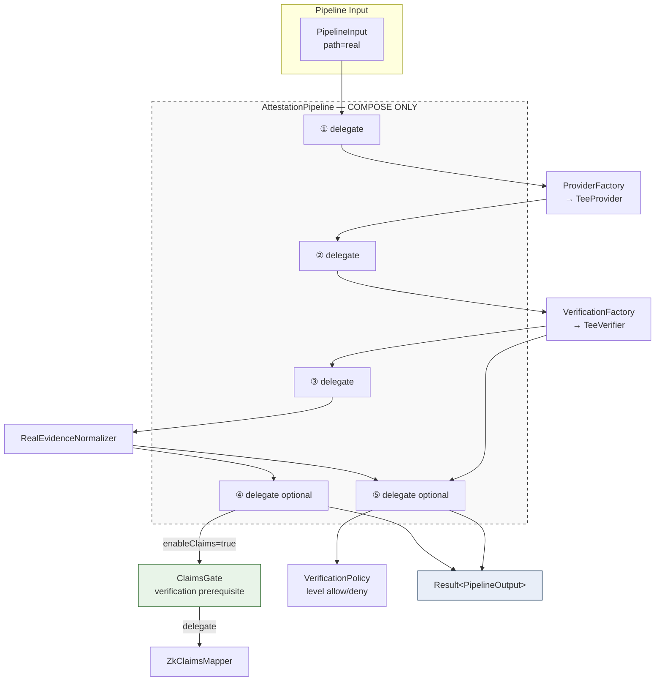
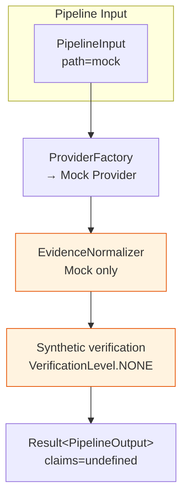
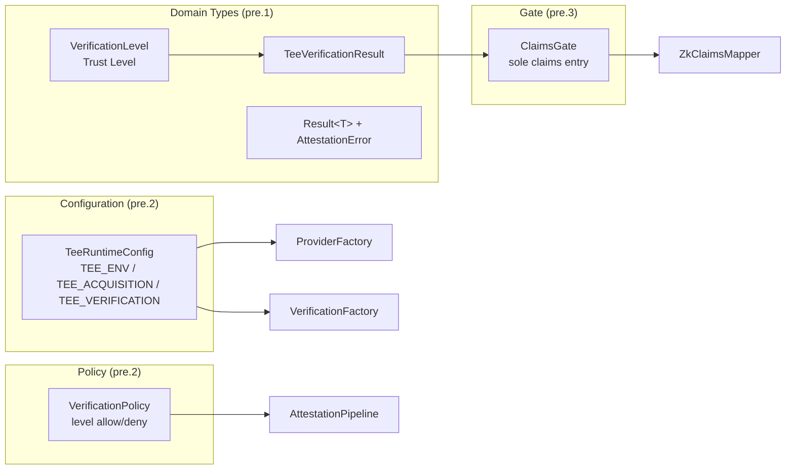

# TEE Attestation Pipeline Architecture

**Status:** Frozen (ADR-001)  
**HEAD reference:** `9d8b7d0`  
**Last updated:** 2026-08-06

---

## Overview

The TEE Adapter Layer (Layer B) uses a **compose-only pipeline** introduced in Phase 8.9C-pre.4. Business logic lives in individual components; `AttestationPipeline` orchestrates call order and error conversion only.

See [ADR-001: Architecture Hardening Freeze](../adr/001-architecture-hardening-freeze.md) for binding decisions.

---

## Component Flow (Real Path)



> **AttestationPipeline** (dashed box): orchestrator only — no verification, claims, policy, parser, or normalizer logic inside.

---

## Component Flow (Mock Path)



Mock path **never** calls `ClaimsGate`. Claims generation is forbidden regardless of `enableClaims`.

---

## Trust & Configuration Layers



### Semantic separation (frozen)

| Field / Type | Represents | MUST NOT represent |
|--------------|------------|-------------------|
| `VerificationLevel` | Trust level | Research scope |
| `pocScope` | Research scope label | Trust level |
| `isValid` | Verifier outcome flag | Sufficient alone for claims |

---

## Directory Map (Hardening additions)

```
tee/
├── config/
│   └── tee-runtime-config.ts      # Centralized env parsing
├── domain/
│   ├── verification-level.ts
│   ├── tee-verification-result.ts
│   ├── attestation-error.ts
│   └── attestation-result.ts
├── policy/
│   └── verification-policy.ts
├── integration/
│   ├── claims-gate.ts             # Claims entry (pre.3)
│   └── zk-claims-mapper.ts        # Unchanged; delegated to
├── pipeline/
│   └── attestation-pipeline.ts    # Orchestrator (pre.4)
└── scripts/
    └── evaluate.ts                # Stages A–G
```

---

## Regression Anchors

| Stage | Scope |
|-------|-------|
| A–F | Pre-hardening baselines (unchanged) |
| **G** | Pipeline E2E — mock/real path, claims gate, policy, `Result` propagation |

Run all stages:

```bash
npx tsx tee/scripts/evaluate.ts
```

---

## Extension Guidelines (Phase 8.9C+)

When adding Remote Verifier or online verification:

1. Add new `TeeVerifier` implementation — do **not** modify pipeline orchestration logic
2. Register via `VerificationFactory` — preserve public API
3. Assign appropriate `VerificationLevel` (e.g., `OFFLINE_VERIFIED`, `HARDWARE_ROOTED`)
4. Update `VerificationPolicy` if new levels need claims eligibility
5. Pass Stage A–G before merge
6. If pipeline flow changes, publish a new ADR — do not silently drift

---

## Related Documents

- [ADR-001: Architecture Hardening Freeze](../adr/001-architecture-hardening-freeze.md)
- [Phase 8.9 Remote Attestation Design](../research/phase8.9-remote-attestation-design.md)
- [TEE README](../../tee/README.md)
