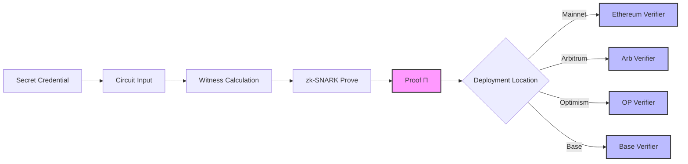
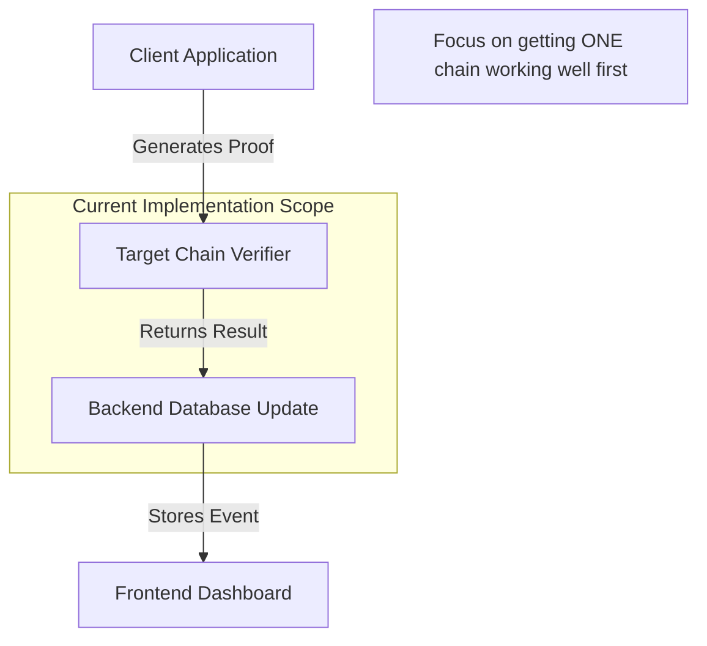
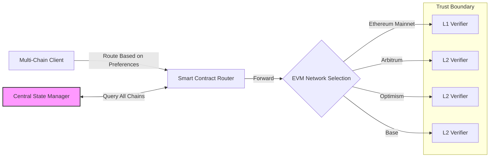

# AegisProof v2 - Cross-Chain Analysis

**Document Version:** 1.0  
**Purpose:** Architectural guidance for multi-chain deployments  
**Date:** August 2026 (Phase 6)  

---

## Executive Summary

This analysis examines architectural considerations for deploying AegisProof v2 across multiple EVM-compatible blockchains. Key findings emphasize mathematical universality of Groth16 proofs while highlighting practical constraints around independent verifier deployment and application-layer chain separation responsibilities.

**Core Thesis:** Groth16 verification operates identically regardless of blockchain network, enabling true proof portability subject only to verifier contract availability on target chain.

---

## 1. Proof Portability Architecture

### 1.1 Mathematical Universality

Groth16 proofs represent cryptographic objects independent of execution environment.

#### Formal Properties

A valid Groth16 proof Π = (πₐ, πᵦ, π꜀) satisfies pairing equation:
```
e(πₐ, πᵦ) == e(α, β) × e(∑pubSignals[i]·IC[i], π꜀)
```

This equation remains invariant across all networks because:
1. Elliptic curve operations depend only on field arithmetic
2. Precompiled contracts provide identical mathematical results
3. Pairing check yields same boolean regardless of gas accounting

**Implication:** Generate proof once; submit anywhere with deployed verifier.

---

#### Proof Generation Workflow



**Key Observation:** Only verifier deployment changes between chains; prover logic remains constant.

---

### 1.2 Practical Portability Constraints

Despite mathematical equivalence, several operational factors distinguish real-world deployments.

#### Constraint 1: Network-Specific Verifier Addresses

Each chain hosts separate contract instance at different address:

```javascript
// Different addresses per network
const VERIFIER_ADDRESSES = {
  ethereum: "0xMainnetVerifier123456789012345678",
  arbitrum: "0xArbitrumVerifier1234567890123456789",
  optimism: "0xOptimismVerifier123456789012345678",
  base: "0xBaseVerifier12345678901234567890123"
};

// Submit to correct verifier based on user's current network
async function submitVerification(proof, signals) {
  const currentNetwork = await getCurrentNetwork();
  const verifierAddr = VERIFIER_ADDRESSES[currentNetwork];
  
  return sendTransaction(verifierAddr, proof, signals);
}
```

**Operational Impact:** Applications must track multiple verifier addresses in configuration.

---

#### Constraint 2: Independent State Management

No shared nullifier registry or session storage across networks:

```typescript
// ❌ WRONG: Assumes global state
const isSessionUsed = await verifier.isSessionUsed(sessionId); // Doesn't exist!

// ✅ CORRECT: Per-chain state tracking
const isUsedOnEth = await ethVerifier.isSessionUsed(sessionId);
const isUsedOnArb = await arbVerifier.isSessionUsed(sessionId);
// Must track each separately
```

**Design Choice:** This explicitness enables fine-grained control but requires manual synchronization when cross-chain state consistency matters.

---

#### Constraint 3: Gas Cost Variability

Verification costs differ by orders of magnitude across networks.

#### Cost Comparison (Estimated)

| Network | Deployment | VerifySingle | VerifyBatch(3) |
|---|---|---|---|
| Ethereum Mainnet | ~$15 USD | ~$8 USD | ~$12 USD |
| Sepolia | Free | Free | Free |
| Arbitrum One | ~$0.50 | ~$0.15 | ~$0.25 |
| Optimism | ~$0.40 | ~$0.10 | ~$0.20 |
| Base | ~$0.35 | ~$0.08 | ~$0.18 |

*Costs calculated as gas × current ETH price ÷ 1M gas rate approximation.*

**Budget Implications:**
- L2 networks offer ~100× cost reduction vs mainnet
- Batch operations achieve amortization benefits
- Always implement dynamic gas estimation before submitting transaction

---

### 1.3 Portability Best Practices

Recommended patterns for maximizing cross-chain flexibility:

#### Pattern 1: Portable Signal Structure

Maintain consistent signal layout regardless of target network:

```javascript
// Fixed structure preserved across all deployments
interface ProofSignal {
  timestamp: bigint;       // Signal index 0
  chainId: bigint;         // Signal index 1 (optional binding)
  protocolVersion: bigint; // Signal index 2 (always "2")
  deviceId: string;        // Signal index 3 (namespace-prefixed)
  commitment: string;      // Signal index 4
  nullifier: string;       // Signal index 5
  sessionId: bigint;       // Signal index 6
  purposeId: bigint;       // Signal index 7
  reserved_8: bigint;      // Signals 8-29 (always zero-padded)
  ...
}
```

#### Pattern 2: Namespace-Based Device IDs

Prevent device identifier collisions across chains:

```javascript
function generateNamespacePrefixedDeviceId(chainId: number, deviceId: string): string {
  const namespacePrefix = `ae-${chainId}`;
  return `${namespacePrefix}:${deviceId}`;
}

// Usage
const ethDevice = generateNamespacePrefixedDeviceId(1, "device-abc");
// Result: "ae-1:device-abc"

const arbDevice = generateNamespacePrefixedDeviceId(42161, "device-abc");
// Result: "ae-42161:device-abc"

// Same physical device → distinct logical identities per chain
```

#### Pattern 3: Universal Client Abstraction

Build SDK that handles network routing transparently:

```typescript
class AegisCrossChainClient {
  private configs: Record<string, NetworkConfig>;
  
  async verify(proof: Proof, signals: Signal[]) {
    // Determine which chain user connected to
    const activeNetwork = await this.detectActiveNetwork();
    const config = this.configs[activeNetwork];
    
    // Submit to appropriate verifier automatically
    return await this.client.verifyAt(config.verifierAddress, proof, signals);
  }
  
  async verifyAcrossAllChains(proof: Proof, signals: Signal[], allowedNetworks: string[]) {
    // Attempt verification on multiple networks sequentially
    // Useful for finding cheapest successful verification path
    
    for (const network of allowedNetworks) {
      try {
        const result = await this.verifyToNetwork(network, proof, signals);
        if (result.success) return result;
      } catch (err) {
        // Continue to next network
      }
    }
    
    throw new Error("All verification attempts failed");
  }
}
```

---

## 2. Chain Separation Design Patterns

Explicit chain isolation ensures predictable behavior under multi-chain operation.

### 2.1 Logical Isolation Strategies

Different levels of separation available depending on security requirements.

#### Level 1: Complete Isolation

Separate everything: keys, state, identities.

```typescript
class CompletelyIsolatedChainManager {
  private chains: Map<string, ChainContext>;
  
  init() {
    this.chains.set("ethereum", new ChainContext({
      privateKey: env.ETH_KEY,
      verifier: env.ETH_VERIFIER_ADDRESS,
      domain: "ethereum_mainnet"
    }));
    
    this.chains.set("arbitrum", new ChainContext({
      privateKey: env.ARBITRUM_KEY,
      verifier: env.ARBITRUM_VERIFIER_ADDRESS,
      domain: "arbitrum_one"
    }));
  }
  
  // Each chain has completely independent key material and state
  async proveOnNetwork(chainName: string, inputs: CircuitInputs) {
    const context = this.chains.get(chainName);
    if (!context) throw new Error(`Unknown chain: ${chainName}`);
    
    return await this.generateProof(inputs, context.domain);
  }
}
```

**Advantages:** Maximum security, no accidental cross-chain interference  
**Disadvantages:** Harder to synchronize state, more complex user experience

---

#### Level 2: Shared Keys, Separate State

Single signing key controls multiple chains but state remains isolated.

```typescript
class SemiIntegratedChainManager {
  private masterKey: Hex;
  private chainConfigs: Record<string, string>;
  
  constructor(masterKey: Hex) {
    this.masterKey = masterKey;
    this.chainConfigs = {
      ethereum: env.ETH_VERIFIER_ADDRESS,
      arbitrum: env.ARBITRUM_VERIFIER_ADDRESS,
      optimim: env.OPTIMISM_VERIFIER_ADDRESS
    };
  }
  
  async signMessage(message: string, chainName: string): Promise<string> {
    // Same master key signs messages across all chains
    // But each chain maintains its own nullifier registry
    const signature = signWithKey(this.masterKey, message);
    
    // Append chain-specific nonce to prevent replay
    const chainNonce = await getChainSpecificNonce(chainName);
    const uniqueSignature = hash(signature + chainNonce);
    
    return uniqueSignature;
  }
}
```

**Advantages:** Simplifies key management, maintains strong separation  
**Disadvantages:** Requires careful nonce coordination

---

#### Level 3: Explicit Synchronization

Allow selective state sharing between chains with authorization boundaries.

```solidity
contract SyncedVerifier extends Groth16VerifierV2Production {
  mapping(string => bool) public acceptedNullifiers;
  mapping(address => bool) public authorizedSyncers;
  
  event NullifierSynced(bytes32 indexed nullifier, uint256 sourceChainId);
  
  modifier onlyAuthorized() {
    require(authorizedSyncers[msg.sender], "Unauthorized");
    _;
  }
  
  function syncNullifier(bytes32 nullifier, uint256 sourceChainId) 
          external 
          onlyAuthorized 
  {
    require(!acceptedNullifiers[nullifier], "Already used");
    acceptedNullifiers[nullifier] = true;
    
    emit NullifierSynced(nullifier, sourceChainId);
  }
  
  function verifyProofWithSyncCheck(
    uint[2] calldata pA,
    uint[2][2] calldata pB,
    uint[2] calldata pC,
    uint[30] calldata pubSignals
  ) external view override returns (bool) {
    bytes32 computedNullifier = computeNullifier(pubSignals);
    require(!acceptedNullifiers[computedNullifier], "Nullifier already used");
    
    return super.verifyProof(pA, pB, pC, pubSignals);
  }
}
```

**Use Case:** High-security applications requiring synchronized revocation across chains  
**Trust Assumption:** Authorized syncers must be trusted parties (multi-sig DAO recommended)

---

### 2.2 Cross-Chain Identity Resolution

Enable users to manage single identity across multiple chains while maintaining audit trails.

#### Resolution Strategy

Maintain centralized mapping service (off-chain database or on-chain registry):

```typescript
interface CrossChainIdentityMapping {
  primaryUserId: string;           // Human-readable ID (e.g., email)
  chains: Record<number, DeviceRecord>;  // Per-chain device metadata
}

interface DeviceRecord {
  deviceId: string;               // Namespaced device ID
  publicKey: string;              // Recovery key for offline sessions
  lastActivity: number;           // Unix timestamp
  trustScore: number;             // 0-1 reputation score
}

// Example resolution flow
function resolveCrossChainUser(userId: string, requestedChainId: number): DeviceRecord {
  const mapping = lookupPrimaryIdentity(userId);
  
  if (!mapping) throw new Error("User not found");
  
  const deviceRecord = mapping.chains[requestedChainId];
  if (!deviceRecord) throw new Error(`No registered device for chain ${requestedChainId}`);
  
  return deviceRecord;
}
```

**Implementation Options:**
- Centralized database: Simple but introduces trust assumption
- On-chain mapping contract: Trustless but expensive
- Hybrid approach: Cache frequently accessed mappings off-chain with periodic verifications

---

## 3. Replay Protection Mechanisms

Without embedded chainID validation, applications must implement their own protections.

### 3.1 Threat Model

Potential attack vectors without proper safeguards:

#### Scenario 1: Cross-Chain Proof Reuse

Attacker captures valid proof from Chain A and replays it on Chain B to gain unauthorized access.

**Countermeasure:** Include globally unique sessionId in every proof:

```javascript
// Unique random UUID per request
const sessionId = crypto.randomUUID(); 

const signals = buildSignals({
  sessionId: sessionId,
  // ... other fields
});
```

Server tracks all seen sessionIds centrally to detect replays.

---

#### Scenario 2: Timestamp-Based Replay

Old proofs within acceptable time window could be reused after attacker gains credentials.

**Countermeasure:** Enforce tight timestamp windows + sequential counters:

```solidity
modifier validProofWindow(uint timestamp, uint sequenceNumber) {
    uint currentTime = block.timestamp;
    uint timeWindow = 300 seconds; // 5 minutes max validity
    
    require(
        currentTime >= timestamp && currentTime <= timestamp + timeWindow,
        "Proof outside valid time window"
    );
    
    // Optional: Track sequence numbers to prevent out-of-order submissions
    require(sequenceNumber > lastSequenceNumbers[msg.sender], "Invalid sequence order");
    
    _;
}
```

---

#### Scenario 3: Multi-Chain Session Hijacking

Same sessionId valid across multiple chains simultaneously, potentially allowing lateral movement.

**Countermeasure:** Prefix session identifiers with chain context:

```javascript
function buildSessionId(chainId: number, originalSessionId: string): string {
  return `${chainId.toString().padStart(10, "0")}:${originalSessionId}`;
}

// Examples
const ethSession = buildSessionId(1, "sess-abc123");  // "0000000001:sess-abc123"
const arbSession = buildSessionId(42161, "sess-abc123");  // "0000042161:sess-abc123"

// Even if attacker knows original session ID, can't derive cross-chain variant
```

---

### 3.2 Comprehensive Defense Stack

Layer defenses for robust replay protection:

#### Defense Layer 1: Temporal Boundaries
```solidity
uint constant PROOF_TTL_SECONDS = 300; // 5 minutes

modifier expired(uint timestamp) {
    require(block.timestamp <= timestamp + PROOF_TTL_SECONDS, "Proof expired");
    _;
}
```

---

#### Defense Layer 2: Single Use Enforcement
```solidity
mapping(bytes32 => bool) private usedNullifiers;

bytes32 public constant NULLIFIER_DOMAIN = keccak256("proof-nullifier-domain-v1");

function extractNullifierFromSignals(uint[30] calldata signals) pure returns (bytes32) {
    return keccak256(abi.encode(NULLIFIER_DOMAIN, signals[5])); // Signal[5] contains nullifier
}

modifier unused(bytes32 nullifier) {
    require(!usedNullifiers[nullifier], "Proof already submitted");
    usedNullifiers[nullifier] = true;
    _;
}
```

---

#### Defense Layer 3: Rate Limiting
```solidity
struct UserRequestState {
    uint lastRequestTime;
    uint requestCount;
}

mapping(address => UserRequestState) private requestStates;
uint constant MAX_REQUESTS_PER_MINUTE = 10;
uint constant ONE_MINUTE = 60 seconds;

modifier rateLimited(address user) {
    UserRequestState storage state = requestStates[user];
    
    if (block.timestamp >= state.lastRequestTime + ONE_MINUTE) {
        state.requestCount = 0;
        state.lastRequestTime = block.timestamp;
    }
    
    require(state.requestCount < MAX_REQUESTS_PER_MINUTE, "Rate limit exceeded");
    state.requestCount++;
    
    _;
}
```

---

#### Defense Layer 4: Source Verification (Optional)
Add client-side validation ensuring user is on expected network:

```javascript
async function validateNetworkBeforeSigning(expectedChainIds: number[]) {
  const currentChainId = parseInt(window.ethereum?.chainId || process.env.CHAIN_ID);
  
  if (!expectedChainIds.includes(currentChainId)) {
    throw new Error(
      `Cannot sign proof on chain ${currentChainId}, ` +
      `expected one of: ${expectedChainIds.join(", ")}`
    );
  }
  
  return true;
}
```

---

## 4. Bridge-Related Considerations

⚠️ **Disclaimer:** This document does NOT implement bridge infrastructure. All guidance below is analytical.

### 4.1 Bridge Types and Trust Models

Different bridging mechanisms carry different trust assumptions.

#### Type 1: Trusted Multisig Bridges

Controlled by known validator set (Polygon PoS model).

**Trust Profile:**
- Fast finality (~minutes)
- Small trusted party risk
- Regulatory exposure possible

**Suitability for AegisProof:** Low value for simple proof forwarding (reduces benefit of ZK privacy), high risk due to centralization.

---

#### Type 2: Optimistic Rollup Bridges

Sequencer + challenger framework (Arbitrum, Optimism, Base).

**Trust Profile:**
- Medium speed (seconds to minutes)
- Economic security via staking
- 7-day challenge period before irreversible

**Suitability for AegisProof:** Reasonable middle ground—accept moderate centralization for significant cost savings.

---

#### Type 3: Zero-Knowledge Bridges

Cryptographic attestation layer (starkgate, Hop Protocol L2-to-L2).

**Trust Profile:**
- Strongest security guarantees
- Complex implementation overhead
- High development cost

**Suitability for AegisProof:** High complexity, potentially excessive unless building truly decentralized cross-chain app.

---

### 4.2 When Bridging Makes Sense

Identify legitimate use cases versus anti-patterns.

#### Legitimate Scenarios

✅ **Cost Optimization:** Generate expensive L1 proof, execute cheaper L2 verification  
✅ **Latency Requirements:** Submit fast L2 transaction for urgent confirmation  
✅ **Data Availability Needs:** Store heavy payload on cheap blob space, verify succinctly on-chain  

#### Anti-Patterns to Avoid

❌ **Automated Forwarding Without Authorization:** Letting anyone relay proofs between chains creates replay vulnerabilities  
❌ **Blind Trust in Bridge Contracts:** Assuming bridge will always deliver your transaction fails under congestion or malicious actor conditions  
❌ **Over-Engineering Early:** Adding cross-chain complexity before validating single-chain product-market fit wastes resources  

---

## 5. Recommended Architecture Patterns

Synthesize lessons into actionable design templates.

### 5.1 Minimal Viability Approach

Start with simplest pattern sufficient for MVP:



**Steps:**
1. Deploy verifier to single testnet (Sepolia)
2. Implement basic prove→verify workflow
3. Test thoroughly
4. Add second chain ONLY if business case justifies complexity

---

### 5.2 Production-Grade Architecture

Full feature set for mature applications:



**Components Required:**
- Smart contract router (optional, adds abstraction layer)
- Central state manager (database tracking events across all chains)
- Per-chain verifier deployments
- Comprehensive monitoring infrastructure

**Complexity Warning:** Only adopt this pattern when justified by actual production needs.

---

## 6. Conclusion

### Key Takeaways

1. **Mathematical Universality:** Groth16 proofs work identically across all EVM-compatible networks
2. **Independent Deployments Required:** Each chain needs its own verifier contract instance
3. **Application Responsibility:** No native chainID binding means you must implement isolation yourself
4. **Replay Protection Essential:** Combine temporal limits, single-use enforcement, and optional rate limiting
5. **Bridge Decisions Require Care:** Weigh security tradeoffs carefully before implementing cross-chain messaging

### Final Recommendation

Begin with single-chain deployment using Ethereum Sepolia for rapid iteration. Once core functionality validated, expand to one L2 (Arbitrum recommended for ecosystem size). Monitor real-world performance characteristics before adding additional chains.

Always prioritize simplicity over premature optimization. A well-tested single-chain solution provides more value than a broken multi-chain system.

---

**Status:** Complete (Phase 6 Milestone 5)  
**Next Phase:** Await authorization for Milestone 6 — Publication Readiness Package
