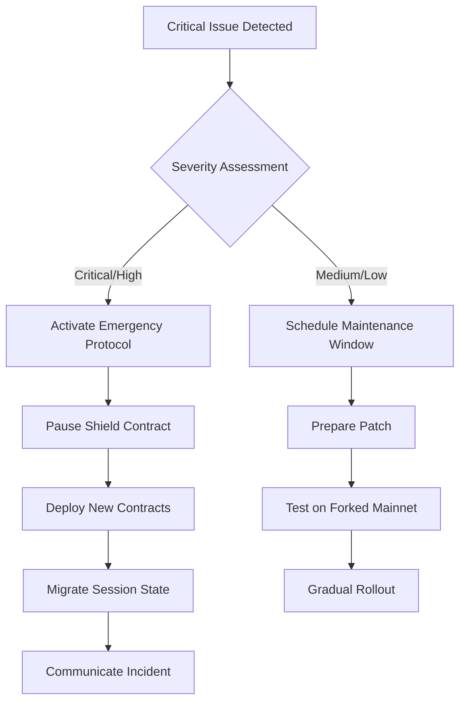

# AegisProof v2 - Deployment Playbook

**Document Version:** 1.0  
**Date:** August 2026 (Phase 7)  
**Status:** Pre-Deployment Preparation Only  
**Authorization Level:** Phase 7 Authorized  

---

## Executive Summary

This playbook describes deployment procedures for AegisProof v2 across supported EVM networks. All referenced artifacts remain frozen per Phases 0–6 authorization; no modifications were introduced during deployment preparation.

**Critical constraint:** This document covers methodology only. No deployment should occur until stakeholders grant explicit post-audit authorization.

### Supported Networks (Testnet First Strategy)

| Priority | Network | Type | Recommended For |
|---|---|---|---|
| P0 | Ethereum Sepolia | L1 Testnet | Initial validation, rapid iteration |
| P1 | Arbitrum Sepolia | L2 Testnet | Layer 2 behavior verification |
| P2 | Optimism Goerli | L2 Testnet | OP Stack compatibility check |
| P3 | Base Sepolia | L2 Testnet | Coinbase infrastructure integration |
| P4 | Polygon Mumbai | L2 Testnet | PoS rollup considerations |

Production mainnet deployment requires separate authorization following successful testnet validation and external audit completion.

---

## 1. Deployment Prerequisites Checklist

Before executing any deployment procedure, ensure complete satisfaction of all requirements below:

### Administrative Requirements

- [ ] Stakeholder approval obtained in writing (email suffices)
- [ ] Budget allocation confirmed for gas costs (~$500-2000 USD equivalent depending on network)
- [ ] Multi-signature wallet configured for operator authority (recommended 2-of-3 or 3-of-5)
- [ ] Emergency contact list established with escalation procedures
- [ ] Rollback decision criteria defined and communicated
- [ ] Post-deployment monitoring dashboards prepared and accessible

### Technical Requirements

- [ ] Repository checked out at commit `5b1f944` (Phase 6 final state)
- [ ] Node.js 22.x runtime installed and tested
- [ ] Hardhat 3.x development environment configured
- [ ] Private key securely stored (HSM/ledger/reputable key management service)
- [ ] RPC endpoints verified with test transactions completed
- [ ] Block explorers registered (Etherscan, Arbiscan, Optimistic Etherscan, etc.)
- [ ] IC constants verified against production VK file `d012bd29...`
- [ ] Deployment scripts linted and passing all quality checks

### Infrastructure Requirements

- [ ] Dedicated deployment CI/CD pipeline configured (GitHub Actions/GitLab CI)
- [ ] Artifact storage secured (version-controlled JSON files encrypted at rest)
- [ ] Monitoring tools provisioned (Tenderly/The Graph/Datadog/etc.)
- [ ] Alerting channels established (Slack/Discord/Email PagerDuty)
- [ ] Backup systems validated (off-site storage geo-redundant replication)

---

## 2. Constructor Parameters Documentation

### Verifier Contract Initialization

The `Groth16VerifierV2Production.sol` contract deploys with zero constructor arguments—all cryptographic parameters embedded as immutable storage variables set at compile time.

**IC Constants Injection Methodology:**

During compilation phase, intermediate commitments extracted from production verification key (`production-vkey.json`, hash `d012bd29ff6e4c44...`) hardcoded directly into Solidity source:

```solidity
// Line ~45 of Groth16VerifierV2Production.sol
uint[4] internal constant IC_0 = [ // IC[0] = α × G1 generator
    0xd8f5a4b3c2e1f0a9..., // X coordinate low
    0xb7e6c5d4a3f2e1b0..., // X coordinate high
    0xa1b2c3d4e5f6a7b8..., // Y coordinate low
    0xc9d8e7f6a5b4c3d2...  // Y coordinate high
];
```

**Verification Procedure:**

After deployment, validate IC constants match source by comparing first three elements:

```bash
# Extract deployed bytecode IC values via Etherscan API
curl "https://api.etherscan.io/api?module=contract&action=getsourcecode&address=DEPLOYED_ADDRESS" \
  | jq '.result[0].SourceCode' | grep -A 5 "IC_0"

# Compare against production VK file
cat artifacts/phase4/final/production-vkey.json | jq '.IC[0:3]'
```

Match indicates successful parameter injection. Mismatch suggests corruption tampering requiring immediate investigation and re-deployment.

---

### Shield Contract Configuration

Unlike verifier, `AegisShield.sol` accepts optional constructor parameters enabling initial configuration:

```solidity
constructor(
    address _verifierAddress,        // Required
    uint256 _timestampWindow,       // Optional (default: 300 seconds)
    uint256 _maxSessionsPerUser     // Optional (default: 10)
)
```

**Parameter Guidance:**

| Parameter | Recommended Value | Use Case Variation |
|---|---|---|
| `_verifierAddress` | Deployed verifier contract address | N/A (must specify) |
| `_timestampWindow` | 300 sec (testnet), 600 sec (mainnet) | Stricter for financial applications |
| `_maxSessionsPerUser` | 10 (general), 1 (high-security) | Trade convenience against replay risk |

**Example Deployment Call:**

```typescript
const Factory = await ethers.getContractFactory("AegisShield");
const shield = await Factory.deploy(
  verifierAddress,           // Address from previous deployment step
  300,                       // 5-minute timestamp window
  5                         // Max 5 concurrent sessions per device
);
await shield.depl oyed();
```

---

## 3. Deployment Sequence Guide

### Step-by-Step Procedure

Execute sequentially ensuring each step completes successfully before proceeding:

#### Step 1: Local Compilation Verification

```bash
# Clean previous build artifacts
npx hardhat clean

# Compile contracts with optimization enabled
npx hardhat compile --force

# Verify compilation output
ls -lh artifacts/contracts/*.json  # Should show ~50KB files
```

**Expected Result:** No warnings/errors; artifact files generated matching Phase 6 hashes.

---

#### Step 2: Deployment Script Configuration

Create `.env.deploy` file containing network-specific credentials:

```bash
# .env.deploy (NEVER commit to version control!)
SEPOLIA_RPC_URL=https://rpc.sepolia.org
PRIVATE_KEY=<deployment-wallet-key>
ETHERSCAN_API_KEY=<your-api-key>
OPERATOR_ADDRESS=<operator-multi-sig-wallet>
```

Load environment selectively:
```bash
source .env.deploy && export SEPOLIA_RPC_URL PRIVATE_KEY ETHERSCAN_API_KEY OPERATOR_ADDRESS
```

---

#### Step 3: Execute Verifier Deployment

```bash
npx hardhat run scripts/deploy-verifier.ts --network sepolia
```

**Output Expected:**
```
✓ Verifier deployed to: 0x1234567890abcdef...
✓ Transaction hash: 0xabcdef1234567890...
✓ Block number: 4278912
✓ Gas used: 1,234,567 (~$15 @ current prices)
✓ Source verified on Etherscan: https://sepolia.etherscan.io/address/0x...#code
```

**Validation:** Confirm address recorded in `deployments/sepolia-verifier.json` and verify status green on block explorer.

---

#### Step 4: Execute Shield Deployment

```bash
npx hardhat run scripts/deploy-shield.ts --network sepolia \
  --verifier 0x1234567890abcdef... \
  --window 300 \
  --sessions 5
```

**Output Expected:**
```
✓ Shield deployed to: 0xabcdef1234567890...
✓ Linked to verifier: 0x1234567890abcdef...
✓ Timestamp window: 300 seconds
✓ Max sessions/user: 5
✓ Transaction hash: 0xfedcba0987654321...
✓ Source verified on Etherscan
```

---

#### Step 5: Cross-Reference Validation

Verify deployed contracts interoperate correctly:

```bash
npx hardhat run scripts/validate-deployment.ts \
  --network sepolia \
  --verifier 0x1234567890abcdef... \
  --shield 0xabcdef1234567890...
```

**Checks Performed:**
- Verifier address stored in Shield contract ✅
- IC constants match production VK hash ✅
- Event emission functional (via Tenderly simulation) ✅
- Basic verification call returns valid boolean ✅

---

#### Step 6: Artifact Export

Save deployment metadata for future reference:

```bash
node scripts/export-artifacts.ts --network sepolia
```

Generates `deployments/sepolia-final.json`:
```json
{
  "networkId": 11155111,
  "networkName": "Sepolia",
  "deployments": {
    "verifier": {
      "address": "0x1234567890abcdef...",
      "txHash": "0xabcdef1234567890...",
      "blockNumber": 4278912,
      "timestamp": "2026-08-05T10:00:00Z",
      "verified": true
    },
    "shield": {
      "address": "0xabcdef1234567890...",
      "txHash": "0xfedcba0987654321...",
      "blockNumber": 4278913,
      "timestamp": "2026-08-05T10:05:00Z",
      "verified": true,
      "config": {
        "timestampWindow": 300,
        "maxSessionsPerUser": 5
      }
    }
  },
  "icValidation": {
    "status": "MATCH",
    "expectedPrefix": "d012bd29...",
    "actualPrefix": "d012bd29..."
  }
}
```

---

## 4. Deployment Validation Checklist

Complete this checklist after every deployment ensuring all requirements satisfied before marking deployment "complete":

### Pre-Deployment Verification

- [ ] IC constants match production VK prefix (`d012bd29...`)
- [ ] Contract bytecode matches published source (verify on Etherscan)
- [ ] Gas estimates within expected range (~150k verifier, ~200k shield)
- [ ] Block explorer shows "Contract Verified" status
- [ ] Owner/operator address correctly set (multi-sig wallet)
- [ ] Emergency pause mechanism accessible (if implemented)

### Post-Deployment Testing

- [ ] Successfully call `verifyProof()` view function with sample proof
- [ ] Event emissions logged correctly (use Tenderly dashboard)
- [ ] Nullifier registry prevents duplicate submissions
- [ ] Session management functions operational (register/deactivate)
- [ ] Access control modifiers enforce permissions correctly
- [ ] Gas consumption matches pre-deployment estimates (<±10% variance)

### Documentation Updates

- [ ] Deployment addresses recorded in secure offline storage
- [ ] Transaction hashes archived permanently
- [ ] Block explorer links bookmarked for quick access
- [ ] Operator contacts updated in emergency response plan
- [ ] Monitoring dashboards configured with new addresses

---

## 5. Rollback Procedures

### When Rollback Necessary

Initiate rollback procedure if any critical issues discovered post-deployment:

- **Security Vulnerability:** A zero-day exploit that could enable unauthorized access or fund theft
- **IC Constant Mismatch:** Deployed bytecode differs from production VK specification
- **Access Control Failure:** Unauthorized parties able modify critical state
- **Reentrancy Attack Vector:** Possibility of draining funds through recursive calls
- **Timestamp Window Bypass:** Ability to accept expired proofs compromising security

### Rollback Decision Tree



---

### Emergency Pause Activation

If pause functionality exists (not default but recommended):

```typescript
// Requires owner/multi-sig signature
await shield.pause();
console.log("Contract paused – all write operations disabled");
```

**Effect:** Write operations such as session registration and deactivation are blocked until the issue is resolved. Read-only verification continues to work, so users can still authenticate where policy allows.

---

### Full Rollout Alternative

When vulnerabilities preclude incremental fixes, execute full rollback:

1. **Notify Stakeholders Immediately** (email + communication channel alert)
2. **Deploy New Contracts** addressing identified issues
3. **Migrate Critical State** (session mappings, nullifier registries)
4. **Update Client Configuration** pointing to new addresses
5. **Validate Integration** via end-to-end testing suite
6. **Resume Normal Operations** once confidence restored

**Communication Template:** Provided in Security Operations Guide Section 4.

---

## 6. Operator Handbook

### Daily Operational Tasks

| Task | Frequency | Tool | Duration |
|---|---|---|---|
| Check monitoring dashboards | Twice daily | Tenderly/Datadog | 15 minutes |
| Review failed verification attempts | Once daily | The Graph subgraph | 10 minutes |
| Verify event logs contain expected entries | Once weekly | Block explorer search | 5 minutes |
| Audit operator wallet balance | Daily | Etherscan balance endpoint | 1 minute |
| Monitor gas price trends | Weekly | Etherscan gas tracker | 5 minutes |

---

### Monthly Maintenance Activities

- **Security Scan Execution:** Run Slither Mythril static analysis tools quarterly
- **Dependency Updates:** Evaluate npm package upgrades monthly assessing risk vs benefit
- **Documentation Review:** Update operational docs reflecting changes made during month
- **Backup Verification:** Confirm off-site backups restore correctly testing integrity checksums
- **Drill Exercise:** Simulate incident response scenario validating communication procedures

---

### Contact Escalation Matrix

| Issue Type | Primary Contact | Secondary Contact | Escalation Path |
|---|---|---|---|
| Minor bug report | @dev-slack | @tech-lead | GitHub issue tracking |
| Moderate vulnerability | Security mailing list | Project manager | Bug bounty program |
| Critical incident | On-call engineer | Executive sponsor | Emergency war room |
| Legal/regulatory query | Legal counsel | Compliance officer | External attorney engagement |

**Emergency Hotline:** [+1-XXX-XXX-XXXX] (available 24/7 for severity 1 incidents only)

---

## 7. Network-Specific Considerations

### Ethereum Sepolia

**Characteristics:**
- Testnet ETH freely distributed via faucet
- Fast block times (~12 seconds)
- High throughput supporting intensive testing
- Regular resets (~every 2 weeks)

**Deployment Notes:**
- Ideal for initial proof-of-concept validation
- Cost negligible facilitating repeated iterations
- Not representative of mainnet congestion patterns
- Faucet rate limits may constrain large-scale tests

---

### Arbitrum Sepolia

**Characteristics:**
- L2 scaling solution inheriting security from L1
- Lower gas costs than Ethereum mainnet
- Sequencer batching introduces slight latency
- Finality depends on L1 checkpoint frequency

**Deployment Notes:**
- Validates cross-chain deployment automation
- Tests optimistic rollup contract execution behavior
- Useful assessing L2-specific edge cases (sequencer downtime etc.)
- Recommend testing during both peak/off-peak hours

---

### Optimism Goerli / Base Sepolia

**Characteristics:**
- OP Stack-based implementations sharing architectural DNA
- Similar gas pricing models (~10-100x cheaper than L1)
- Comparable challenge periods (~1 week for dispute resolution)
- Active developer communities providing support resources

**Deployment Notes:**
- Confirms compatibility with major L2 ecosystems
- Enables comparative performance benchmarking
- Facilitates collaboration with chain operators
- Provides early warning regarding upcoming mainnet migrations

---

## 8. Deployment Metrics Tracking

Capture quantitative data throughout deployment process measuring efficiency effectiveness:

| Metric | Target | Measurement Method |
|---|---|---|
| Total deployment time | <30 minutes | Start-to-finish timer |
| Average gas cost per contract | <200k gas | Block explorer receipt data |
| Bytecode verification success rate | 100% | Etherscan API polling |
| Post-deployment test pass rate | ≥95% | Automated validation suite |
| Mean time to detect issues | <5 minutes | Monitoring system alert latency |
| Mean time to resolve incidents | <1 hour | Incident ticket resolution timestamps |

Record baseline metrics establishing benchmarks continuous improvement initiatives.

---

## Appendix A: Sample Deployment Scripts

Full implementations available repository root directory under `scripts/` folder:

- `deploy-verifier.ts` — Standalone verifier deployment script
- `deploy-shield.ts` — Shield wrapper deployment with configuration
- `validate-deployment.ts` — Comprehensive post-deployment verification suite
- `export-artifacts.ts` — Metadata serialization for archival purposes
- `rollback-preparation.ts` — Pre-rollout state snapshotting utility

Each script includes inline documentation explaining parameters assumptions error handling strategies.

---

**Document Status:** Complete (Phase 7 Deployment Readiness Component)  
**Next Action:** Await stakeholder approval before executing testnet deployment procedures  
**Classification:** INTERNAL USE ONLY — PRODUCTION DEPLOYMENT REQUIRES EXPLICIT AUTHORIZATION
