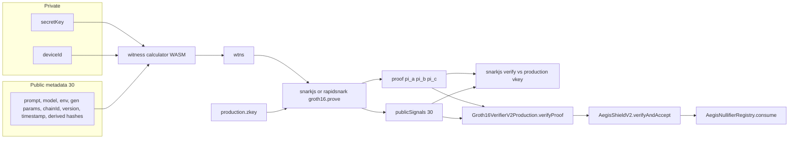

# Repository Overview

調査対象: AegisProof v2（HEAD `22255e7`、ブランチ起点 `master`）。
この文書は README ではなく、追跡したソース・設定・テスト・生成物に基づく。コードから確認できない事項は「不明」と書く。

解析から除外したもの:

- `node_modules/`、`server/node_modules/`（未インストールまたは依存展開。lockfile は確認した）
- `artifacts/hardhat/`（Hardhat ビルド出力。`.gitignore` 済み。この作業ツリーには存在しない）
- `formal/.lake/`（Lean ビルドキャッシュ。存在しない）
- `rapidsnark/`、`/circom/`（ベンダ。リポジトリに存在しない）
- snarkjs が生成した `Groth16Verifier*.sol` のペアリング展開本体（IC 定数と `verifyProof` 署名は確認し、楕円曲線演算の各行は再検証していない）

---

## 1. プロジェクト概要

- **プロジェクト名:** AegisProof v2。npm パッケージ名はルート `package.json` に `name` が無い。SDK は `@zenoamo/aegisproof-sdk` `1.0.0`（`packages/sdk/package.json`）。サーバは `aegisproof-server`（`server/package.json`）。Lean パッケージは `AegisProof` `0.1.0`（`formal/lakefile.toml`）。リリース表記は README の `v2.0.1`。
- **目的:** 秘密入力 `secretKey` と `deviceId` の知識を、コンテンツコミットメントとナリファイアに束縛した Groth16 証明として示す。公開信号は 30 個。検証はオフチェーン（snarkjs）とオンチェーン（Solidity verifier + Shield）の両方を想定する。
- **解決しようとしている問題:** LLM 実行のモデル・環境・生成パラメータ（重み、トークナイザ、LoRA、温度、seed など）をフィールド要素としてコミットし、同じ消費ドメイン（秘密鍵、デバイス、purpose、session、commitment、protocol version、chainId）を一度しか使えないようにする。タイムスタンプは回路では認証せず、契約側の時間窓だけで新鮮さを見る。
- **主な利用技術:** Circom 2.1.6 のコンパイル済み成果物（ソースは失われている、後述）、snarkjs `^0.7.6`、Groth16 / BN254、Poseidon（circomlib / circomlibjs）、Solidity `0.8.28`、Hardhat 3、viem、Fastify、`@noble/post-quantum` の ML-DSA-87、Lean 4、研究用の Intel TDX / AMD SEV-SNP アダプタ、RISC Zero zkVM の独立 PoC。
- **想定される利用者・利用方法:** 監査者・研究者が、ピン留めされたアーティファクトに対して証明生成・検証・回帰（T1–T9）・プロベナンス照合を行う。オペレータが Shield のセッション登録と `verifyAndAccept` を呼ぶ想定。README と `docs/architecture/overview.md` は、メインネット配備・本番 TEE・ライブ Vault は未検証であり、このリポジトリはレビューと研究用だと明記している。本番利用手順として完成しているわけではない。

---

## 2. ディレクトリ構成

```text
repository/
├── protocol/          契約、v1 回路ソース、phase2 が読む SSoT ファイル
├── specs/             codegen が読む SSoT JSON
├── packages/sdk/      TypeScript SDK
├── scripts/           証明、ゲート、プロベナンス、KMS、デプロイ
├── crypto-artifacts/  追跡されている回路バイナリと開発セットアップ
├── artifacts/         セレモニー記録、プロベナンス、一部レポート（回路バイナリは欠落）
├── generated/         SSoT から生成した TS 定数
├── server/            Fastify の読み取り API
├── tee/               TEE 研究アダプタ（プロトコル非接続）
├── formal/            Lean 4 の抽象モデル
├── zkvm/              RISC Zero PoC
├── circuits/          v1 の .r1cs/.sym とチャンク木 Circom
├── tests/ verification/  回帰・侵入・統合テスト
├── deployments/       配備マニフェスト（未配備）
├── .github/workflows/ CI
├── docs/              設計・運用文書
├── examples/          説明用 README 群
├── evidence/ build/ benchmarks/ audit-*/ 
└── package.json hardhat.config.ts
```

| ディレクトリ | 役割 | 重要度 | 主要ファイル |
|---|---|---|---|
| `protocol/contracts/` | オンチェーン検証とセッションポリシー | 最高 | `AegisShieldV2.sol`, `AegisNullifierRegistry.sol`, `AegisCanonicalRegistry.sol`, `Groth16VerifierV2Production.sol` |
| `protocol/circuits/` | 残っている Circom。中身は v1 セマンティクス | 高（ただし v2 の正本ではない） | `aegis_commit_core.circom` |
| `protocol/specs` | ファイル。ゲートと `phase2_verify.mjs` の SSoT | 最高 | JSON 103 行 |
| `specs/` | codegen と SDK の SSoT | 最高 | `aegis-protocol.v2.json` |
| `crypto-artifacts/phase2/` | 正本の R1CS / WASM / SYM / 開発 zkey / テストベクタ | 最高 | `aegis_commit_core_v2.r1cs`, `.wasm`, `input_v2.json` |
| `crypto-artifacts/phase4/` | 本番 VK のみ。`production.zkey` は無い | 最高 | `production-vkey.json` |
| `artifacts/provenance/` | SHA-256 マニフェストと ML-DSA 公開鍵 | 高 | `manifest.json`, `public-keys/aegis-ci-mldsa87-v1.json` |
| `scripts/lib/` | 証明・解決・署名の実装 | 最高 | `provers.mjs`, `resolve-artifacts.mjs`, `artifact-provenance.mjs`, `pqc-signature.mjs` |
| `scripts/gates/` | レイアウト・束縛・ドメインの独立ゲート | 最高 | `gate_binding.mjs`, `run_all.mjs` |
| `packages/sdk/src/` | 信号配列、calldata、eth_call | 高 | `core.ts`, `generated/AegisSignals.ts` |
| `server/` | ローカルチェーンのセッション読み取り | 中 | `src/index.ts`, `src/AegisShield.ts` |
| `tee/` | モック / オフライン fixture の証明パイプライン | 中（研究）。プロトコル正しさには非依存 | `pipeline/attestation-pipeline.ts` |
| `formal/` | 30 信号という基数などの抽象定理 | 中。暗号の正しさは証明していない | `AegisProof.lean`, `lakefile.toml` |
| `zkvm/risc0-poc/` | `input^2+7` のゲスト | 低。Frozen Core と無接続 | `methods/guest/src/main.rs` |
| `.github/workflows/` | 再現性 CI、依存監査、リリース | 高 | `aegis_repro_ci.yml` |

`contracts/` ディレクトリは存在しない。Hardhat 既定の sources は `contracts/` なので、ルートの `npx hardhat compile` が `protocol/contracts/` をコンパイルする設定にはなっていない（`hardhat.config.ts` は `paths.artifacts` のみ上書き）。

---

## 3. アーキテクチャ

### コンポーネントと責務

1. **凍結された Groth16 コア。** コンパイル済み WASM / R1CS / SYM が回路の正本。証明は `scripts/lib/provers.mjs:proveCanonical()`。検証鍵と本番 verifier 契約が同じセットアップを表す。
2. **プロトコル契約。** `AegisShieldV2.verifyAndAccept()` が Groth16 成功のあと、chainId、版、時間窓、セッション、purpose、リプレイを検査する。リプレイの実体は `AegisNullifierRegistry.consume()`。
3. **SSoT とコード生成。** 信号名とインデックスの意図された正本は JSON。TypeScript 定数は生成される。Solidity ライブラリ `AegisSignals.sol` は生成先が import 先と一致していない（後述）。
4. **プロベナンス外層。** アーティファクトの SHA-256。任意で ML-DSA-87。Groth16 検証は置換しない。
5. **ハイブリッド認証・KMS。** 研究用エンベロープと Vault/HSM 抽象。契約の `operator` 権限とは別。
6. **TEE アダプタ。** `AttestationPipeline.run()` はモックまたは fixture 検証で止まり、公開信号へ書かない。
7. **形式モデル。** Lean は信号個数 30 と抽象的な決定性を述べる。Poseidon も EVM もモデル化しない。
8. **読み取りサーバ。** Shield の `sessionExists` / `sessions` / `usedNullifiers` を返す。証明は受理しない。

### 依存関係

```text
specs/aegis-protocol.v2.json
  → scripts/codegen_signals.mjs
      → generated/AegisSignals.ts
      → packages/sdk/src/generated/AegisSignals.ts
      → contracts/generated/AegisSignals.sol   （このパスは存在しない）

protocol/specs
  → scripts/phase2_verify.mjs:loadSsot()
  → scripts/gates/gate_lib.mjs PATHS.ssot

crypto-artifacts (wasm, r1cs, dev zkey, vkey, input)
  → scripts/lib/resolve-artifacts.mjs:resolveArtifacts()
      → proveCanonical()
      → gate_binding.mjs:genWitness()

production-vkey.json + Groth16VerifierV2Production.sol
  → snarkjs.groth16.verify()
  → verifyProof()

AegisShieldV2
  → IAegisVerifierV2.verifyProof
  → AegisCanonicalRegistry.verifierForChain / registryForChain
  → AegisNullifierRegistry.consume
```

SDK は契約をデプロイしない。`proveCanonical()` は SDK に無い。ADR-0001 は `packages/sdk/` の `proveCanonical()` を凍結対象に書くが、実装は `scripts/lib/provers.mjs` にある。

### データの流れ



入力は JSON のフィールド要素（十進文字列）。処理は witness 計算、Groth16 証明、任意のローカル検証。出力は `{ proof, publicSignals, backend, verified, hashes }`（`proveCanonical()` の戻り値）。

### 外部システム

- Ethereum JSON-RPC: Hardhat ネットワーク、任意の Sepolia / Mainnet（`hardhat.config.ts`）。メインネット配備は未実施。
- npm: `snarkjs`, `circomlib`, `viem`, `fastify`, `@noble/post-quantum`。
- 任意: rapidsnark バイナリ、`AEGIS_PRODUCTION_ZKEY_PATH`、Vault Transit、AWS KMS / Azure / GCP（optionalDependencies）、GitHub OIDC。ライブ接続はこの作業ツリーでは未実行。
- TEE ハードウェア、Intel PCCS、AMD KDS へのオンライン接続は実装の既定経路に無い。`TEE_VERIFICATION=remote` は `stub` に落ちる（`tee/config/tee-runtime-config.ts:parseVerification()`）。

---

## 4. 実行フロー

### 4.1 証明生成（本番プロファイル）

```text
npm run prove
  → scripts/prove.js
      → scripts/lib/canonical-prover.mjs（re-export）
          → scripts/lib/provers.mjs:proveCanonical()
              → resolve-artifacts.mjs:resolveArtifacts()     profile 既定 "prover"
              → resolve-artifacts.mjs:assertCoreArtifacts()
              → getProver()  AEGIS_PROVER=snarkjs|rapidsnark
              → writeWitnessFile()
                  → getCalculator() が witness_calculator.js を cache にコピーして require
                  → calculateBinWitness(input, 1)
                  → writeWtnsFile()  BN128 素数ヘッダ付き wtns
              → SnarkjsProver.prove() = snarkjs.groth16.prove(zkey, wtns)
                 または RapidsnarkProver.prove() = execFileSync(prover, [zkey, wtns, ...])
              → publicSignals.length === 30 でなければ throw
              → verify 既定 true: snarkjs.groth16.verify(vkey, publicSignals, proof)
出力: proof JSON と publicSignals[30]
      scripts/prove.js は build/proofs/proof_<suffix>.json と public_<suffix>.json に書く
```

このチェックアウトでは `production.zkey` が無い。`resolveArtifacts()` の本番 zkey 候補 `artifacts/phase4/final/production.zkey` と `crypto-artifacts/phase4/production.zkey` はどちらも存在しない。`AEGIS_PRODUCTION_ZKEY_PATH` が無い限り `proveCanonical()` は `assertCoreArtifacts()` で失敗する。開発 zkey は `profile: "phase2"` のときだけ選ばれる。

### 4.2 オフチェーン検証

```text
snarkjs.groth16.verify(vkey, publicSignals, proof)
  呼び出し: provers.mjs:verifyProof()
  VK: resolveArtifacts() の vkey
      本番プロファイル → crypto-artifacts/phase4/production-vkey.json
      phase2 プロファイル → crypto-artifacts/phase2/phase2/vkey/vkey_v2.json
```

公開信号を 1 要素変えると検証は失敗する。これは `tests/prover-compatibility.test.ts` の T8 が commitment（index 28）を +1 して確認する。アーティファクトが揃わないとスイート自体が `process.exit(0)` で SKIP する。

### 4.3 オンチェーン受理

```text
オペレータ TX
  → AegisShieldV2.verifyAndAccept(pA, pB, pC, pubSignals[30], expectedSessionId)
      1. msg.sender == operator
      2. verifier.verifyProof(...)   Groth16VerifierV2Production.verifyProof()
      3. pubSignals[22] == block.chainid
      4. pubSignals[23] == 2
      5. timestamp 窓: ts <= now+300 かつ now <= ts+86400+300
      6. sessionId, purposeId, commitment, nullifier が非ゼロ
      7. sessionId == expectedSessionId、登録済み、active、purpose 一致
      8. allowedPurposes[purposeId]
      9. nullifierRegistry.consume(nullifier)
         AegisNullifierRegistry.consume(): 認可 consumer かつ未使用
      10. usedNullifiers[nullifier] = true
      11. ProofAccepted(sessionId, commitment, nullifier)
```

コンストラクタは `AegisCanonicalRegistry.verifierForChain(block.chainid)` と `registryForChain` に一致するアドレスだけを受け付ける。実装は chainId `31337` だけアドレスを返し、それ以外は `address(0)` で revert する（`AegisCanonicalRegistry.sol:verifierForChain()`）。したがって現状のソースではメインネットにこの Shield をデプロイできない。

インデックス定数は `import { AegisSignals as S } from "./generated/AegisSignals.sol"` だが、`protocol/contracts/generated/AegisSignals.sol` はリポジトリに無い。`scripts/codegen_signals.mjs` は `contracts/generated/AegisSignals.sol` に書く。生成物も未コミット。この契約は現状のツリーではコンパイルできない。

### 4.4 ゲート（開発 zkey / WASM）

```text
node scripts/gates/run_all.mjs
  → gate_layout.mjs
  → gate_binding.mjs
  → gate_icvk.mjs
  → gate_domain.mjs
  → gate_forbidden_hardcode.mjs
```

`gate_binding.mjs` は `protocol/specs` を読み、Poseidon(6) と Poseidon(8) を circomlibjs で再計算し、WASM witness の public ワイヤ 1..30 が入力と一致することを見る。

### 4.5 読み取り API

```text
server/src/index.ts:start()
  → Fastify listen 127.0.0.1:3000
  → routes/health.ts
  → routes/sessions.ts:sessionRoutes()
      GET /sessions/:sessionId
      GET /nullifiers/:nullifier
      viem readContract(aegisShieldAbi)
```

`server/src/config.ts` は起動時に `RPC_URL`、`OPERATOR_PRIVATE_KEY`、`SHIELD_ADDRESS`、`VERIFIER_ADDRESS` を必須にする。読み取りルートは秘密鍵を使わない。ABI の `verifyAndAccept` は `uint256[29]`（`server/src/AegisShield.ts`）で、v2 契約の `uint[30]` と一致しない。

### 4.6 TEE

```text
AttestationPipeline.run(input, deps)     tee/pipeline/attestation-pipeline.ts
  path == "mock" → ProviderFactory → EvidenceNormalizer
                 → verification.isValid = false, policyPassed = false
  path == "real" → VerificationFactory.getTdxVerifier / getSevVerifier
                 → stub または offline fixture
                 → RealEvidenceNormalizer
                 → enableClaims なら ClaimsGate.toClaims()
                      → ZkClaimsMapper.toClaims()  SHA-256。回路には渡さない
```

### 4.7 プロベナンス署名

```text
scripts/lib/pqc-signature.mjs:buildSignMessage()
  = UTF-8( "AEGIS_ARTIFACT_PROVENANCE_V1\n" + canonicalJson(payload) )
scripts/lib/pqc-signature.mjs:createPqcSignatureEnvelope()
  = ml_dsa87.sign(message, secretKey)
検証: verify 経路は公開鍵レジストリ artifacts/provenance/public-keys/
マニフェストの production.zkey エントリは status "unsigned"（artifacts/provenance/manifest.json）
```

---

## 5. 主要コンポーネント

### Frozen circuit artifacts

- **ファイル:** `crypto-artifacts/phase2/phase2/r1cs/aegis_commit_core_v2.r1cs`、同 `.sym`、`aegis_commit_core_v2_js/aegis_commit_core_v2.wasm`、`witness_calculator.js`。`artifacts/phase2/r1cs/` は存在しない。
- **責務:** v2 回路の唯一の実行可能な定義。ドキュメント `docs/v2-circom-reconstruction-task.md` は Circom ソース喪失を明記する。
- **入力:** JSON。秘密 2、公開 30。`input_v2.json` が基準ベクタ。
- **出力:** witness。公開信号はワイヤ 1..30。出力ワイヤ数 0（input-flip）。
- **依存先:** snarkjs の witness calculator ランタイム。
- **依存元:** `provers.mjs:getCalculator()`、`gate_lib.mjs:genWitness()`、`phase2_verify.mjs`。
- **セキュリティ:** ソースが無いため、制約の意図は WASM の挙動とゲートの再計算でしか確認できない。テストベクタの `secretKey` は `"123456789"` で、本番秘密ではない。
- **変更時:** 証明、VK、verifier 契約、T1–T9、プロベナンスハッシュが同時に無効になる。

### `protocol/circuits/aegis_commit_core.circom`

- **責務:** テンプレート `AegisCommitCore`。これは v2 正本ではない。
- **実装されている計算:** Poseidon(7) の commitment（`timestamp` を含む）、Poseidon(5) の nullifier、ドメイン定数 `548923749238475923`、公開出力 5 つ。コメントは公開信号 29。
- **v2 SSoT との差:** v2 は Poseidon(6)（timestamp 除外）、Poseidon(8)（domain, secret, device, purpose, session, commitment, version, chainId）、出力 0、公開 30。
- **依存元:** v2 の `proveCanonical()` はこのファイルをコンパイルしない。
- **変更時:** v2 証明の意味は変わらない。Phase 0 ハッシュや「v1 参照ソース」という文書との対応は壊れる。文書が指すパス `circuits/aegis_commit_core.circom` は無く、実体は `protocol/circuits/` にある。

### `AegisShieldV2`

- **ファイル:** `protocol/contracts/AegisShieldV2.sol`
- **責務:** オペレータ限定のセッション台帳と証明受理。
- **入力:** Groth16 calldata と `expectedSessionId`。
- **出力:** イベント `ProofAccepted`。状態 `usedNullifiers`、レジストリの消費。
- **依存先:** verifier インタフェース、`AegisCanonicalRegistry`、`AegisNullifierRegistry`、未生成の `AegisSignals`。
- **依存元:** `scripts/deploy.ts`（ただしデプロイ名はコメントと実装がずれている）、`verification/tests/integration/`。
- **セキュリティ:** `verifyAndAccept` は `only operator`。誰でも証明を提出できる設計ではない。ナリファイアは `address(this)` を含まない。チェーン全体の一意性は共有レジストリに依存する。`allowedPurposes[0] = true` だが zero check が purpose 0 を拒否するため、0 は受理不能。
- **変更時:** セッション互換、リプレイ、chain 束縛。

### `AegisNullifierRegistry`

- **ファイル:** `protocol/contracts/AegisNullifierRegistry.sol`
- **責務:** `consume()`。認可された consumer だけがナリファイアを焼ける。第三者の先食いを防ぐ、とコメントにある。
- **セキュリティ:** `admin` が `setConsumerAuthorized` を持つ。admin 鍵は信頼境界。二重消費は `usedNullifiers` で拒否。
- **変更時:** 全 Shield のリプレイ意味。

### `AegisCanonicalRegistry`

- **ファイル:** `protocol/contracts/AegisCanonicalRegistry.sol`
- **責務:** chainId から verifier と registry のアドレスを返す。
- **実装:** `31337` は Hardhat の決定的アドレス `0x5fbdb2315678afecb367f032d93f642f64180aa3` と `0xe7f1725e7734ce288f8367e1bb143e90bb3f0512`。メインネット定数 `MAINNET_VERIFIER` / `MAINNET_REGISTRY` はソースにあるが、`verifierForChain()` / `registryForChain()` はメインネット分岐を持たず `address(0)` を返す。
- **セキュリティ:** 未検証アドレスへの束縛を拒否する fail-closed。定数が残っているので、分岐を戻すと即座にそのアドレスを信頼する。
- **変更時:** デプロイ可能なチェーン集合。

### `Groth16VerifierV2Production`

- **ファイル:** `protocol/contracts/Groth16VerifierV2Production.sol` と、証明テスト用コピー `scripts/prover-contracts/Groth16VerifierV2Production.sol`。
- **責務:** `verifyProof(uint[2], uint[2][2], uint[2], uint[30])`。IC0..IC30 の 31 点。
- **ヘッダのピン:** zkey SHA-256 `ce5a3d30…6571`、vkey `d012bd29…d2ec`。
- **ライセンス:** ファイル先頭は GPL-3.0（snarkjs 生成）。リポジトリ LICENSE は MIT。
- **変更時:** すべての本番証明が検証不能、または誤って受理されうる。

### SDK

- **ファイル:** `packages/sdk/src/core.ts`
- **責務:** 30 信号の検証、BN254 スカラー検査、snarkjs の G2 座標順を Solidity 順へ入れ替える `grothProofToCalldata()`、`eth_call` の `verifyOnChain()` / `offChainVerify()`。
- **入力:** `GrothProof` と十進文字列 30 個。
- **出力:** calldata、`VerificationResult`、boolean。
- **注意:** `computeProofHash()` は XOR であり暗号学的ハッシュではない、とコメントがある。`offChainVerify()` という名前だが実装は RPC の `readContract`。
- **依存先:** `viem`、`generated/AegisSignals.ts`。
- **証明生成はしない。**

### サーバ

- **ファイル:** `server/src/index.ts`, `routes/sessions.ts`, `AegisShield.ts`
- **責務:** ローカルホストチェーンの閲覧。
- **セキュリティ:** 秘密鍵を起動条件にしているが署名には使っていない。ABI が v1 の 29 信号。

### TEE

- **ファイル:** `tee/pipeline/attestation-pipeline.ts`, `tee/verification/verification-factory.ts`, `tee/integration/claims-gate.ts`, `tee/integration/zk-claims-mapper.ts`
- **責務:** 研究用の証拠整形。`ZkClaimsMapper` のコメントはプロトコルと回路に接続しないと書く。
- **変更時:** Groth16 には影響しない。ADR-001 の隔離を破る変更は別問題。

### 形式検証

- **ファイル:** `formal/AegisProof/**/*.lean`。ビルド入口は `formal/AegisProof.lean` と `formal/Main.lean`。
- **責務:** 信号数 30、抽象 commitment `commitmentOf(w) = w.secret`、抽象 nullifier `secret + domain`、TEE 隔離フラグ。`formal/README.md` は Groth16・EVM・ストレージレイアウトをモデル化しないと書く。
- **範囲外:** `formal/AegisSignalBinding.lean` は `AegisProof.lean` から import されない。

### zkVM PoC

- **ファイル:** `zkvm/risc0-poc/methods/guest/src/main.rs`, `host/src/main.rs`
- **処理:** `output = input^2 + 7` を journal に commit し、host が Image ID で検証する。Frozen Core の文を証明しない。

---

## 6. データモデル

### 公開信号（v2、index 0..29）

正本の名前と束縛は `specs/aegis-protocol.v2.json` の `publicSignals` と、生成物 `generated/AegisSignals.ts:SIGNAL_INDEX`。

| index | 名前 | 回路での扱い（SSoT） | 契約 |
|---:|---|---|---|
| 0–1 | expectedPromptRoot, expectedOutputRoot | commitment 入力 | ログのみ（Shield は値を保存しない） |
| 2 | sessionId | nullifier 入力。非ゼロ | 登録セッションと一致 |
| 3 | purposeId | nullifier 入力。非ゼロ | ホワイトリストとセッション purpose |
| 4–21 | モデル・環境・生成パラメータ | 中間 Poseidon を経由して commitment | 契約は再計算しない |
| 22 | chainId | nullifier 入力 | `== block.chainid` |
| 23 | protocolVersion | commitment と nullifier | `== 2` |
| 24 | timestamp | どちらにも入らない | 時間窓のみ |
| 25–27 | model / env / generation commitment | commitment 入力。回路が再計算して等号制約 | 契約は見ない |
| 28 | commitment | Poseidon(6) の等号制約。nullifier 入力 | 非ゼロ。イベント |
| 29 | nullifier | Poseidon(8) の等号制約 | 非ゼロ。レジストリ消費 |

秘密信号: `secretKey`, `deviceId`。公開配列には出ない。SSoT は nullifier 入力と定める。WASM が実際にそう制約していることは、ゲートが witness と Poseidon 再計算を比較することで検査する。ソースが無いので、ゲートがカバーしないワイヤの制約は不明。

### commitment / nullifier

```text
commitment = Poseidon(6)(
  expectedPromptRoot, expectedOutputRoot,
  modelManifestCommitment, executionEnvCommitment, generationCommitment,
  protocolVersion)

nullifier = Poseidon(8)(
  DOMAIN_NULLIFIER_V2, secretKey, deviceId, purposeId, sessionId,
  commitment, protocolVersion, chainId)

DOMAIN_NULLIFIER_V2 =
  Poseidon([ UTF-8("AEGIS_NULLIFIER_V2") をビッグエンディアン整数化 ])
  = 20148535406093122816468858649806210947444276317485944952083069500197208546562
```

再計算は `scripts/gates/gate_binding.mjs` と `scripts/gates/gate_lib.mjs:utf8BE()`。v1 Circom のドメイン定数とは別物。

### 証明オブジェクト

snarkjs 形式: `pi_a[2]`, `pi_b[2][2]`, `pi_c[2]`（各点の無限遠フラグは calldata 変換で捨てる）。Solidity は `uint[2]`, `uint[2][2]`, `uint[2]`, `uint[30]`。G2 の座標順は `packages/sdk/src/core.ts:grothProofToCalldata()` と `tests/prover-compatibility.test.ts:calldata()` が入れ替える。

### プロベナンス JSON

`artifacts/provenance/manifest.json`: `schemaVersion`, `phase: "8.13"`, `pinnedProductionHashes`, `entries[]`。各 entry は `artifact`, `path`, `sha256`, `size`, `pqcSignatureEnvelope`。署名対象ペイロードは `pqc-signature.mjs:entrySignPayload()` の 7 フィールド。`present: true` と書かれた `crypto-artifacts/phase4/production.zkey` は、この作業ツリーにはファイルが無い。マニフェストは生成時点の状態であり、現在のファイルシステムと一致しない。

### 配備マニフェスト

`deployments/manifest.json`: `deploymentStatus: "not-deployed"`。チェーン `31337` のみ。`deployable: false`。本番アドレスは null。

### サーバ応答

`GET /sessions/:sessionId` → `{ sessionId, exists, purposeId, active }`。`purposeId` は十進文字列。

### シリアライズ

- 公開信号: 十進文字列。SDK は先頭ゼロと非十進を拒否し、BN254 スカラー体未満を要求する（`core.ts:validateSignalValues()`）。`toCalldataSignals()` は 64 文字パディングで、`0x` は付けない。
- witness: 32 バイトリトルエンディアンの wtns v2（`provers.mjs:writeWtnsFile()`）。
- PQC: hex。署名メッセージはドメイン文字列 + 改行 + キーソート済み JSON。
- ハイブリッド認証: ドメイン `AEGIS_AUTH_ENVELOPE_V1`。ペイロードドメインは `AEGIS_DEPLOYMENT_AUTH_V1`。古典署名は secp256k1 ECDSA-SHA256（`hybrid-auth-envelope.mjs`）。

### 公開と秘密

公開: 30 信号、証明、VK、ハッシュ、ML-DSA 公開鍵、セレモニー記録。  
秘密: `secretKey`（テストベクタとしてはコミットされている）、PQC 秘密鍵（`artifacts/provenance/keys/` は gitignore）、オペレータ鍵、`production.zkey`（gitignore。このツリーには無い）、開発 zkey と ptau は allowlist されて追跡されている。

---

## 7. 外部インターフェース

### REST

`server/src/index.ts` の Fastify。

- `GET /sessions/:sessionId` — セッション閲覧。`sessionRoutes()`。
- `GET /nullifiers/:nullifier` — ローカル mapping の使用済みフラグ。チェーン全体レジストリではない。
- health ルートは `routes/health.ts`。

証明提出 API は無い。バインドは `127.0.0.1:3000` 固定。

### RPC

viem / Hardhat。SDK は `verifyProof` を `eth_call` する。デプロイスクリプトは `network.connect({ network: "localhost" })`。メインネットは `scripts/mainnet-nonce-probe.mjs` と `scripts/mainnet-preflight.mjs` が読み取り専用。トランザクション送信はこの 2 つには無い（preflight のワークフローコメントが read-only と書く）。

### CLI

`package.json` の npm scripts。主要なものは `prove`, `prove:native`, `test:prover-compat`, `verify:provenance`, `check:sensitive-files`, `test:penetration`, `test:phase813`, `preflight:mainnet`, `generate:mainnet-canonical-registry`。引数の詳細は各スクリプト先頭コメント。

`npm test` は `tsx test/testVerifyAndAccept.ts`。そのパスは存在しない。実体は `verification/tests/integration/testVerifyAndAccept.ts`。

### SDK

`@zenoamo/aegisproof-sdk`。公開関数は `packages/sdk/src/core.ts`。エントリ `packages/sdk/src/index.ts` は `export * from './core'`。publish 先は GitHub Packages（`publishConfig.registry`）。peer は `viem` と `ethers`。ethers を core は import していない。

### スマートコントラクト

| 契約 | 公開関数 | 用途 |
|---|---|---|
| `Groth16VerifierV2Production` | `verifyProof` | 本番 Groth16 |
| `Groth16VerifierV2` | `verifyProof` uint[30] | 開発セットアップ。本番に使わない、と Shield ヘッダが書く |
| `Groth16Verifier`, `Groth16Verifier24`, `Groth16Verifier29`, `AegisVerifier` | `verifyProof` uint[29] | v1 世代。`AegisVerifier.sol` の契約名は `Groth16Verifier` |
| `AegisShield` | `verifyAndAccept` uint[29] | v1。`SIGNAL_NULLIFIER = 28` |
| `AegisShieldV2` | `registerSession`, `deactivateSession`, `setPurposeAllowed`, `verifyAndAccept` | v2 ポリシー |
| `AegisNullifierRegistry` | `setConsumerAuthorized`, `consume` | リプレイ |
| `AegisCanonicalRegistry` | `verifierForChain`, `registryForChain`, `forChain` | アドレスピン |

calldata は上記 `verifyProof` / `verifyAndAccept` の ABI。チェーン ID を nullifier に含めるため、別チェーンの証明は `chainId` 検査で落ちる。契約アドレスは nullifier に入らない。

### 環境変数

値は書かない。名前だけ。

```text
SEPOLIA_RPC_URL=<secret or url>
SEPOLIA_PRIVATE_KEY=<secret>
MAINNET_RPC_URL=<url>
MAINNET_PRIVATE_KEY=<secret>
RPC_URL=<url>
LOCALHOST_RPC_URL=<url>
OPERATOR_PRIVATE_KEY=<secret>
LOCALHOST_PRIVATE_KEY=<secret>
SHIELD_ADDRESS=<address>
VERIFIER_ADDRESS=<address>
NULLIFIER_REGISTRY_ADDRESS=<address>
AEGIS_PRODUCTION_ZKEY_PATH=<path>
AEGIS_PROVER=snarkjs|rapidsnark
AEGIS_PROVER_FALLBACK=snarkjs
RAPIDSNARK_BIN=<path>
PROVER_BIN=<path>
KMS_BACKEND_MODE=stub|live
AEGIS_PROVENANCE_SIGNING=<mode>
AEGIS_PROVENANCE_BACKEND=<backend>
AEGIS_PROVENANCE_KEY_ID=<id>
VAULT_ADDR=<url>
VAULT_TOKEN=<secret>
VAULT_JWT_ROLE=<role>
AEGIS_MAINNET_EXPECTED_DEPLOYER=<address>
AEGIS_MAINNET_DEPLOYER_NONCE=<integer>
AEGIS_MAINNET_CANONICAL_VERIFIER=<address>
AEGIS_MAINNET_CANONICAL_REGISTRY=<address>
TEE_ENV=mock|tdx|sev-snp
TEE_ACQUISITION=default|experimental
TEE_VERIFICATION=stub|offline
```

`TEE_VERIFICATION=remote` は実装上 stub になる。

### 設定ファイル

- `hardhat.config.ts` — Solidity 0.8.28、artifacts を `artifacts/hardhat` に隔離、Hardhat の初期時刻を `1754300000`（テストベクタの timestamp）に固定。
- `scripts/hardhat-prover.config.ts` — sources を `scripts/prover-contracts` に限定。T3/T4 が使う。
- `tsconfig.json`, `server/tsconfig.json`, `packages/sdk/tsconfig.json`
- `formal/lean-toolchain`, `formal/lakefile.toml`
- `scripts/sensitive-files-allowlist.json`
- `.github/dependabot.yml`, `.github/CODEOWNERS`

### サードパーティ

本番依存（`package.json` `dependencies`）: `circomlib`, `dotenv`, `fastify`, `viem`。  
開発依存: `snarkjs`, `circomlibjs`, `hardhat` 一式, `@noble/post-quantum`, `typescript`, `tsx`。  
CI は `elliptic` と `circomlibjs` が本番依存木に入ると失敗する（`aegis_repro_ci.yml` の production dependency boundary）。  
任意: `@aws-sdk/client-kms`, `@azure/identity`, `google-auth-library`。

---

## 8. 暗号・セキュリティ関連

実装されているものと、文書だけのものを分ける。

### 実装されている

| 項目 | 実体 |
|---|---|
| 証明系 | Groth16, BN254。verifier の体素数 `r`, `q` は `Groth16VerifierV2Production.sol` |
| 回路ハッシュ | Poseidon。次数は SSoT とゲート。v1 Circom は別次数 |
| ドメイン分離 | ラベル `AEGIS_NULLIFIER_V2` を 1 フィールドに符号化して Poseidon。`gate_binding.mjs` が再導出 |
| 完全性の検査 | snarkjs `groth16.verify` とコントラクト `verifyProof` のペアリング |
| 改ざん検知（証明） | 公開信号または証明点を変えると verify が false。T8 |
| 改ざん検知（供給網） | ファイル SHA-256。`resolve-artifacts.mjs:sha256File()` と `sha256VkeyCeremony()`（`JSON.stringify(vkey, null, 2)`） |
| PQC | FIPS 204 ML-DSA-87。`@noble/post-quantum`。対象はプロベナンスまたは研究用認証ペイロード。証明は署名しない |
| 古典署名 | Node `crypto.sign("sha256")` の secp256k1 ECDSA。ハイブリッド認証のみ |
| ナリファイア一意性 | レジストリの mapping。暗号学的一回性ではなく状態 |
| TEE | SHA-256 による claims。DCAP/VCEK のオンライン検証は既定で走らない。stub は `isValid: false` 寄り（テスト `tee/tests/verification-stub.test.ts`） |
| 入力検証 | SDK の十進・体、サーバの uint256 範囲、Shield のゼロと時間窓、KMS live モードが stub 署名を拒否（`scripts/lib/kms-provenance.mjs`） |

### 文書またはコメントにあり、このコードが実装していない

- v2 Circom ソースそのもの（再構成タスクは未実行、`docs/v2-circom-reconstruction-task.md` が DEFINITION ONLY）。
- 本番 `production.zkey` の中身。ハッシュと「存在する」というマニフェスト記述だけ。
- ライブ Vault / OIDC / Cloud HSM の成功。コードとモックテストはある。README は NOT VERIFIED。
- 本番 TEE、PCCS、KDS。
- Lean による Groth16 健全性。`commitmentOf` は秘密の恒等写像（`formal/AegisProof/Core/Commitment.lean`）。
- zkVM による Aegis 文の証明。ゲストは `x^2+7`。
- PQC が PR CI で必須であること。未署名は WARN、マニフェスト entry は `unsigned`。

### 鍵

- Groth16 toxic waste: セレモニー記録は `artifacts/phase4/ceremony/` と `beacon/beacon-record.json`。貢献秘密がリポジトリに残っているかは、この調査では貢献チェーン本体（gitignore の `artifacts/phase4/contributions/`）が無いことまで。中身の破棄は不明。
- 開発 zkey と pot10 ptau は git に追跡され、allowlist されている。本番鍵ではない。
- ML-DSA 秘密鍵ディレクトリは gitignore と `CRITICAL_PATTERNS`。
- オペレータ秘密鍵は環境変数。サーバは起動時に必須だが、閲覧ルートは未使用。

### Trust boundary

- 回路が拘束するのは SSoT が列挙したフィールド関係。タイムスタンプ、実モデルファイルのバイト、TEE 測定値は拘束しない。ハッシュを信用するのは証明者とその入力を作る側。
- オンチェーンで追加される信頼は、verifier バイトコード、正準アドレス、オペレータ、レジストリ admin。
- `verifyAndAccept` を呼べるのはオペレータだけ。利用者は自分で証明をチェーンに載せられない。
- メインネット定数は参照用で、lookup は fail-closed。ジェネレータ `scripts/gen-mainnet-canonical-registry.mjs:renderCanonicalRegistry()` は `chainId == 1` で `MAINNET_VERIFIER` を返すソースを出力する。コミット済み Solidity は返さない。ジェネレータを実行すると fail-closed が外れる。
- GitHub は公開コードとハッシュ。`production.zkey` と秘密鍵は外、という境界は `docs/architecture/github-security-boundary.md` と `sensitive-files-policy.mjs` が実装側で一部強制する。

### Attack surface

- 公開されたナリファイアを第三者が先に `consume` すること: 認可 consumer 以外は拒否。admin が悪意ある consumer を足せば可能。
- オペレータ鍵の盗難: 任意セッションの登録と証明受理。
- 開発 zkey で作った証明を本番 verifier に出す: VK が違うので失敗するはず。テストが本番 zkey 不在時に SKIP するため、この作業ツリー単体では T1 がそれを再確認していない。
- 信号レイアウトの取り違え: サーバ ABI と v1 契約と Lean の古いファイルが 29 信号のまま残っている。
- `computeProofHash` を真正性に使うと衝突する。コメントはキャッシュ用途と限定している。
- allowlist された ptau / dev zkey が公開リポジトリにある。本番 toxic waste ではないが、開発セットアップの再現材料ではある。
- テスト `tests/security/mainnet-canonical-registry.test.mjs` の fail-closed 正規表現は、文字クラスが `[\\s\\S]` になっており空白を跨がない。ジェネレータがメインネット return を出してもこのアサーションは通る。

### 不変条件（暗号）

- 公開信号はちょうど 30、順は `SIGNAL_INDEX`。
- スカラーは BN254 の `r` 未満。
- IC は 31 点。`phase2_verify.mjs` が開発 VK の `IC.length !== 31` で失敗する。本番 Solidity に `IC30x` がある。
- zkey SHA-256 と ceremony vkey SHA-256 は `resolve-artifacts.mjs` の定数と verifier ヘッダとマニフェストで同じ値。
- タイムスタンプは commitment にも nullifier にも入らない（SSoT とゲート）。v1 Circom は入る。v2 WASM がゲートに合格するなら v1 ソースとは異なる。

---

## 9. ビルド・生成物

```text
失われた aegis_commit_core_v2.circom
  → （過去の circom コンパイル。このリポジトリでは再実行されない）
  → R1CS, SYM, WASM, witness_calculator.js     crypto-artifacts/phase2/...

開発 Powers of Tau + zkey
  → crypto-artifacts/phase2/phase2/setup/pot10_*.ptau
  → aegis_v2_0000.zkey
  → vkey_v2.json
  再生成経路: node scripts/phase2_verify.mjs --setup
  CI コメントは FULL が一時的な開発セットアップを作ることがあると書く。本番セレモニーは CI で実行しない。

Phase 4 本番セレモニー（既に実施された記録）
  → production.zkey   ハッシュのみ。ファイルは不在
  → production-vkey.json
  → snarkjs が生成した Groth16VerifierV2Production.sol
  再生成スクリプト: scripts/gen_verifier_production.mjs, scripts/phase4_ceremony.mjs
  この調査では再実行していない。

SSoT JSON
  → node scripts/codegen_signals.mjs
  → generated/AegisSignals.ts
  → packages/sdk/src/generated/AegisSignals.ts
  → contracts/generated/AegisSignals.sol   未コミット。import パスとも不一致

SDK
  → packages/sdk: npm run build → tsc → dist/
  このツリーに dist/ は確認していない（publish ワークフローが build する）

Lean
  → cd formal && lake build
  → .lake/ ビルド。暗号アーティファクトは出ない

RISC Zero
  → zkvm/risc0-poc: cargo run --release
  ELF と receipt はコミットしない、と README が書く

Hardhat
  → npx hardhat compile → artifacts/hardhat/
  既定 sources は存在しない contracts/
  証明互換テストは scripts/hardhat-prover.config.ts で本番 verifier だけをコンパイルする

チャンク木
  → circuits/chunk_tree/aegis_chunk_tree.circom の AegisChunkTree16
  v2 の prove 経路からは呼ばれない。prompt root をこの回路で作るスクリプトは scripts/chunk_tree_root.js。v2 WASM への自動接続は無い。
```

`evidence/phase0/manifest.sha256` は Phase 0 時点のパス（`contracts\AegisShield.sol` など、バックスラッシュ）を凍結している。それらの多くは現在のパスに無い。空ファイルの SHA-256 `e3b0c442…` が `scripts/verify.js` と当時の `scripts/sync-signals.ts` に記録されている。

---

## 10. CI/CD

ワークフローは `.github/workflows/` の 9 本。README が書く `security.yml` は存在しない。CodeQL は `security-agent.yml`。

| ワークフロー | トリガ | 検証するもの | 検証しないもの |
|---|---|---|---|
| `aegis_repro_ci.yml` | push, PR, 手動, 毎週月曜 03:00 UTC | push/PR: 依存監査、elliptic/circomlibjs の本番境界、秘密ファイル、侵入テスト、KMS 抽象、プロベナンス（zkey 欠落を許容しうる）、証明互換、codegen diff、ゲート、`hardhat compile`、phase2 FAST、TEE、Lean `lake build`、ハイブリッド認証。週次/手動: FULL、ベンチ、PQC hardening、完全侵入、phase 8.13 | 本番 zkey がシークレットに無ければ完全な prove。ライブ Vault。メインネット送信。CodeQL は別ワークフロー |
| `security-gate.yml` | PR（パス限定）, push main/master, 毎日 19:00 UTC, 手動 | lockfile、fast-uri、サーバ依存、frozen-core と public-signals ジョブ | パスが一致しない PR では動かない |
| `security-agent.yml` | PR, push main/master, 毎日 03:17 UTC, 手動 | CodeQL（javascript-typescript） | Solidity の CodeQL 言語はマトリクスに無い |
| `dependency-security-update.yml` | 要確認の定期更新。名前は依存更新 | 依存の自動更新 PR を作る側。正しさの暗号検証ではない | |
| `mainnet-preflight.yml` | workflow_dispatch、environment `production` | RPC で nonce と設定の読み取り | デプロイそのもの |
| `mainnet-readiness.yml` | 別ワークフロー | 準備状況スクリプト | 実デプロイの成功 |
| `release.yml` | tag `v*.*.*` | 秘密スキャン、phase813 ゲート、ライブ KMS でプロベナンス生成を試みる | タグを打たない限り走らない。Vault が無ければ失敗する |
| `publish-sdk.yml` | release published, 手動 | SDK テストと publish | プロトコル全体 |
| `security-kms-live-smoke.yml` | 手動、self-hosted `kms-signer` | OIDC → Vault → ローカル OpenSSL | PR では走らない |
| `formal/.github/workflows/lean_action_ci.yml` | formal 配下の checkout では親リポジトリの Actions にならない | 親が `aegis_repro_ci.yml` で `lake build` する | 孤立ファイル `AegisSignalBinding.lean` は import されない |

`aegis_repro_ci.yml` の `required-gate` は push/PR では週次ジョブを要求しない。週次ジョブが skipped でも push は成功しうる（`case` がイベントで分岐する。925 行以降）。

プロベナンスの live 検証は、環境変数 `AEGIS_PRODUCTION_ZKEY_PATH` が空なら `--allow-missing-production-zkey` を付ける。本番証明鍵のバイトは CI の通常 PR では検証されない。

---

## 11. テスト戦略

### 分類

| 種別 | 場所 | 保証すること |
|---|---|---|
| プロトコル回帰 T1–T9 | `tests/prover-compatibility.test.ts` | snarkjs 証明が VK で検証できる。信号 30 個がベースラインと一致。zkey と ceremony vkey のハッシュ。改ざん拒否。オンチェーン `verifyProof`。rapidsnark はバイナリがあれば。無ければ SKIP。アーティファクト欠落ならスイート全体 SKIP |
| ゲート | `scripts/gates/*.mjs` | SSoT 順、Poseidon(6)/(8)、NUS ドメイン、IC/VK、v1 ドメイン定数の混入禁止 |
| phase2 スイート | `scripts/phase2_verify.mjs --fast/--full` | SSoT スキーマ、レイアウト、否定ベクタ。FAST はセットアップと証明をしない、とファイル先頭が書く |
| 単体に近いスクリプトテスト | `tests/pqc-signature.test.mjs`, `hybrid-auth-envelope.test.mjs`, `artifact-provenance.test.mjs`, `artifact-resolution.test.mjs` | 署名、解決順、マニフェスト |
| セキュリティ | `tests/security/*.mjs` | 秘密ファイル、elliptic 境界、KMS が live で stub を拒否、侵入境界、メインネット計画 |
| SDK | `packages/sdk/test/index.test.ts`, `integration.test.ts` | 信号変換とクライアント。チェーン無しで完結する範囲は index テスト |
| 統合（Hardhat） | `verification/tests/integration/*.ts` | セッション登録、失効、verifyAndAccept、ペネトレーション。`npm test` からは呼ばれない |
| TEE | `tee/tests/*.ts` | モック、fixture、パイプライン、claims が mock を拒否。ハードウェア保証ではない |
| 形式 | `formal/AegisProof/Tests/*.lean` | 抽象モデルの回帰。`lake build` に含まれる |
| スナップショットに近い | `artifacts/phase4/reports/production_proof_baseline.json` | T5 が公開信号の全一致を要求 |

E2E のブラウザ検証（`examples/browser-verifier/index.html`）を CI が起動している記述は、ワークフロー本文からは確認できない。

### 弱い箇所、モック依存

- 本番 zkey が無い環境では T1–T9 が成功ではなく SKIP。
- `AegisShieldV2` は生成 Solidity が無く、このツリーではコンパイル不能。契約ポリシーの多くは統合テストが別レイアウトの Hardhat に依存している。テストがどの sources を使うかは `verification/tests` 側の Hardhat 設定次第で、ルート compile は `contracts/` を見にいく。
- KMS、OIDC、Cloud HSM は stub とモックが中心。live smoke は手動かつ self-hosted。
- TEE の PASS は fixture。`AttestationPipeline` の mock 経路は常に `policyPassed: false`。
- Lean は Poseidon の衝突耐性を保証しない。
- `mainnet-canonical-registry.test.mjs` の fail-closed 検査は正規表現が実ソースの空白にマッチしない。
- 否定ベクタ `input_v2_bad_*.json` はゲートと phase2 スイートが使う。サーバと SDK の結合テストは薄い。
- `formal/AegisSignalBinding.lean` はテストされていない（ビルド対象外、かつ定数と定理が矛盾）。

---

## 12. 設定・環境

ネットワーク:

- Hardhat 内部 chain id はツール既定の 31337。初期時刻は Unix `1754300000`。これは `input_v2.json` の `timestamp` と一致する。EVM 時刻を巻き戻せないため、と `hardhat.config.ts` がコメントする。
- `localhost` は `http://127.0.0.1:8545`。
- `sepolia` と `mainnet` は URL と秘密鍵が無ければ空アカウント、URL はローカルにフォールバック。

フィーチャーフラグに相当するもの:

- `AEGIS_PROVER`, `AEGIS_PROVER_FALLBACK`
- `KMS_BACKEND_MODE`
- `TEE_ENV`, `TEE_ACQUISITION`, `TEE_VERIFICATION`（未知の値は mock/stub へ）
- プロベナンスの `--live`, `--allow-missing-production-zkey`, `--pqc`, `--require-pqc`（ADR-0003）

秘密が必要な設定はセクション 7 の名前一覧。値はリポジトリにコミットされていない（`.env` は gitignore）。テストベクタの `secretKey` は秘密情報ではなく公開フィクスチャ。

`deployments/` は gitignore だが `deployments/manifest.json` は追跡されている。スキャナは `manifest.json` 以外の `deployments/` を critical にする（`sensitive-files-policy.mjs`）。

---

## 13. 重要な不変条件

| 不変条件 | 依存するコード |
|---|---|
| 公開信号 30、名前順は `SIGNAL_INDEX` | `generated/AegisSignals.ts`、SDK `validateSignalCount`、`provers.mjs` の `EXPECTED_PUBLIC_SIGNALS`、verifier `uint[30]`、SSoT 両方 |
| commitment は Poseidon(6) で timestamp を含まない | `specs/aegis-protocol.v2.json`、`protocol/specs`、`gate_binding.mjs` |
| nullifier は Poseidon(8) と固定ドメイン | 同上。契約は再計算せず、証明が正しいことだけを見る |
| chainId は index 22、version は 23、timestamp は 24、commitment 28、nullifier 29 | Shield は生成ライブラリ経由。ライブラリが無いとコンパイルできない。SDK とテスト T8 は 28 を直に使う |
| `SUPPORTED_PROTOCOL_VERSION = 2` | SSoT と Shield |
| `MAX_AGE = 86400`, `CLOCK_SKEW = 300` | SSoT と生成定数。Shield はライブラリ経由 |
| 本番 zkey SHA-256 `ce5a3d308868f2fe7a6a8e3b68d717c3217f84b0ddfbb3dc155338b9be4d6571` | `resolve-artifacts.mjs:PRODUCTION_ZKEY_HASH`、verifier ヘッダ、マニフェスト、T6 |
| ceremony vkey SHA-256 `d012bd29ff6e4c44b4c656c7af6b289c5c8286a1554ce7b2b8fd1a7d3c67d2ec` | `PRODUCTION_VKEY_HASH`、SDK 先頭コメント、verifier ヘッダ、T7。計算は pretty-print JSON |
| WASM 先頭 `a0d3c53f3cdce624` | `WASM_HASH_PREFIX`。マニフェストは完全ハッシュ `a0d3c53f…db60bd` |
| IC 31 点 | 本番 verifier の IC0..IC30、phase2 の VK 検査 |
| Hardhat 正準アドレス 2 つ | `AegisCanonicalRegistry`、`deployments/manifest.json`、`scripts/deploy.ts` の期待値 |
| メインネット lookup は `address(0)` | `AegisCanonicalRegistry.sol` の 2 関数。ジェネレータ出力とは不一致 |
| G2 座標順の入れ替え | SDK と prover-compat の `calldata()`。片方だけ変えるとオンチェーン検証が壊れる |
| wtns ヘッダと BN128 素数 | `provers.mjs:writeWtnsFile()`。rapidsnark と snarkjs が同じファイルを読む |
| ナリファイアに契約アドレスを入れない | Shield コメントと SSoT。入れ始めると既存証明とセレモニーが無効 |
| TEE をプロトコル意味に混ぜない | `ZkClaimsMapper` が回路へ書いていないこと。ADR-001 |
| PQC ドメイン文字列 `AEGIS_ARTIFACT_PROVENANCE_V1\n` | `pqc-signature.mjs:buildSignMessage()` |
| 開発セットアップと本番 VK を混ぜない | `resolveArtifacts()` の profile。phase2 は dev zkey、prover は production zkey |

---

## 14. 変更影響分析

### Core logic

- `crypto-artifacts/phase2/**/aegis_commit_core_v2.{r1cs,wasm,sym}` を変えると、既存 zkey と verifier とベースライン証明が同時に無効。ゲートの witness 比較も失敗する。
- `scripts/lib/provers.mjs:proveCanonical()` の信号数検査や wtns 形式を変えると、snarkjs と rapidsnark の両方が壊れる。
- `protocol/circuits/aegis_commit_core.circom` を直しても v2 証明は変わらない。文書と Phase 0 の対応だけが変わる。

### Protocol / interface

- `specs/aegis-protocol.v2.json` と `protocol/specs` は別ファイル。片方だけ変えると codegen とゲートが分裂する。現状すでに `crossContract` 文面が違う。
- `AegisShieldV2.verifyAndAccept()` の検査順を変えると、時間窓やリプレイの意味が変わる。呼び出しはオペレータ限定のまま。
- `uint[30]` を変えると SDK ABI、本番 verifier、ベースラインが同時に不一致。
- サーバ ABI はすでに 29。サーバを v2 の証明提出に使う実装は無い。

### Cryptographic code

- verifier の IC 定数または αβγδ を変えると、正当な証明が失敗するか、別の証明が通る。
- ドメインラベルや Poseidon 入力順を変えると、すべてのナリファイアが変わる。オンチェーンの使用済み集合は移行できない。
- `grothProofToCalldata()` の座標順を戻すと、オフチェーンでは検証できてオンチェーンでは失敗する。

### Generated artifact

- `codegen_signals.mjs` の出力先を変えない限り、Shield の import は解決されない。
- マニフェストの `present: true` はファイルシステムを見ない。再生成しないと嘘のまま残る。
- `generate:mainnet-canonical-registry` は fail-closed の Solidity を上書きする。

### Test

- T5 はベースライン JSON の 30 文字列と完全一致。証明器の非決定性が公開信号に出ると失敗する（Groth16 の公開信号は witness から一意であるべき）。
- SKIP 経路があるため、CI が緑でも prove が走っていないことがある。

### CI/CD

- `required-gate` の `needs` を変えると、週次ジョブの失敗が PR に波及するかが変わる。
- `--allow-missing-production-zkey` を外すと、シークレット無しの PR はプロベナンスで落ちる。

### SDK / API

- `validateSignalValues` を緩めると、体の外や曖昧な十進が ABI に入る。
- `verifyOnChain` はトランザクションを送らない。送信 API に変えるとオペレータ鍵の扱いが必要になる。SDK は今は持っていない。

---

## 15. 技術的負債・リスク

根拠はすべてこのツリーのファイル。

- **回路ソースの欠落。** `docs/v2-circom-reconstruction-task.md`。正本はバイナリ。レビューは R1CS を直接読む必要がある。
- **SSoT が二ファイル。** `protocol/specs` と `specs/aegis-protocol.v2.json`。差分は `approval.crossContract` と `contractPolicy.crossContract` の文面。数値仕様は一致している（diff で確認）。
- **生成 Solidity のパス分裂。** `codegen_signals.mjs` は `contracts/generated/`。`AegisShieldV2.sol` は `./generated/AegisSignals.sol`。どちらもワークスペースに成果物が無い。CI の codegen ステップは `git diff --exit-code` で `contracts/generated/AegisSignals.sol` を見る。未追跡ファイルは `git diff` に出ないため、新規生成を見逃す。
- **Hardhat sources の不在。** `contracts/` が無い。`scripts/deploy.ts` は `contracts/Groth16VerifierV2.sol:Groth16VerifierV2` をデプロイしようとする。コメントは `Groth16Verifier29` と書く。実引数は V2。
- **v1 回路が protocol 配下に残る。** timestamp を commitment に入れる。v2 と逆。
- **Lean ファイルの内部矛盾。** `formal/AegisSignalBinding.lean` は `SESSION_ID_INDEX = 7` と定義し、定理 `session_id_index_is_two` は `= 2` を `rfl` で主張する。`COMMITMENT_INDEX = 3` に対し定理は 27。`Signals29` は v1 の長さ。`AegisProof.lean` はこれを import しない。新しい `PublicSignals` は 30 個の無名フィールドで、名前の束縛は証明していない。
- **メインネット定数と lookup の分裂、ジェネレータとテストの分裂。** 上記セクション 8。
- **本番 zkey 欠落。** マニフェストは `present: true`、size 2881473。ディレクトリ `crypto-artifacts/phase4/` には `production-vkey.json` だけ。
- **README の allowlist「8 件」。** `scripts/sensitive-files-allowlist.json` の `paths` は 7 件（dev zkey、ptau 5、wtns 1）。
- **追跡されている開発暗号バイナリ。** allowlist の 7 パスは `git ls-files` に含まれる。
- **`npm test` の壊れ。** 存在しない `test/testVerifyAndAccept.ts`。
- **phase2 の Phase 0 パス。** `phase2_verify.mjs` の `PHASE0_FILES` は欠落パスを `"MISSING"` として記録するだけで即失敗にはしない（`phase0Hashes()`）。凍結ハッシュの強制にはなっていない。
- **サーバ ABI の 29 信号。** `server/src/AegisShield.ts`。
- **purpose 0 が許可され、かつ拒否される。** `AegisShieldV2` コンストラクタと zero check。
- **ハードコードされた purpose。** `1390390813970800776…`。同じ数が v1 Shield と `build/proofs/public_29.json` にある。導出式はこの契約内に無い。
- **`deploy.ts` が `.env` にアドレスを書く。** `syncLocalhostAddresses()`。秘密鍵そのものは書いていない。
- **GPL-3.0 生成 verifier と MIT ライセンスの併存。** 配布条件の解釈は法務事項。コード上は両方が存在する。
- **依存。** `elliptic` は開発木に残る前提で、本番木への混入だけを落とす。パッチ済み上流が無い、と CI コメントが書く。`fast-uri` は security-gate が版を検査する。
- **XOR ハッシュ。** `core.ts:computeProofHash()`。
- **ドキュメント空ファイル。** `docs/protocol.md` は空。
- **形式 README の存在しないパス。** `formal/README.md` は `AegisProof/Basic.lean` と `AegisProof/AegisSignals.lean` を挙げる。実在するのは `AegisProof/Basic.lean` ではなく `AegisProof/Core/*` と、リポジトリ直下ではない `formal/` 配下。`AegisProof/Basic.lean` はリポジトリ直下 `AegisProof/Basic.lean` にある。
- **デッドに近い複製。** verifier が `protocol/contracts` と `scripts/prover-contracts` に二部。v1 verifier が 4 本。
- **TEE `remote` の黙っての降格。** 設定ミスが stub になる。

---

## 16. 実装とドキュメントの差異

### ✅ 一致

- Groth16、公開信号 30、本番 verifier の `uint[30]` と IC30。
- タイムスタンプは v2 SSoT 上、commitment と nullifier の外。契約が時間窓を持つ。
- chainId を nullifier に含め、契約が `block.chainid` と比較する設計（Shield の検査 2）。
- メインネットは未配備。`deployments/manifest.json` の `not-deployed`。lookup は fail-closed。
- TEE はプロトコルに未接続。`ZkClaimsMapper` のコメントと import グラフ。
- PQC は外層。`pqc-signature.mjs` は Groth16 を呼ばない。
- 本番 zkey は gitignore。開発バイナリは allowlist。
- `proveCanonical()` の実装場所を除けば、証明の段は witness → prove → 30 信号検査 → 任意検証、で README の説明と一致する。
- ドメイン値は両 SSoT と `generated/AegisSignals.ts` で同一。

### ⚠️ 一部相違

- **Frozen の `proveCanonical()` の所在。** ADR-0001 と README は SDK。実装は `scripts/lib/provers.mjs`。SDK は検証と calldata。
- **SSoT の正本が二つ。** 数値は一致。クロス契約の文章だけ `protocol/specs` が古い（DEPLOYMENT_DOMAIN のみ）。新しい文章はレジストリ。実装の Shield はレジストリ側。
- **README の CI 表。** `security.yml` は無い。実体は `security-gate.yml` と `security-agent.yml`。リリースは `release.yml` でタグ起動。表に無い workflow が 6 本以上ある。
- **allowlist 件数。** README は 8。JSON は 7。
- **v1 ソースのパス。** 再構成文書は `circuits/aegis_commit_core.circom`。実ファイルは `protocol/circuits/aegis_commit_core.circom`。`circuits/` には `.sym` とチャンク木だけ。
- **形式モデル。** `formal/AegisProof` の 30 は一致。`formal/AegisSignalBinding.lean` のインデックスは v1 以前のコメントとも定理とも食い違う。README は対応を検証すると書く。
- **サーバ。** ドキュメントのオンチェーンは 30 信号。サーバ ABI は 29。
- **プロベナンスマニフェスト。** `production.zkey` を present と記録。作業ツリーには無い。
- **Hardhat クイックスタート。** README は `npx hardhat compile`。sources ディレクトリが無い。
- **`docs/architecture/overview.md` のアーティファクトパス。** `artifacts/phase2/r1cs/...` を正本と書く。追跡されている実体は `crypto-artifacts/phase2/phase2/r1cs/...`。リゾルバは artifacts を先に探し、無ければ crypto-artifacts に落ちる。
- **ジェネレータと「fail-closed を維持する」テスト。** テスト名は維持を主張する。`renderCanonicalRegistry()` はメインネットでアドレスを返す。
- **SDK 名。** README 表は `@aegisproof/sdk`。`package.json` は `@zenoamo/aegisproof-sdk`。
- **ライセンス。** README は MIT。生成 verifier は GPL-3.0。

### ❌ 実装されていない / ドキュメントが古い

- `docs/protocol.md` は空。
- v2 `.circom` の再構成は未実施。
- ライブメインネット配備、ライブ Vault を PR が必須とすること、本番 TEE。README 自身が未実施と書いているので、README の Status 表は実装と一致する。古いのは「security.yml が主セキュリティジョブ」という CI 節や、Phase 0 マニフェストのパス。
- `npm test` が指すテストファイル。
- `AegisSignals.sol`。コメントは「必ず生成ライブラリを使え」。生成物はコミットされていない。
- Lean README の `AegisProof/AegisSignals.lean`。
- チャンク木を v2 commitment の前段として必ず通す、という実行経路。回路ファイルとスクリプトはあるが、`proveCanonical()` は完成したルートを入力として受け取るだけ。

---

## 17. 「このリポジトリを理解するための最短ルート」

1. **最初に読むファイル**  
   `specs/aegis-protocol.v2.json`  
   `generated/AegisSignals.ts`  
   `docs/adr/0001-frozen-core.md`  
   数値仕様は JSON、凍結の意味は ADR。

2. **次に読むファイル**  
   `scripts/lib/resolve-artifacts.mjs`  
   `scripts/lib/provers.mjs`  
   `protocol/contracts/AegisShieldV2.sol`  
   `protocol/contracts/AegisCanonicalRegistry.sol`  
   `protocol/contracts/AegisNullifierRegistry.sol`  
   `crypto-artifacts/phase2/phase2/tests/input_v2.json`  
   対比として `protocol/circuits/aegis_commit_core.circom`（v1 であり v2 ではない）。

3. **重要な関数**  
   `proveCanonical()`  
   `resolveArtifacts()`  
   `gate_binding.mjs` の Poseidon 再計算  
   `AegisShieldV2.verifyAndAccept()`  
   `AegisNullifierRegistry.consume()`  
   `AegisCanonicalRegistry.verifierForChain()`  
   `packages/sdk/src/core.ts` の `grothProofToCalldata()` と `validateSignalValues()`  
   `pqc-signature.mjs:buildSignMessage()`  
   `AttestationPipeline.run()`

4. **重要な設定**  
   `hardhat.config.ts` の初期時刻  
   `scripts/hardhat-prover.config.ts` の sources  
   `PRODUCTION_ZKEY_HASH` と `PRODUCTION_VKEY_HASH`  
   `scripts/sensitive-files-allowlist.json`  
   環境変数はセクション 12。`AEGIS_PRODUCTION_ZKEY_PATH` が無いと本番 prove は始まる前に失敗する。

5. **実行すべきテスト**  
   アーティファクトが揃う環境で `npm run test:prover-compat`。  
   このツリーでも開発 zkey があるので `node scripts/gates/run_all.mjs`。  
   `npm run check:sensitive-files`。  
   `npm run test:penetration`。  
   `cd formal && lake build`。  
   `npm test` はパスが壊れているので、代わりに `verification/tests/integration/` のどのファイルを Hardhat で実行するかを先に確認する。

6. **理解すべきデータフロー**  
   秘密 2 つと公開メタデータ → WASM witness → production zkey で Groth16 → 公開信号 30 → snarkjs と `verifyProof` → オペレータが Shield でポリシーとナリファイア消費。  
   その外側に、ファイルハッシュと任意の ML-DSA。TEE と zkVM はこの流れに入らない。

---

## 18. 最終サマリー

### What it is

AegisProof v2 は、LLM 実行メタデータを Poseidon で束縛し、秘密鍵とデバイスとセッションに紐づくナリファイアを一度だけ消費するための Groth16 プロトコル実装である。正本の回路はソースではなく、追跡されている WASM / R1CS と、リポジトリに無い本番 zkey のハッシュである。

### How it works

`proveCanonical()` が witness を作り、snarkjs または rapidsnark で証明し、30 個の公開信号を返す。チェーンでは本番 verifier がペアリングを検査し、`AegisShieldV2` がオペレータ権限のもとで版・チェーン・時間窓・セッション・リプレイを検査する。リプレイの共有状態は `AegisNullifierRegistry`。プロベナンス、ML-DSA、TEE、zkVM、Lean は外側または研究用で、証明の受理条件には入っていない。

### Critical components

`crypto-artifacts` の v2 WASM/R1CS、`production-vkey.json`、`Groth16VerifierV2Production.sol`、`AegisShieldV2.sol`、`AegisNullifierRegistry.sol`、`AegisCanonicalRegistry.sol`、`specs/aegis-protocol.v2.json` と `protocol/specs`、`provers.mjs`、`resolve-artifacts.mjs`、`gate_binding.mjs`。

### Critical invariants

公開信号 30 の順序、Poseidon(6)/(8) と `AEGIS_NULLIFIER_V2`、timestamp をハッシュに入れないこと、chainId と version の位置、本番 zkey/vkey の SHA-256、IC 31 点、G2 calldata の座標順、ナリファイアにアドレスを入れないこと、未検証メインネットアドレスを lookup しないこと。

### Main risks

回路ソースが無くバイナリが正本であること。SSoT と生成物と Hardhat パスが分裂し Shield がこのツリーではコンパイル不能であること。本番 zkey が欠落し T1–T9 が SKIP しうること。メインネット用ジェネレータが fail-closed を上書きしうること、その回帰テストの正規表現が空白にマッチしないこと。v1 契約・サーバ ABI・古い Lean が 29 信号のまま残っていること。開発 ptau/zkey が公開追跡されていること。オペレータとレジストリ admin が受理とリプレイの信頼点であること。

### Unknowns

- 喪失した v2 Circom が、ゲートの Poseidon 検査以外の制約（レンジチェックの有無など）を持つか。SYM と R1CS の全制約は展開していない。
- Phase 4 セレモニーの貢献者が toxic waste を破棄したか。記録ファイルの存在は確認できるが、運用事実は不明。
- `production.zkey` の実バイトがピンのハッシュと一致するか。ファイルがこのツリーに無い。
- ハードコード purpose の生成式。
- ライブ Vault、メインネット RPC、TEE ハードウェアに対する実行結果。コードとワークフロー定義のみ確認した。
- `AegisShieldV2` の統合テストが、生成ライブラリ欠落のまま現在の Hardhat で通るか。この調査ではコンパイルを実行していない。
- GPL-3.0 生成物と MIT の法的な併存条件。
