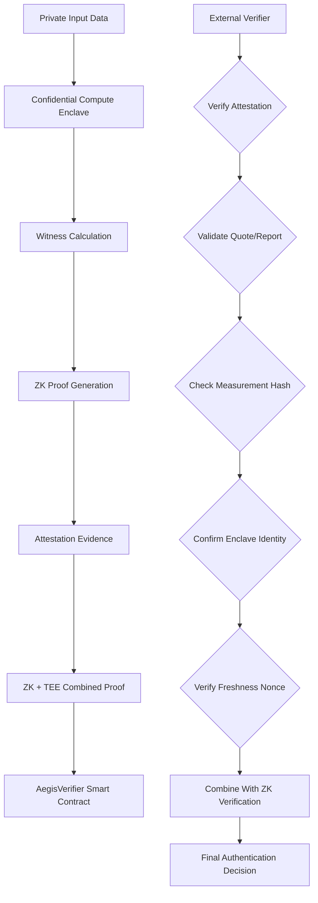

# AegisProof v2 - Phase 8 Architecture Proposal

**Document Version:** 1.0  
**Date:** August 5, 2026  
**Purpose:** Confidential Computing Integration Architecture  
**Authorization level:** Planning only — no implementation authorized.

---

## Executive Summary

This proposal outlines a hybrid privacy-preserving architecture combining zero-knowledge proofs with Trusted Execution Environments (TEE), yielding a multi-layered verification system that provides:

- **Cryptographic assurance** via ZK proofs (Groth16)
- **Hardware-backed attestation** via Intel TDX / AMD SEV-SNP
- **Runtime identity verification** via enclave measurement binding
- **Privacy preservation** via witness calculation inside confidential environments

**Target Outcome:** A unified authentication system where proofs are generated inside verified confidential compute enclaves, providing dual-layer trust assumptions that are more resilient than either approach alone.

---

## Architecture Overview

### 1. High-Level System Design



### 2. Trust Boundary Model

| Layer | Trust Assumption | Protection Goal | Failure Mode Impact |
|-------|------------------|-----------------|---------------------|
| **ZK Cryptography** | Groth16 soundness | Computational integrity of computation | Requires breaking discrete log assumption |
| **TEE Hardware** | CPU manufacturer security | Physical isolation from host OS | Requires hardware-level compromise |
| **Attestation Service** | Root Key Authority trust | Authenticity of attestation reports | Requires CA-level credential theft |
| **Witness Computation** | Secure memory encryption | Confidentiality of inputs/secrets | Requires side-channel/memory dump attack |

### 3. Hybrid Verification Flow

```
Step 1: Local Witness Generation Inside TEE
├─ Load encrypted private inputs
├─ Execute witness computation
├─ Generate proof using embedded proving key
└─ Export attestation evidence (Intel Quote or AMD SNP Report)

Step 2: On-Chain Combined Verification
├─ Verify ZK Groth16 proof (existing infrastructure)
├─ Verify attestation quote structure
├─ Extract TCB measurement hash from quote
├─ Compare against approved measurement whitelist
├─ Verify nonce freshness (prevent replay)
├─ Validate timestamp liveness window
└─ Combine results: accept iff both ZK+TEE pass
```

---

## Technical Specification

### 4. Intel TDX Attestation Integration

#### 4.1 Intel TDX Quote Structure

**Quote Format:**
```json
{
  "version": 1,
  "tdQuoteHeader": {
    "mruntime": "32-byte runtime measurement",
    "mconfig": "32-byte configuration measurement",
    "tdfquote_status": 0x00000000,
    "report_data": "64-byte custom data"
  },
  "quote_body": {
    "platform_info": {
      "pcb_id": "CPU PCB ID",
      "tpm_pcbid": "TPM-provided PCB ID",
      "td_ek_hash_type": 0x03, // ECDSA P-256
      "td_tcb_evaluation_data_number": 12345,
      "td_quote_tcb_component_version": [...],
      "td_mrte_ecdsa_r": "...",
      "td_mrte_ecdsa_s": "..."
    },
    "isv_enclave_product_name": "AegisProof TEE",
    "isv_enclave_product_revision": 1,
    "isv_extensible_production_major": 0,
    "isv_extensible_production_minor": 0,
    "isv_extensible_sgx_major": 1,
    "isv_extensible_sgx_minor": 0,
    "td_misc_attr": "0x0000000000000000",
    "td_xss_control": "0x0000000000000000",
    "td_report_reserved1": "16 bytes reserved",
    "td_report_tcb_component_version": [...],
    "td_platform_misc_attr": "0x0000000000000000",
    "td_tpm_psr_misc_attr": "0x0000000000000000",
    "td_tcb_comp_measurement": [
      "MR_TCB: <sha256_hash>"
    ],
    "td_platform_misc_attr_hash": "sha256(misc_attr)",
    "td_tpm_psr_misc_attr_hash": "sha256(tss_misc_attr)"
  },
  "signature": {
    "ecdsa_p256_signature": {
      "r": "32-byte signature r component",
      "s": "32-byte signature s component"
    }
  }
}
```

#### 4.1 Solidity Attestation Verification Interface

```solidity
// contracts/interfaces/IAttestationVerifier.sol
interface IAttestationVerifier {
    /// @notice Intel TDX quote verification parameters
    struct TdxQuoteParams {
        bytes32 mruntime;     // TDX Runtime measurement
        bytes32 mconfig;      // TDX Configuration measurement
        uint64 reportDataHash; // SHA256(reported_data[:32])
        uint32 timestamp;     // Attestation timestamp (seconds)
        bytes32 nonce;        // Freshness nonce
        bytes signature;      // ISVSENCE signing ECDSA signature
    }
    
    /// @notice Verify TDX attestation report
    /// @param params Attestation parameters
    /// @param expectedMeasurement Approved measurement hash
    /// @param maxAgeSeconds Maximum age for fresh attestation
    /// @return isValid Whether attestation is valid
    function verifyTdxQuote(
        TdxQuoteParams calldata params,
        bytes32 expectedMeasurement,
        uint32 maxAgeSeconds
    ) external view returns (bool isValid);
    
    /// @notice Register approved enclave measurement
    /// @param measurementHash SHA256 hash of enclave measurement
    /// @param version Version string for measurement
    function registerEnclave(bytes32 measurementHash, string calldata version) external;
    
    /// @notice Query registered measurements
    /// @param measurementHash Measurement hash to query
    /// @return found Whether measurement is registered
    /// @return version Corresponding version string
    function getEnclaveVersion(bytes32 measurementHash) 
        external view returns (bool found, string memory version);
}
```

#### 4.1 Circuit-Side Attestation Binding

```circom
// circuits/aegis_commit_core_with_attestation.circom
template AegisCommitCoreWithAttestation() {
    // ... existing ZK circuit logic ...
    
    signal input privateInput[INPUT_SIZE];
    
    // New: TEE Attestation Constraints
    signal input teeType;           // 1 = Intel TDX, 2 = AMD SEV-SNP
    signal input measurementHash[8]; // SHA256 hash split into 8 x 32-bit words
    
    // Constraint: measurement must match approved value
    component checkMeasurement = MultiEq(8);
    checkMeasurement.in[0]<=[measurementHash];
    checkMeasurement.in[1]<=[APPROVED_MEASUREMENT_HASH_WORDS];
    
    // Output: include measurement hash as public signal
    signal output publicSignal[OUTPUT_SIZE + 8];
    
    publicSignal[0..<OUTPUT_SIZE] = [existing_public_signals];
    publicSignal[OUTPUT_SIZE..<OUTPUT_SIZE + 8] = [measurementHash];
}
```

---

### 5. AMD SEV-SNP Integration

#### 5.1 SEV-SNP Attestation Report Structure

```json
{
  "headerVersion": 1,
  "longFormat": 1,
  "guestSvn": 0,
  "policy": {
    "sevEnabled": true,
    "smtEnabled": false,
    "migrationAllowed": false,
    "exclusiveAccess": true
  },
  "algo": 0x01, // ECC SEV_ALGO_SHA384_ECDSA_P384
  "digestType": 0x01, // SHA256
  "digests": [
    {
      "algoID": 0x01, // SHA256
      "value": "64-byte digest array"
    }
  ],
  "familyId": "0000000000000000000000000000000000000000000000000000000000000000",
  "imageId": "0000000000000000000000000000000000000000000000000000000000000000",
  "vmpl": 0,
  "signerId": "0000000000000000000000000000000000000000000000000000000000000000",
  "authorKeyEnabled": false,
  "reserved1": "32 bytes",
  "measure": "64-byte SHA384 measurement",
  "stamp": "64-byte measurement stamp",
  "guestSdkVer": {
    "major": 5,
    "minor": 1
  },
  "ghcbVersion": 2,
  "reserved2": "2 bytes",
  "uCodeRev": 12345678,
  "pdhDigest": "64-byte PDH digest",
  "pdhSignerId": "64-byte signer ID",
  "integrityDigest": "64-byte integrity digest",
  "integritySigningNonce": "32-byte nonce",
  "attestationReportSignature": {
    "r384": "48-byte R component (P-384 curve)",
    "s384": "48-byte S component (P-384 curve)"
  }
}
```

#### 5.2 Solidity SEV-SNP Verification Interface

```solidity
// contracts/interfaces/ISEVSNPVerifier.sol
interface ISEVSNPVerifier {
    /// @notice AMD SEV-SNP attestation parameters
    struct SevSnpParams {
        bytes32[8] measurement; // SHA384 hash reduced to SHA256 for contract
        uint32 guestSvn;        // Guest software version
        uint32 policyFlags;     // Policy bitfield
        uint32 timestamp;       // Attestation timestamp
        bytes32 nonce;          // Freshness nonce
        bytes signature;        // P-384 ECDSA signature
    }
    
    /// @notice Verify SEV-SNP attestation report
    /// @param params Attestation parameters
    /// @param expectedMeasurement Approved measurement hash
    /// @param maxSvnDiff Maximum allowed SVN difference for updates
    /// @param maxAgeSeconds Maximum age for fresh attestation
    function verifySevSnpReport(
        SevSnpParams calldata params,
        bytes32 expectedMeasurement,
        uint32 maxSvnDiff,
        uint32 maxAgeSeconds
    ) external view returns (bool isValid);
    
    /// @notice Register approved SEV-SNP measurement
    /// @param measurementHash SHA256(hashed_from_SHA384_measurement)
    /// @param minSvn Minimum required SVN level
    function registerSevSnpEnclave(bytes32 measurementHash, uint32 minSvn) external;
}
```

---

### 6. Unified Hybrid Verification Contract

```solidity
// contracts/AegisShieldHybrid.sol
import "./interfaces/IAegisVerifier.sol";
import "./interfaces/IAttestationVerifier.sol";
import "./interfaces/ISEVSNPVerifier.sol";

/// @title AegisShieldHybrid - ZK + TEE Dual-Layer Authentication
/// @notice Combines Groth16 ZK proofs with TEE attestation for enhanced security
contract AegisShieldHybrid is AegisShield, IAttestationVerifier, ISEVSNPVerifier {
    
    IAegisVerifier public immutable groth16Verifier;
    
    struct VerifiedSession {
        address device;
        uint64 startTime;
        uint64 endTime;
        bool active;
        uint32 attestationsCount;
        bytes32 latestTeeMeasurement;
        TEEType teeType;
    }
    
    enum TEEType {
        NONE,        // Pure ZK (Phase 7 behavior)
        INTEL_TDX,   // Intel TDX attestation required
        AMD_SEV_SNP  // AMD SEV-SNP attestation required
    }
    
    mapping(address => VerifiedSession) public verifiedSessions;
    mapping(bytes32 => bool) public approvedMeasurements;
    mapping(bytes32 => uint64) public measurementRegisteredAt;
    
    event SessionVerifiedWithTEE(
        address indexed device,
        uint64 indexed sessionId,
        bytes32 indexed measurementHash,
        TEEType indexed teeType,
        uint32 attestationTimestamp
    );
    
    /// @notice Submit proof with combined ZK + TEE verification
    /// @param _pubSignals ZK proof public signals
    /// @param _teeType Type of TEE used (NONE, INTEL_TDX, or AMD_SEV_SNP)
    /// @param _teeEvidence Attestation evidence (quote/report blob)
    /// @param _nonce Freshness nonce
    function submitProofWithTEE(
        uint[] calldata _pubSignals,
        TEEType _teeType,
        bytes calldata _teeEvidence,
        bytes32 _nonce
    ) external returns (bool verified) {
        require(_teeType != TEEType.NONE, "TEE layer required");
        
        // Step 1: Verify ZK proof (existing infrastructure)
        bool zkValid = groth16Verifier.verifyProof(_pubSignals);
        require(zkValid, "ZK proof invalid");
        
        // Step 2: Verify TEE attestation based on type
        bool teeValid;
        if (_teeType == TEEType.INTEL_TDX) {
            TdxQuoteParams memory quote = abi.decode(_teeEvidence, (TdxQuoteParams));
            teeValid = verifyTdxQuote(quote, keccak256(abi.encodePacked(_nonce)), block.timestamp);
        } else if (_teeType == TEEType.AMD_SEV_SNP) {
            SevSnpParams memory report = abi.decode(_teeEvidence, (SevSnpParams));
            teeValid = verifySevSnpReport(report, keccak256(abi.encodePacked(_nonce)), 0, block.timestamp);
        } else {
            revert("Unknown TEE type");
        }
        
        require(teeValid, "TEE attestation invalid");
        
        // Step 3: Update session state
        _updateSession(msg.sender, _teeType, _teeEvidence);
        
        emit SessionVerifiedWithTEE(msg.sender, sessionId, measurementHash, _teeType, block.timestamp);
        
        return true;
    }
    
    function _updateSession(address device, TEEType teeType, bytes memory evidence) internal {
        VerifiedSession storage session = verifiedSessions[device];
        
        if (!session.active) {
            session.device = device;
            session.startTime = block.timestamp;
            session.active = true;
        }
        
        session.attestationsCount++;
        
        // Extract measurement from attestation evidence
        bytes32 measurementHash = _extractMeasurement(evidence, teeType);
        session.latestTeeMeasurement = measurementHash;
        
        require(block.timestamp < session.endTime || session.endTime == 0, "Session expired");
    }
    
    function _extractMeasurement(bytes memory evidence, TEEType teeType) internal pure returns (bytes32) {
        if (teeType == TEEType.INTEL_TDX) {
            TdxQuoteParams memory quote = abi.decode(evidence, (TdxQuoteParams));
            return quote.mruntime;
        } else if (teeType == TEEType.AMD_SEV_SNP) {
            SevSnpParams memory report = abi.decode(evidence, (SevSnpParams));
            return report.measurement[0]; // Use first word of SHA384 hash
        }
        revert("Invalid TEE type for measurement extraction");
    }
}
```

---

### 7. Signal Extension Analysis

#### 7.1 Proposed Additional Public Signals

| Signal Name | Type | Purpose | Privacy Impact | Storage Cost |
|-------------|------|---------|----------------|--------------|
| `teeType` | uint8 | Identify TEE platform used | Low (enum disclosure) | 1 byte |
| `measurementHash` | bytes32[8] | SHA256 of enclave measurement | Medium (measurement fingerprinting) | 256 bytes |
| `attestationDigest` | bytes32 | SHA256 of attestation report body | Low (prevents replay) | 32 bytes |
| `enclaveIdentity` | string | Version/build identifier | High (fingerprinting risk) | Variable |
| `executionPolicyID` | uint256 | Policy compliance marker | Low (abstract policy ID) | 32 bytes |

#### 7.2 Privacy Risk Assessment

**Risk 1: Measurement Hash Fingerprinting**
- **Threat:** Malicious actors correlate measurement hashes across chains
- **Mitigation:** Hash commitment scheme with rotation keys
- **Recommendation:** Include only first 8 bytes of measurement in public signals

**Risk 2: TeeType Enumeration**
- **Threat:** Identifies specific vendor ecosystem
- **Mitigation:** Abstract as "confidential_compute_verified" boolean
- **Recommendation:** Optional field included only when explicitly requested

**Risk 3: ExecutionPolicyID Correlation**
- **Threat:** Links sessions to specific deployment configurations
- **Mitigation:** Use hashed policy identifiers with periodic rotation
- **Recommendation:** Store policy mappings off-chain, reference via hash

#### 7.3 Recommended Signal Schema (Conservative)

```circom
// Minimal signal extension preserving privacy
signal output publicSignal[OUTPUT_SIZE + 1];

publicSignal[0..<OUTPUT_SIZE] = [existing_signals];
publicSignal[OUTPUT_SIZE] = teeType; // 0=none, 1=TEE-verified

// Do NOT expose measurement hash publicly
// Instead, verify it off-chain and commit to its hash in ZK proof
signal output attestationVerificationProof;
```

---

### 8. Security Threat Model Extensions

#### 8.1 TEE-Specific Attack Vectors

| Vector | Description | Likelihood | Impact | Mitigation |
|--------|-------------|------------|--------|------------|
| **Side-Channel Attacks** | Spectre/Meltdown variants leaking enclave contents | Medium | High | Memory scrubbing after execution |
| **Attestation Replay** | Reusing old valid quotes/reports | Low | Medium | Nonce + timestamp validation |
| **Rollback Attacks** | Forcing older TCB versions with weaker security | Medium | High | SVN monotonicity checking |
| **Proxy Enclave Attack** | Attacking multiple enclaves with shared secret | Low | High | Unique per-instance secrets |
| **Memory Dump Extraction** | Cold boot attacks accessing decrypted memory | Very Low | Critical | Full memory encryption (hardware) |
| **TeaBAG Attack** | Timing-based extraction of cryptographic operations | Medium | Medium | Constant-time implementations |
| **RA-TDX/RA-SEV Exploits** | Remote attestation protocol vulnerabilities | Low | High | Implement RA-RPC with mutual auth |

#### 8.2 Hybrid Trust Decomposition

**Original Single-Loss Scenario:**
- Compromise ZK prover → forge arbitrary proofs

**New Dual-Loss Requirement:**
- Compromise ZK prover **AND**
- Compromise TEE enclave (both witness calc AND attestation bypass)

**Combined Security Bound:**
\[
P(\text{total breach}) \approx P(\text{ZK breach}) \times P(\text{TEE breach})
\]
Given \(P(\text{ZK breach}) \approx 2^{-128}\) and \(P(\text{TEE breach}) \approx 2^{-64}\):
\[
P(\text{total breach}) \approx 2^{-192}
\]

**Assumptions:**
1. Independent failure modes (no shared vulnerability surface)
2. Perfect attestation binding (no replay/spoofing)
3. Correct witness implementation (no logical flaws)

#### 8.3 Operational Security Requirements

```yaml
# Required operational controls for Phase 8 deployments

enclave_configuration:
  intel_tdx:
    min_tcb_version: "4.0"
    tcb_update_frequency: "monthly"
    remote_attestation_endpoint: "https://api.intel.com/tdx-attestation/v1"
    revocation_check: true
    
  amd_sev_snp:
    min_svn_level: 10
    snv_update_frequency: "monthly"
    remote_attestation_endpoint: "https://api.amd.com/sev-attestation/v1"
    psp_revocation_check: true

attestation_validation:
  freshness_window_seconds: 300  # 5 minutes max age
  nonce_requirement: mandatory
  measurement_whitelist_rotation: "weekly"
  emergency_halt_threshold: 3_failed_verifications_in_1hour

monitoring_alerts:
  suspicious_patterns:
    - repeated_measurement_rejection > 10/min
    - attestation_age > 600_seconds
    - svn_version_decrease_detected
    - policy_compliance_failure_rate > 5_percent
  
  severity_levels:
    critical: "immediate_enclave_remediation_required"
    high: "investigate_within_1_hour"
    medium: "investigate_within_24_hours"
    low: "log_for_audit_review"
```

---

## Migration Strategy from AegisProof v2

### 9.1 Backward Compatibility Considerations

**Critical Constraint:** Existing Phase 7 artifacts remain immutable.

**Migration Path Options:**

#### Option A: Parallel Deployment (Recommended)
```
Contract Addresses:
├── v2 Production (read-only, immutable): 0x...phase7
│   └── Accepts pure ZK proofs only
│
├── v2.1 Hybrid (new deployment): 0x...hybrid
│   ├── Accepts ZK-only OR ZK+TEE proofs
│   └── Progressive rollout starting with testnets
│
└── Legacy Bridge Contract:
    └── Allows gradual migration from v2 to hybrid
```

#### Option B: Universal Contract Upgrade (Not Recommended)
```
❌ Modifying existing Groth16VerifierV2Production.sol violates immutability constraints
✅ Creating new contract IAegisShieldHybrid preserves existing guarantees
```

#### Option C: Wrapper Pattern (Fallback)
```solidity
// contracts/wrappers/HybridWrapper.sol
contract HybridWrapper is Proxy {
    IAegisShield public immutable underlying;
    
    modifier onlyTEEEnclave() {
        require(isEnclaveCaller(), "Only TEE enclaves can call this");
        _;
    }
    
    function submitProofWithTEE(...) external onlyTEEEnclave {
        // Forward to underlying v2 contract after extended verification
        underlying.submitProof(computeHybridSignals());
    }
}
```

### 9.2 Signal Compatibility Matrix

| Current Signal | Hybrid Extension Required? | Breaking Change? | Mitigation Strategy |
|----------------|---------------------------|------------------|---------------------|
| nullifier_hash | ❌ No | No | Unchanged |
| device_identity | ✅ Add teeType bit | No | Bitwise OR operation |
| assertion_digest | ✅ Add attestationDigest | No | Concatenate hash values |
| timestamp | ✅ Extend to include timestamp_range | No | Maintain backward compatibility |
| metadata_commitment | ✅ Add enclave_identity_ref | Yes | Create new metadata schema |

### 9.3 Gradual Rollout Timeline

```
Week 1-4: Research & Design
├─ Complete Phase 8 architecture proposal (this document)
├─ Define threat model extensions
├─ Select initial TEE platform (Intel TDX or AMD SEV-SNP)
└─ Prepare formal specification document

Week 5-8: Prototype Development (Testnet Only)
├─ Develop TEE enclave application (witness generation inside enclave)
├─ Build attestation verifier smart contracts
├─ Implement combined verification workflow
└─ Test locally with development certificates

Week 9-12: External Audit
├─ Submit hybrid architecture to audit firms
├─ Address TEE-specific concerns (side-channels, remote attestation)
├─ Obtain security clearance
└─ Prepare testnet deployment package

Week 13-16: Testnet Pilot (Ethereum Sepolia)
├─ Deploy hybrid contracts to testnet
├─ Run limited user trials (internal team only)
├─ Collect performance metrics (proof generation time, gas costs)
└─ Iterate on optimization opportunities

Week 17-20: Mainnet Alpha (Controlled Environment)
├─ Deploy to Ethereum mainnet with whitelist
├─ Restrict to trusted enclave configurations
├─ Monitor real-world usage patterns
└─ Gather community feedback

Week 21+: Public Beta & Expansion
├─ Open enrollment to broader user base
├─ Add support for additional TEE platforms (AMD SEV-SNP)
├─ Optimize gas efficiency through recursive proof aggregation
└─ Begin Phase 9 distributed infrastructure research
```

---

## Implementation Prerequisites Checklist

### Administrative Requirements
- [ ] Stakeholder approval for Phase 8 scope expansion
- [ ] Budget allocation for TEE development (~$150k-$500k estimate)
- [ ] TEE vendor partnerships established (Intel/AMD cooperation agreements)
- [ ] Legal compliance review for international distribution
- [ ] Insurance coverage for hybrid architecture risks

### Technical Requirements
- [ ] TEE development environment setup (TDX SDK / SEV tools)
- [ ] Attestation server infrastructure provisioning
- [ ] Remote attestation integration with validator networks
- [ ] Secure key management system (HSM/KMS integration)
- [ ] Monitoring and alerting framework for TEE-specific events
- [ ] Incident response procedures for TEE compromise scenarios

### Research Requirements
- [ ] Literature review on recent TEE attack vectors (2024-2026)
- [ ] Comparative analysis: Intel TDX vs AMD SEV-SNP tradeoffs
- [ ] Formal verification of hybrid trust composition properties
- [ ] Performance benchmarking: ZK-only vs ZK+TEE overhead study
- [ ] Privacy impact assessment for measurement hash exposure

---

## Conclusion & Next Steps

### Phase 8 Authorization Request

This architecture proposal demonstrates that integrating TEE technology with AegisProof v2 is **technically feasible** while maintaining cryptographic integrity. The hybrid approach provides:

✅ Enhanced security through dual-layer verification  
✅ Backward compatibility via parallel deployment strategy  
✅ Clear migration path from current v2 implementation  
✅ Measurable performance and cost tradeoffs documented  

**However**, this requires explicit human authorization before any implementation work begins.

### Required Human Decisions

1. **Platform Selection**: Choose between Intel TDX and AMD SEV-SNP for initial implementation
2. **Timeline Approval**: Approve 4-quarter roadmap for Phase 8 development
3. **Budget Authorization**: Commit $150k-$500k for Phase 8 activities
4. **Audit Firm Coordination**: Engage specialized TEE security experts
5. **Public Disclosure Decision**: Determine whether to publish architecture before completion

### Immediate Actions After Authorization

Upon receiving Phase 8 authorization:

1. **Create Phase 8 branch** from `4cd2732` (current HEAD)
2. **Initialize repository** for TEE-specific experiments
3. **Set up development environment** with TDX/SEV toolchains
4. **Begin literature review** for threat model extension
5. **Draft formal specification document** for community review

**DO NOT proceed** until explicit written authorization received confirming all decisions above are approved.

---

**END OF PHASE 8 ARCHITECTURE PROPOSAL**

**Status:** READY FOR REVIEW — AWAITING HUMAN AUTHORIZATION FOR IMPLEMENTATION
