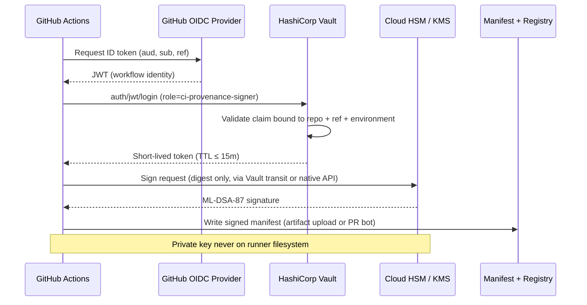

# Production KMS/HSM Architecture — AegisProof v2 Phase 8.14

**Version:** 1.0  
**Date:** 2026-08-08  
**Status:** Design (Task 1)  
**Scope:** ML-DSA-87 provenance keys and operator authentication keys only  

> **Groth16 core is permanently frozen.** This design does not generate private keys, does not modify `protocol/`, `packages/sdk/`, `tee/`, verifier contracts, `production.zkey`, VK, `proveCanonical()`, or `publicSignals(30)`. KMS/HSM applies exclusively to the **outer governance layer** established in Phase 8.13.

---

## 1. Purpose

Phase 8.14 Task 1 defines how production-grade cryptographic keys are owned, generated, stored, rotated, revoked, and recovered for:

| Key role | Algorithm | Domain | Module |
|----------|-----------|--------|--------|
| **Artifact provenance signer** | ML-DSA-87 (FIPS 204) | `AEGIS_ARTIFACT_PROVENANCE_V1` | `scripts/lib/pqc-signature.mjs` |
| **Operator auth (PQC leg)** | ML-DSA-87 | `AEGIS_AUTH_ENVELOPE_V1` | `scripts/lib/hybrid-auth-envelope.mjs` |
| **Operator auth (classical leg)** | ECDSA secp256k1 | `AEGIS_AUTH_ENVELOPE_V1` | `scripts/lib/hybrid-auth-envelope.mjs` |

These keys sign **metadata and authorization envelopes** — not Groth16 proofs, not on-chain verifier inputs, not TEE attestations.

---

## 2. Trust Boundary

```
┌─────────────────────────────────────────────────────────────────────────┐
│  PUBLIC / GITHUB (auditable, committable)                                 │
│  • Source: scripts/, tests/, docs/, CI workflows                          │
│  • Manifest: artifacts/provenance/manifest.json (hashes + signatures)     │
│  • Public key registry: artifacts/provenance/public-keys/*.json           │
│  • Hash pins: PRODUCTION_ZKEY_HASH, PRODUCTION_VKEY_HASH                  │
└─────────────────────────────────────────────────────────────────────────┘
         │ verify only                          │ verify only
         ▼                                      ▼
┌──────────────────────┐              ┌──────────────────────┐
│  CI RUNNER (ephemeral) │              │  OPERATOR WORKSTATION │
│  OIDC → short-lived   │              │  MFA + policy gate    │
│  signing session      │              │  (deployment auth)    │
└──────────┬───────────┘              └──────────┬───────────┘
           │ sign request                         │ sign request
           ▼                                      ▼
┌─────────────────────────────────────────────────────────────────────────┐
│  PROTECTED — NEVER IN GIT                                               │
│  ┌─────────────────┐  ┌─────────────────┐  ┌─────────────────────────┐ │
│  │ KMS / HSM       │  │ Vault           │  │ production.zkey (separate)│ │
│  │ ML-DSA-87 keys  │  │ policy + audit  │  │ NOT managed by this doc │ │
│  │ ECDSA operator  │  │ secret engine   │  │ frozen ceremony artifact│ │
│  └─────────────────┘  └─────────────────┘  └─────────────────────────┘ │
└─────────────────────────────────────────────────────────────────────────┘
         ↕ no connection
┌─────────────────────────────────────────────────────────────────────────┐
│  FROZEN ZK CORE (Phase 8.10–8.13, immutable)                            │
│  circuits · R1CS · zkey · VK · Groth16Verifier · proveCanonical()       │
│  publicSignals(30) · protocol/ · packages/sdk/ · tee/                 │
└─────────────────────────────────────────────────────────────────────────┘
```

### Boundary rules

| Asset | GitHub | KMS/HSM | Groth16 path |
|-------|--------|---------|--------------|
| ML-DSA-87 **public** key | Yes (registry) | Export allowed | No |
| ML-DSA-87 **private** key | **Never** | Yes | No |
| ECDSA operator **public** key | Optional (registry extension) | Export allowed | No |
| ECDSA operator **private** key | **Never** | Yes | No |
| Signed manifest | Yes | — | No |
| `production.zkey` | Hash only (migration) | Separate custody | Yes (proving) |

Enforcement: `check:sensitive-files`, PT-01, PT-05, `.gitignore` on `artifacts/provenance/keys/`.

---

## 3. Key Ownership

| Key ID (example) | Owner | Purpose | Approval |
|------------------|-------|---------|----------|
| `aegis-provenance-prod-v1` | Security / Release Engineering | Sign manifest entries after release | 2-of-3 release officers |
| `aegis-ci-mldsa87-v1` | CI Platform | Ephemeral/scheduled manifest verify baseline | Platform team |
| `aegis-operator-ecdsa-prod-v1` | Protocol Operations | Hybrid auth classical leg | 2-of-2 ops + security |
| `aegis-operator-pqc-prod-v1` | Protocol Operations | Hybrid auth PQC leg | 2-of-2 ops + security |

### RACI

| Activity | Release Eng | Security | Platform (CI) | Protocol Ops |
|----------|-------------|----------|---------------|--------------|
| Provenance key generation | A | R | I | I |
| Operator key generation | I | A | I | R |
| Rotation | R | A | R | R |
| Revocation | C | A | R | R |
| Registry commit (public key) | R | A | C | I |
| CI OIDC policy | I | A | R | I |

**R** = Responsible, **A** = Accountable, **C** = Consulted, **I** = Informed

Private keys are owned by the **Security organization** with operational custody in KMS/HSM. No individual developer holds production private key material.

---

## 4. Key Lifecycle

```
┌──────────┐    ┌──────────┐    ┌──────────┐    ┌──────────┐    ┌──────────┐
│ Planned  │───▶│ Generated│───▶│ Active   │───▶│ Rotating │───▶│ Revoked  │
│ (design) │    │ (HSM)    │    │ (signing)│    │ (overlap)│    │ (archive)│
└──────────┘    └──────────┘    └──────────┘    └──────────┘    └──────────┘
                                      │                               │
                                      └───────────▶ Retired ◀─────────┘
                                                   (verify-only)
```

| State | Signing | Verification | Registry |
|-------|---------|--------------|----------|
| **Planned** | No | No | Not published |
| **Generated** | No (quarantine) | Test vectors only | Staged, not committed |
| **Active** | Yes | Yes | Committed, `immutable: true` |
| **Rotating** | Old + new both valid | Both keys in registry | New key committed before old revoke |
| **Retired** | No | Yes (historical manifests) | `immutable: true`, `status: retired` |
| **Revoked** | No | No (FAIL closed) | `revokedAt` set; CI strict mode rejects |

Lifecycle events are append-only in an external audit log (Vault audit device / CloudTrail / HSM transaction log).

---

## 5. Generation

**Policy:** Production private keys are generated **inside** KMS or HSM. This repository does not generate production keys (Phase 8.14 Task 1 is design-only).

### 5.1 Provenance signing key (ML-DSA-87)

| Step | Actor | Action |
|------|-------|--------|
| 1 | Security | Create HSM key slot / KMS asymmetric key with `SIGN_VERIFY` purpose |
| 2 | HSM | Generate ML-DSA-87 keypair; private key non-exportable |
| 3 | Security | Export **public** key only; assign `keyId`: `aegis-provenance-prod-v1` |
| 4 | Release Eng | Write `artifacts/provenance/public-keys/aegis-provenance-prod-v1.json` |
| 5 | CI | Verify registry record via `validateRegistryRecord()` (PT-05) |

Public key registry record shape (committed):

```json
{
  "keyId": "aegis-provenance-prod-v1",
  "algorithm": "ML-DSA-87",
  "version": "v1",
  "publicKey": "<hex, no 0x prefix>",
  "purpose": "Production artifact manifest signing",
  "createdAt": "<ISO-8601>",
  "immutable": true
}
```

### 5.2 Operator authentication keys

Hybrid auth requires **two independent** signing keys:

| Leg | Algorithm | Storage | Notes |
|-----|-----------|---------|-------|
| Classical | ECDSA secp256k1 | HSM (P-256/K256 support) or Vault transit | Maps to `classicalSignature` in envelope |
| PQC | ML-DSA-87 | HSM or KMS PQC-capable module | Maps to `pqcSignature` in envelope |

Generation follows the same HSM-only rule. Public keys may be registered in an extended registry or embedded in deployment policy documents (not in Groth16 verifier).

### 5.3 Development and CI (non-production)

| Tier | Method | Location |
|------|--------|----------|
| Dev | `npm run generate:pqc-dev-keys` (local only) | `artifacts/provenance/keys/` (gitignored) |
| CI ephemeral | Workflow-injected secret or OIDC-fetched short-lived key | Runner only; never committed |

Production keys must **never** share HSM slots with dev/CI keys.

---

## 6. Rotation

### 6.1 Triggers

| Trigger | Action |
|---------|--------|
| Scheduled (annual) | Proactive rotation with 90-day overlap |
| Personnel change | Rotate operator keys within 24h |
| Suspected compromise | Emergency rotation + revocation |
| Algorithm policy update | New `keyId` suffix (`v2`); old key retired |

### 6.2 Rotation procedure (provenance key)

1. Generate new key in HSM: `aegis-provenance-prod-v2`
2. Commit new public key to registry **before** first production signature
3. Overlap window: both `v1` and `v2` verify in `verifyPqcSignatureEnvelope()` (registry lookup by `publicKeyId`)
4. Re-sign manifest with `v2` on next release
5. Mark `v1` as `status: retired` in registry metadata (optional field; verification still allowed for historical manifests)
6. After overlap window, revoke `v1` if no historical verify needed

### 6.3 Rotation procedure (operator keys)

1. Issue new ECDSA + ML-DSA-87 pair in HSM
2. Update deployment authorization policy to accept new public keys
3. Dual-sign transition envelopes during overlap (both key sets valid)
4. Revoke old keys after all in-flight deployments complete

Rotation does **not** require Groth16 artifact regeneration. Manifest re-signing is an outer-layer operation only.

---

## 7. Revocation

| Scenario | Provenance key | Operator key |
|----------|----------------|--------------|
| Compromise suspected | Immediate HSM disable; add `revokedAt` to registry | Disable + invalidate active sessions |
| Employee offboarding | N/A unless custodian | Rotate within 24h |
| Key expiry | Move to retired, then revoke | Same |

### Revocation registry update

```json
{
  "keyId": "aegis-provenance-prod-v1",
  "algorithm": "ML-DSA-87",
  "version": "v1",
  "publicKey": "<hex>",
  "immutable": true,
  "revokedAt": "2026-08-08T12:00:00.000Z",
  "revocationReason": "scheduled-rotation"
}
```

Verification behavior (Phase 8.13+ scripts):

| Mode | Revoked key signature |
|------|----------------------|
| Default (`--live`) | WARN → migrate to strict |
| Strict (`--require-pqc`) | **FAIL** |
| Historical audit | Optional `--allow-revoked` (future Task; audit tooling only) |

Revocation is enforced at the **registry + verify** layer, not in Groth16 contracts.

---

## 8. Recovery

### 8.1 Disaster scenarios

| Scenario | Recovery |
|----------|----------|
| HSM failure | Failover to HSM replica; keys are HA-replicated at generation |
| Vault unavailability | Cached read-only public keys in git suffice for **verify**; signing blocked until Vault restored |
| Registry corruption in git | Restore from last signed tag; verify manifest hashes against pinned constants |
| Lost operator key | Generate new HSM key; update registry; cannot recover old private key (by design) |
| Manifest unsigned after outage | Re-run `generate:provenance` with HSM signing session when KMS available |

### 8.2 Recovery priorities

1. **Verify path** (no secrets): SHA-256 + public key registry in git — always recoverable
2. **Sign path**: Requires HSM/Vault restoration; no offline private key backup in repository
3. **Groth16 proving**: `production.zkey` custody is **separate** from PQC KMS (different team, different storage tier)

### 8.3 Break-glass

Break-glass signing requires:

- Security incident ticket
- 2-of-3 executive approval
- Ephemeral HSM key with 24h TTL
- Mandatory rotation within 72h after incident closure

Break-glass events are logged to immutable audit storage. No break-glass key material in git or CI secrets long-term.

---

## 9. CI OIDC Flow

GitHub Actions obtains short-lived credentials via OIDC — no long-lived PATs or committed secrets for signing.



### OIDC claim binding

| Claim | Required value |
|-------|----------------|
| `repository` | `zenoamo/AegisProof-v2` (or org repo) |
| `ref` | `refs/heads/master` or release tag pattern |
| `environment` | `provenance-signing` (protected environment) |
| `workflow` | Allowlist: `aegis_repro_ci.yml` jobs only |

### CI tiers (aligned with Phase 8.13)

| Tier | Trigger | Key source | PQC mode |
|------|---------|------------|----------|
| PR | push / PR | None | Hash required; PQC WARN |
| Schedule | weekly | OIDC → Vault → HSM | `--require-pqc` |
| Release | tag `v*` | OIDC → production HSM role | `--require-pqc` + registry prod key |
| Manual | workflow_dispatch | Same as schedule | Operator approval gate |

Existing workflow reference: `provenance-pqc-hardening` job uses ephemeral local key today; Phase 8.14 Task 2+ will replace with OIDC-backed HSM signing.

---

## 10. HSM Integration Model

### 10.1 Recommended architecture

```
┌─────────────┐     ┌─────────────┐     ┌─────────────────────────┐
│  Signer CLI │────▶│  Vault      │────▶│  Cloud HSM              │
│  (scripts/) │     │  Transit /  │     │  AWS CloudHSM           │
│             │     │  PKI engine │     │  GCP Cloud HSM          │
└─────────────┘     └─────────────┘     │  Azure Dedicated HSM    │
                                        │  YubiHSM / Thales Luna  │
                                        └─────────────────────────┘
```

### 10.2 HSM requirements

| Requirement | Detail |
|-------------|--------|
| Key generation | FIPS 140-2 Level 3+ validated module |
| Private key export | **Disabled** (non-exportable) |
| Algorithm | ML-DSA-87 (FIPS 204); ECDSA secp256k1 for operator classical leg |
| Sign operation | Raw message or pre-hash per `buildSignMessage()` domain separation |
| Audit | Every sign operation logged with requester identity |
| HA | Multi-AZ replication |

### 10.3 Signing adapter (future Task 2)

Phase 8.14 Task 1 defines the interface; implementation deferred:

```javascript
// scripts/lib/kms-signer.mjs (Task 2 — not implemented in Task 1)
// signProvenancePayload(payload) → { signature, publicKeyId, signedAt }
// signAuthEnvelope(payload) → { classicalSignature, pqcSignature }
```

Adapter responsibilities:

1. Canonicalize payload (`entrySignPayload` / `buildAuthSignMessage`)
2. Send digest to HSM (never send raw private key to Node process)
3. Return envelope fields compatible with existing `verifyEnvelope()` / `verifyHybridAuthEnvelope()`

**No adapter code in Task 1** — design only.

### 10.4 Native vs software fallback

| Environment | Sign | Verify |
|-------------|------|--------|
| Production | HSM only | `@noble/post-quantum` (existing) |
| CI schedule | HSM via OIDC | Same |
| Developer laptop | Local dev key (gitignored) | Same |
| Air-gapped audit | N/A | Offline verify with committed public keys |

Software ML-DSA in Node (`@noble/post-quantum`) remains **verify-only** in production policy.

---

## 11. Vault Integration Model

### 11.1 Secret engines

| Engine | Use |
|--------|-----|
| **Transit** | Sign/verify operations; keys never leave Vault |
| **KV v2** | Public key metadata cache (optional; git registry is SSoT) |
| **PKI** | Operator ECDSA certificates (alternative to raw ECDSA keys) |
| **Audit device** | Append-only log of all sign requests |

### 11.2 Path layout

```
secret/aegis/provenance/
  signing-policy          # allowed artifacts, key IDs
  rotation-schedule       # cron metadata

transit/keys/
  aegis-provenance-prod-v1   # ML-DSA-87 (if supported) or wrapped HSM ref
  aegis-operator-pqc-prod-v1
  aegis-operator-ecdsa-prod-v1

auth/jwt/role/
  ci-provenance-signer       # OIDC bound role for GitHub Actions
  release-provenance-signer  # Protected environment role
```

### 11.3 Policy example (conceptual)

```
path "transit/sign/aegis-provenance-prod-v1" {
  capabilities = ["update"]
}
path "transit/keys/aegis-provenance-prod-v1" {
  capabilities = []  # no read/export
}
```

CI role: sign-only on specific transit key paths. Human operators: sign + rotate with MFA. Security: revoke + audit read.

### 11.4 Vault ↔ HSM binding

| Model | When to use |
|-------|-------------|
| **Vault with embedded HSM** | Single vendor stack (e.g., Vault Enterprise + HSM seal) |
| **Vault Transit → external HSM** | Cloud KMS as backend; Vault as policy layer |
| **Direct HSM API** | Maximum isolation; Vault for OIDC only |

Recommended: Vault as **policy and OIDC gate**; HSM as **key root of trust**.

---

## 12. Verification Alignment (Phase 8.13)

Existing verification order is unchanged:

```
manifest integrity → SHA-256 artifact hash → ML-DSA-87 signature (optional/required)
```

| Function | Role |
|----------|------|
| `verifyManifestIntegrity()` | Schema + pinned hash constants |
| `verifyManifest()` | Live file hash + PQC layer |
| `validateRegistryRecord()` | Public key hygiene (PT-05) |
| `verifyHybridAuthEnvelope()` | Operator auth (research → production in later tasks) |

KMS/HSM signing produces signatures consumed by these existing verify functions. **No changes to Groth16 verifier path.**

---

## 13. Out of Scope (Phase 8.14 Task 1)

| Item | Phase |
|------|-------|
| `scripts/lib/kms-signer.mjs` implementation | Task 2+ |
| GitHub OIDC workflow wiring | Task 2+ |
| PR-tier `--require-pqc` promotion | Task 3+ (after review period) |
| Hybrid auth → `deploy.ts` integration | Task 4+ |
| Groth16 / ZK modifications | **Never** |
| Private key generation in repo | **Never** |

---

## 14. References

| Document | Relevance |
|----------|-----------|
| [phase8.13-final-completion-report.md](../research/phase8.13-final-completion-report.md) | Phase closure baseline |
| [phase8.13-architecture-summary.md](../research/phase8.13-architecture-summary.md) | Outer layer overview |
| [github-security-boundary.md](../architecture/github-security-boundary.md) | Repository trust model |
| [penetration-test-completion-report.md](./penetration-test-completion-report.md) | PT-04/05/06 baseline |
| `scripts/lib/pqc-signature.mjs` | ML-DSA-87 provenance adapter |
| `scripts/lib/hybrid-auth-envelope.mjs` | Operator auth envelope |
| `scripts/lib/public-key-registry.mjs` | Committed public key SSoT |

---

**Groth16 core unchanged.** Phase 8.14 Task 1 is documentation-only; no production keys generated.
